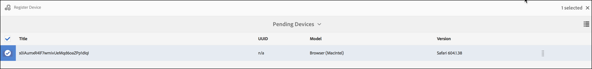
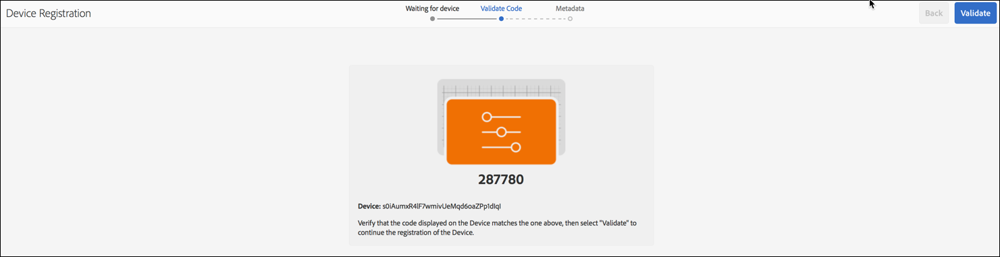
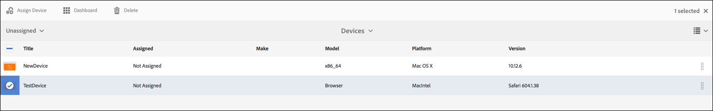

# Criação e gerenciamento de uma Live Copy {#creating-and-managing-a-live-copy}

Esta página descreve a criação e o gerenciamento de Live Copies de canais.

A ***Live Copy*** é uma cópia do conteúdo específico do site para o qual é mantido um relacionamento dinâmico com a origem original. Esse relacionamento dinâmico permite que a live copy herde conteúdo e propriedades de página da origem.

Esta página descreve a criação e a propagação de uma live copy de um canal, a exibição de propriedades, a verificação de status e a propagação de alterações de um canal para sua live copy.

## Criação de uma Live Copy {#creating-a-live-copy}

Siga as etapas abaixo para criar uma Live Copy de um canal na pasta do projeto.

1. Selecione o link Adobe Experience Manager (canto superior esquerdo) e **Screens**. Como alternativa, você pode ir diretamente para: `http://localhost:4502/screens.html/content/screens`.

1. Navegue até o projeto do Screens e clique em **Canais**.
1. Clique em **Criar** e selecione **Live Copy** para criar uma live copy do canal.
1. Selecione o destino e clique em **Próxima**.
1. Selecione o local em que a live copy pode residir.
1. Insira o **Título** e **Nome** no **Criar Live Copy** página.

1. Clique em **Abertura** para exibir o conteúdo da nova live copy ou **Concluído** para retornar à página principal.

Como alternativa, consulte as etapas abaixo para obter representação visual para criar uma nova live copy de um canal.

O exemplo a seguir mostra a criação de uma live copy (***IdleLiveCopy***) para ***Canal ocioso*** com a pasta de destino como ***Canais***.

## Exibição de conteúdo do canal da Live Copy {#viewing-content-of-the-live-copy-channel}

Uma Live Copy é uma cópia de um canal que existe.

Para exibir o conteúdo da live copy, consulte as etapas abaixo:

1. Navegue até o projeto do Screens e clique no local em que você criou originalmente a live copy, como mostrado na seção acima. (Aqui, a localização foi escolhida como **Canais** pasta)

   

1. Clique em **Editar** na barra de ações.

   

   >[!NOTE]
   >
   >Ao visualizar o conteúdo de um canal de live copy, você pode visualizar um item extra no menu como **Status da Live Copy**. Consulte a seção abaixo para obter mais detalhes.

### Visualização de propriedades de uma Live Copy {#viewing-properties-of-a-live-copy}

Além disso, é possível visualizar as propriedades do canal da live copy.

1. Navegue até o canal da live copy e clique em **Propriedades** na barra de ações.

   

1. Selecione o **Live Copy** para exibir detalhes do seu canal.

   

### Status da Live Copy   {#live-copy-status}

O modo **Status da Live Copy**, como mostrado na figura abaixo, permite visualizar o status do relacionamento de todos os ativos no canal.

1. Clique em **Editar** para que você possa escolher o **Status da Live Copy** e visualizam a associação do conteúdo do canal ao canal original (do qual a live copy é gerada).

   

1. Selecionar **Status da Live Copy** para exibir a página de visualização.

   Todos os recursos com borda verde mostram que o conteúdo é herdado do canal original.

   

### Interromper a herança {#breaking-the-inheritance}

Você também pode cancelar a herança da live copy, para que o conteúdo se torne independente da ramificação original.

O exemplo a seguir mostra que você selecionou a imagem no modo de edição e clicou no símbolo de herança de cancelamento na parte superior direita.

### Propagação de alterações no canal da Live Copy {#propagating-changes-to-the-live-copy-channel}

Se você fizer alterações ou atualizações no canal original, propague essas alterações no canal da Live Copy também.

Siga as etapas abaixo para garantir que suas alterações sejam propagadas do canal original para o canal de live copy:

1. Selecione o canal original (***Canal ocioso***) e selecione **Editar** na barra de ações.

   

1. Faça edições no conteúdo deste canal. Por exemplo, exclua uma imagem deste canal.

   

1. Selecione a live copy do canal (***IdleLiveCopy***) e selecione **Editar** na barra de ações. Observe que a imagem excluída ainda está visível na live copy.

   Para propagar as alterações, sincronize o canal.

   

1. Para propagar alterações para o canal de live copy, navegue até o painel AEM, selecione o canal de live copy e clique em **Propriedades** na barra de ações.

   

1. Selecione o **Live Copy** e selecione **Sincronizar** na barra de ações.

   

1. Selecionar **Sincronizar** e selecione **Salvar e fechar** para voltar para o painel AEM.

   

   Observe que a imagem agora também é excluída do canal de live copy.
