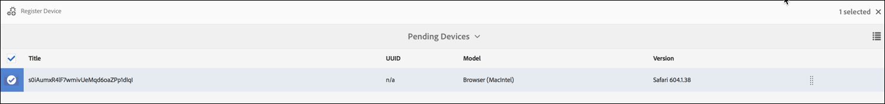
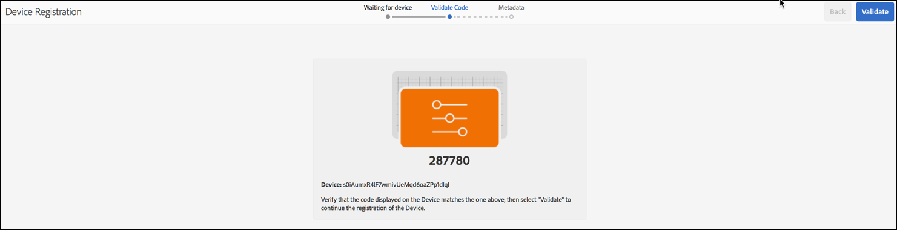
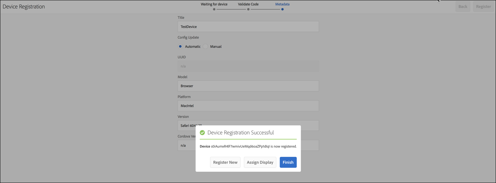
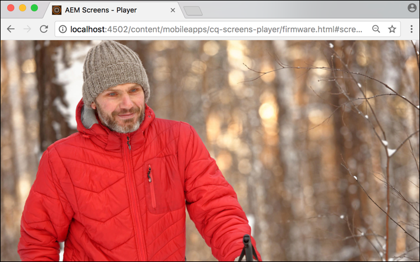
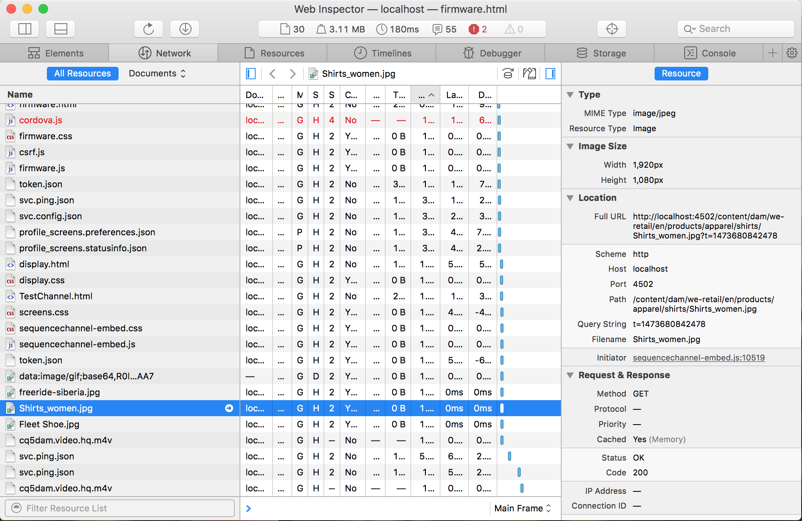
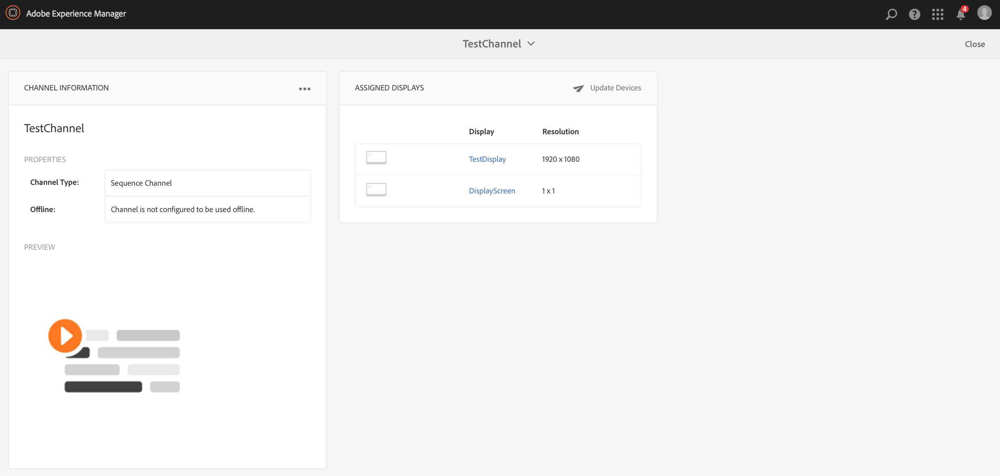
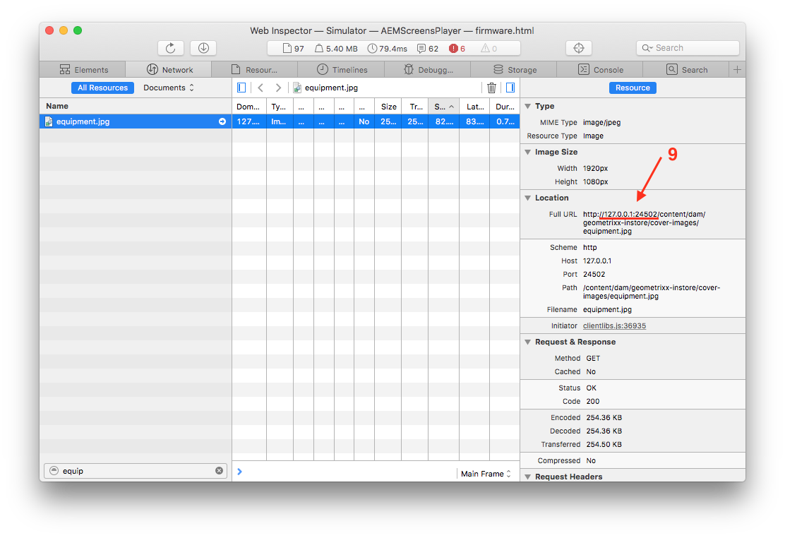
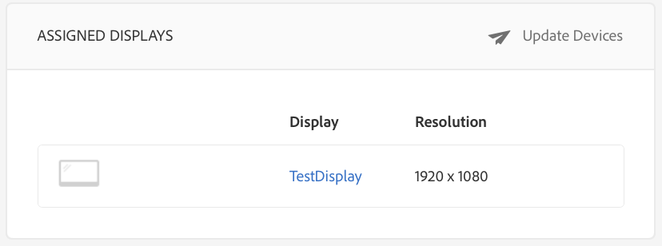
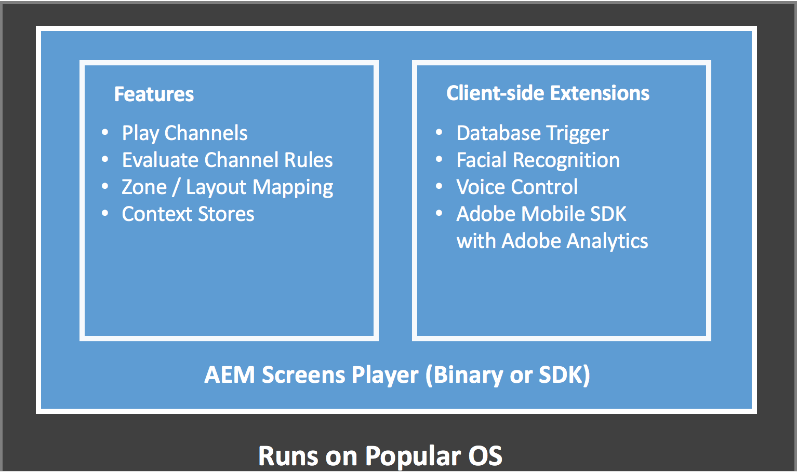
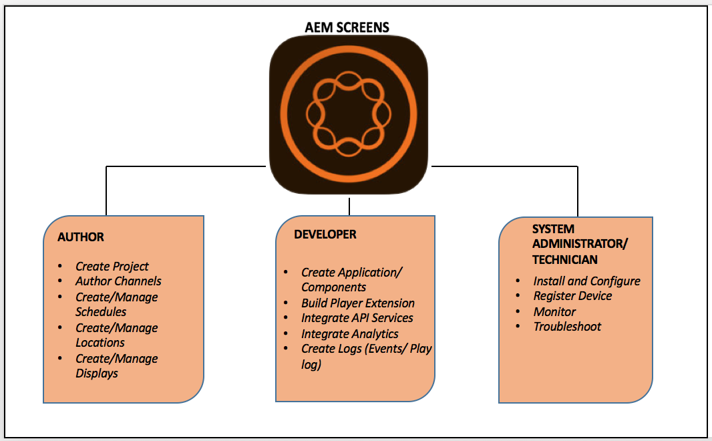

# Criação e gerenciamento de uma Live Copy {#creating-and-managing-a-live-copy}

>[!IMPORTANT]
>Esse conteúdo é válido para o AEM no local/AMS (AEM 6.5LTS e AEM 6.5). Para ver o conteúdo do AEM as a Cloud Service Screens, consulte o [guia do AEM as a Cloud Service](https://experienceleague.adobe.com/pt-br/docs/experience-manager-cloud-service/content/screens-as-cloud-service/overview/introduction).

Esta página descreve a criação e o gerenciamento de Live Copies de canais.

Uma ***Live Copy*** é uma cópia do conteúdo específico do site para o qual é mantido um relacionamento dinâmico com a origem original. Esse relacionamento dinâmico permite que a live copy herde conteúdo e propriedades de página da origem.

Esta página descreve a criação de uma live copy de um canal, a exibição de propriedades, a verificação de status e a propagação de alterações de um canal para sua live copy.

## Criação de uma Live Copy {#creating-a-live-copy}

Siga as etapas abaixo para criar uma Live Copy de um canal na pasta do projeto.

1. Clique no link do Adobe Experience Manager (canto superior esquerdo) e depois em **Screens**. Como alternativa, você pode ir diretamente para: `http://localhost:4502/screens.html/content/screens`.

1. Navegue até o projeto do Screens e clique em **Canais**.
1. Clique em **Criar** e em **Live Copy** para criar uma live copy do canal.
1. Clique no destino e em **Avançar**.
1. Clique no local em que a live copy pode residir.
1. Insira o **Título** e o **Nome** na página **Criar Live Copy**.

1. Clique em **Abrir** para exibir o conteúdo da nova live copy ou **Concluído** para retornar à página principal.

Como alternativa, consulte as etapas abaixo para obter representação visual para criar uma nova live copy de um canal.

O exemplo a seguir mostra a criação de uma live copy (***IdleLiveCopy***) para ***Canal Ocioso*** com a pasta de destino como ***Canais***.

## Exibição de conteúdo do canal da Live Copy {#viewing-content-of-the-live-copy-channel}

Uma live copy é uma cópia de um canal que existe.

Para exibir o conteúdo da live copy, consulte as etapas abaixo:

1. Navegue até o projeto do Screens e clique no local onde você criou originalmente uma live copy, como mostrado na seção acima. (Aqui, o local foi escolhido como a pasta **Canais**)

   

1. Clique em **Editar** na barra de ações.

   

   >[!NOTE]
   >
   >Ao exibir o conteúdo de um canal de live copy, você pode exibir um item extra no menu como **Status da Live Copy**. Consulte a seção abaixo para obter mais detalhes.

### Visualização de propriedades de uma Live Copy {#viewing-properties-of-a-live-copy}

Além disso, é possível visualizar as propriedades do canal da live copy.

1. Navegue até o canal de live copy e clique em **Propriedades** na barra de ações.

   

1. Clique na guia **Live Copy** para exibir detalhes do seu canal.

   

### Status da Live Copy {#live-copy-status}

O modo **Status da Live Copy**, como mostrado na figura abaixo, permite exibir o status do relacionamento de todos os ativos no canal.

1. Clique em **Editar** para poder escolher o **Status da Live Copy**. Você também pode exibir a associação do conteúdo do canal ao canal original do qual a live copy é gerada.

   

1. Clique em **Status da Live Copy** para exibir a página de visualização.

   Todos os recursos com borda verde mostram que o conteúdo é herdado do canal original.

   

### Interromper a herança {#breaking-the-inheritance}

Você também pode cancelar a herança da live copy, para que o conteúdo se torne independente da ramificação original.

O exemplo a seguir mostra que você clica na imagem no modo de edição e clica no ícone **Cancelar Herança** na parte superior direita.

### Propagação de alterações no canal da Live Copy {#propagating-changes-to-the-live-copy-channel}

Se você fizer alterações ou atualizações no canal original, propague essas alterações também no canal da live copy.

Siga as etapas abaixo para garantir que suas alterações sejam propagadas do canal original para o canal de live copy:

1. Clique no canal original (***Canal ocioso***) e clique em **Editar** na barra de ações.

   

1. Faça edições no conteúdo deste canal. Por exemplo, exclua uma imagem deste canal.

   

1. Clique na Live Copy do canal (***IdleLiveCopy***) e clique em **Editar** na barra de ações. Observe que a imagem excluída ainda está visível na live copy.

   Para propagar as alterações, sincronize o canal.

   

1. Para propagar alterações para o canal de live copy, navegue até o painel do AEM, clique no canal de live copy e clique em **Propriedades** na barra de ações.

   

1. Clique na guia **Live Copy** e clique em **Sincronizar** na barra de ações.

   

1. Clique em **Sincronizar** e em **Salvar e fechar** para voltar para o painel do AEM.

   

   Observe que a imagem agora também é excluída do canal de live copy.
