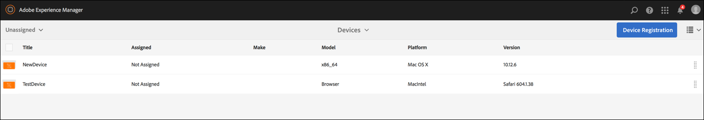

# Criação e gerenciamento de uma Live Copy {#creating-and-managing-a-live-copy}

Esta página descreve como criar e gerenciar Live Copies de canais.

Uma ***Live Copy*** é uma cópia do conteúdo específico do site para o qual é mantido um relacionamento dinâmico com a fonte original. Este relacionamento dinâmico permite que a live copy herde as propriedades do conteúdo e da página de origem.

Esta página descreve como criar uma live copy de um canal, exibir as propriedades, verificar o status e propagar as alterações de um canal para sua live copy.

## Criação de uma Live Copy {#creating-a-live-copy}

Siga as etapas abaixo para criar uma live copy de um canal na pasta do projeto.

1. Selecione o link do Adobe Experience Manager (parte superior esquerda) e o **Screens**. Como alternativa, você pode acessar diretamente: `http://localhost:4502/screens.html/content/screens`.

1. Navegue até o projeto do Screens e clique em **Canais**.
1. Clique em **Criar** e selecione **Live Copy** para criar uma live copy do canal.

1. Selecione o destino e clique em **Próximo**.
1. Selecione a localização da live copy.
1. Insira o **Título** e o **Nome** na página **Criar Live Copy**.

1. Clique em **Abrir** para exibir os conteúdos da nova live copy ou em **Concluído** para retornar à página principal.

Como alternativa, consulte as etapas abaixo para ver a representação visual da criação de uma nova Live Copy de um canal.

O exemplo a seguir mostra como criar uma live copy (***IdleLiveCopy***) para o ***Canal inativo*** com a pasta de destino ***Canais***.

## Exibir o conteúdo do canal da live copy {#viewing-content-of-the-live-copy-channel}

Uma Live Copy é uma cópia de um canal que já existe.

Para exibir o conteúdo da live copy, siga as seguintes etapas:

1. Navegue até o projeto do Screens e clique no local onde você criou originalmente a live copy, conforme mostrado na seção acima. (Aqui, o local foi escolhido como pasta **Channels**)

   

1. Clique em **Editar** na barra de ações para exibir o conteúdo no canal.

   

   >[!NOTE]
   >
   >Quando visualiza o conteúdo de um canal de live copy, você vê um item adicional no menu definido como **Status da Live Copy**. Consulte a seção abaixo para obter mais detalhes.

### Exibir as propriedades de uma live copy {#viewing-properties-of-a-live-copy}

Além disso, é possível exibir as propriedades do seu canal Live Copy.

1. Navegue até o canal da live copy e clique em **Propriedades** na barra de ações.

   

1. Selecione a guia **Live Copy** para exibir os detalhes do canal.

   

### Status da Live Copy    {#live-copy-status}

O modo **Status da Live Copy**, como mostrado na figura abaixo, permite visualizar o status do relacionamento de todos os ativos no canal.

1. Clique em **Editar** para escolher o **Status da Live Copy** e exibir a associação do conteúdo do seu canal ao canal original (do qual a live copy é gerada).

   

1. Selecione **Status da Live Copy** para exibir a página de visualização.

   Todos os recursos com borda verde mostram que o conteúdo foi herdada do canal original.

   

### Interromper a herança {#breaking-the-inheritance}

Também é possível cancelar a herança da livecopy para tornar o conteúdo independente da ramificação original.

O exemplo a seguir mostra que você seleciona a imagem no modo de edição e clica no símbolo para cancelar a herança na parte superior direita.

### Propagar as alterações ao canal da live copy {#propagating-changes-to-the-live-copy-channel}

Se você fizer alterações/atualizações no canal original, também será necessário propagar essas alterações no canal da Live Copy.

Siga as etapas abaixo para garantir que as alterações sejam propagadas do canal original ao canal da live copy:

1. Selecione o canal original (***Canal inativo***) e clique em **Editar** na barra de ações.

   

1. Edite esse conteúdo de canal. Por exemplo, exclua uma imagem deste canal.

   

1. Selecione a live copy do canal (***IdleLiveCopy***) e clique em **Editar** na barra de ações. Você notará que a imagem excluída ainda está visível na live copy.

   Para propagar as alterações, é necessário sincronizar o canal.

   

1. Para propagar alterações no canal da live copy, navegue até o painel do AEM, selecione o canal da live copy e clique em **Propriedades** na barra de ações.

   

1. Selecione a guia **Live Copy** e clique em **Sincronizar** na barra de ações.

   

1. Clique em **Sincronizar** para confirmar as alterações. Clique em **Salvar e fechar** para navegar de volta ao painel de AEM.

   

   Você notará que a imagem também foi excluída do canal da live copy.

