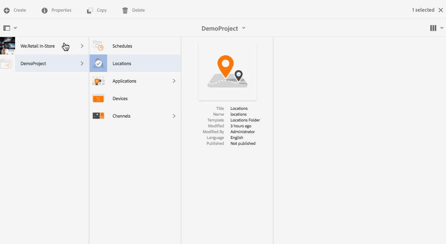
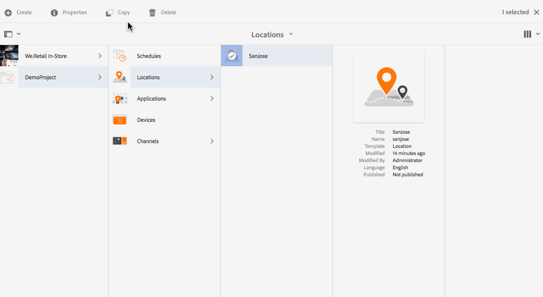

# Criação e Gerenciamento de Locais {#creating-and-managing-locations}

>[!IMPORTANT]
>Esse conteúdo é válido para o AEM no local/AMS (AEM 6.5LTS e AEM 6.5). Para ver o conteúdo do AEM as a Cloud Service Screens, consulte o [guia do AEM as a Cloud Service](https://experienceleague.adobe.com/pt-br/docs/experience-manager-cloud-service/content/screens-as-cloud-service/overview/introduction).

Os locais hospedam a configuração das exibições de acordo com o local em que as várias telas estão.

Esta página mostra como criar e gerenciar locais para o Screens.

**Pré-requisitos**:

* [Configuração e implantação do Screens](configuring-screens-introduction.md)
* [Criação e gerenciamento de projetos do Screens](creating-a-screens-project.md)
* [Criação e gerenciamento de canais](managing-channels.md)

## Criar um novo local {#creating-a-new-location}

Depois de criar seu projeto para o Screens, siga as etapas abaixo para criar um Local para um projeto do Screens:

1. Clique no link Adobe Experience Manager (canto superior esquerdo) e, em seguida, em Screens. Como alternativa, você pode navegar diretamente para: `http://localhost:4502/screens.html/content/screens`.
1. Navegue até o projeto do Screens e clique em **Locais**.
1. Clique em **Criar** ao lado do ícone de adição na barra de ações.
1. Clique no modelo **Local** no assistente e clique em **Avançar**.
1. Insira as propriedades para **Título e Marcas**, **Mais Títulos e Descrição**, **Horário Ligado/Desligado** e **URL Personalizada**.
1. Clique em **Criar** e o local será criado e adicionado à pasta de locais.

Consulte as etapas abaixo para entender a criação de um local para um projeto do AEM Screens. Para fins de demonstração, o novo local (SanJose) é criado em *DemoProject*.

Depois de criar um local, crie uma exibição para o seu local.

### Editando Propriedades de um Local {#editing-properties-for-a-location}

Para editar/acessar as propriedades de um local:

1. Clique no local.
1. Clique em **Propriedades** na barra de ações.

#### Próximas etapas {#the-next-steps}

Depois de criar um local, crie uma exibição para o seu local.

Consulte [Criação e gerenciamento de exibições](managing-displays.md).

