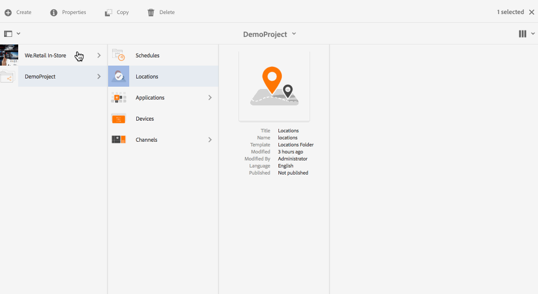

# Criação e gerenciamento de localizações {#creating-and-managing-locations}

As localizações hospedam a configuração da exibição de acordo com a posição das várias telas.

Esta página mostra como criar e gerenciar localizações para o Screens.

**Pré-requisitos**:

* [Configuração e implantação do Screens](configuring-screens-introduction.md)
* [Criando e Gerenciando Projeto de Telas](creating-a-screens-project.md)
* [Criação e gerenciamento de canais](managing-channels.md)

## Criação de uma nova localização {#creating-a-new-location}

Depois de criar seu projeto para o Screens, siga as etapas abaixo para criar um novo Local para um projeto do Screens:

1. Selecione o link do Adobe Experience Manager (canto superior esquerdo) e, em seguida, o Screens. Como alternativa, você pode navegar diretamente para: `http://localhost:4502/screens.html/content/screens`.
1. Navegue até o projeto do Screens e clique em **Locais**.
1. Clique em **Criar** ao lado do ícone de adição na barra de ações. Um assistente será aberto.
1. Selecione o modelo **Location** no assistente e clique em **Next**.

1. Insira as propriedades para **Título e Tags**, **Mais títulos e descrição**, **Tempo ligado/desligado** e **URL personalizado**.

1. Clique em **Criar** e o local será criado e adicionado à pasta de seus locais.

Consulte as etapas abaixo para entender como criar um novo local para um projeto AEM Screens. Para fins de demonstração, o novo local (SanJose) é criado em *DemoProject*.

Depois de criar uma localização, você precisa criar uma nova exibição para ela.

### Editar propriedades para um local {#editing-properties-for-a-location}

Para editar/acessar as propriedades de um local:

1. Selecione o local.
1. Clique em **Propriedades** na barra de ações.

#### Próximas etapas {#the-next-steps}

Depois de criar uma localização, você precisa criar uma nova exibição para ela.

Consulte [Criação e gerenciamento de telas](managing-displays.md) para obter mais detalhes.
