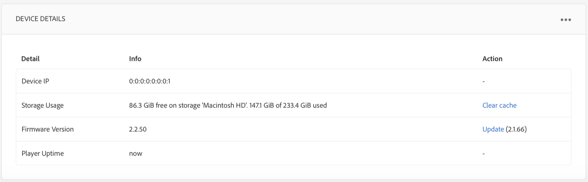

# Criar e gerenciar agendas {#creating-and-managing-schedules}

>[!IMPORTANT]
>Esse conteúdo é válido para o AEM no local/AMS (AEM 6.5LTS e AEM 6.5). Para ver o conteúdo do AEM as a Cloud Service Screens, consulte o [guia do AEM as a Cloud Service](https://experienceleague.adobe.com/pt-br/docs/experience-manager-cloud-service/content/screens-as-cloud-service/overview/introduction).

**Calendários** no AEM Screens permitem organizar canais em grupos reutilizáveis. Isso significa que não é necessário repetir a atribuição individualmente para cada exibição na qual deseja mostrar o conteúdo.

O agendamento, quando combinado com ***DayParting***, permite que você defina um agendamento global com vários canais em execução em horários específicos do dia e reutilize essa configuração para todas as suas exibições de uma só vez.

>[!NOTE]
>
>Essa funcionalidade do AEM Screens só estará disponível se você tiver instalado o AEM 6.3 Sites Feature Pack 1. Para obter acesso a este Feature Pack, entre em contato com o Suporte da Adobe e solicite acesso. Após ter as permissões necessárias, você pode baixá-lo do Compartilhamento de pacotes.

## Criar um agendamento {#creating-a-schedule}

Você pode criar um agendamento para o seu projeto do Screens que possa gerenciar todas as atividades do seu caso de uso.

Siga as etapas abaixo para criar um agendamento para seu canal:

1. Clique no link Adobe Experience Manager (canto superior esquerdo) e, em seguida, em Screens. Como alternativa, você pode ir diretamente para: `http://localhost:4502/screens.html/content/screens`.
1. Navegue até o projeto do Screens e clique em **Agendamentos**.
1. Clique em **Criar** na barra de ações.
1. Clique em **Agendar** no assistente **Criar** e clique em **Avançar**.

1. Insira o **Nome** e o **Título** e clique em **Criar**.

Você pode ver uma pasta de agendamento com o nome e o título designados em seu projeto.

## Exibir painel {#viewing-dashboard}

Depois de criar uma pasta de agendamentos no projeto, você pode exibir os detalhes no painel de agendamentos.

Siga as etapas abaixo para visualizar o painel de agendamento. O exemplo a seguir mostra o painel do projeto `We.Retail`:

1. Navegue até a pasta **Agendamentos** do projeto Screens (exemplo, `We.Retail`).

   

1. Clique em **Painel** na barra de ações.

   Você pode exibir três painéis diferentes, como **INFORMAÇÕES DE AGENDAMENTO**, **CANAIS ATRIBUÍDOS** e **EXIBIÇÕES ATRIBUÍDAS**.

   

   **Painel de Informações de Agendamento** - Clique em Propriedades no canto superior direito do Painel de INFORMAÇÕES DE AGENDAMENTO para exibir/alterar as propriedades do agendamento.

   **Painel Canais atribuídos** - Clique em +Atribuir canal no canto superior direito do painel CANAIS ATRIBUÍDOS para abrir a caixa de diálogo Atribuição de canal.

   **Painel Exibições Atribuídas** - Clique em qualquer exibição do Painel EXIBIÇÕES ATRIBUÍDAS para abrir o painel de exibição.
