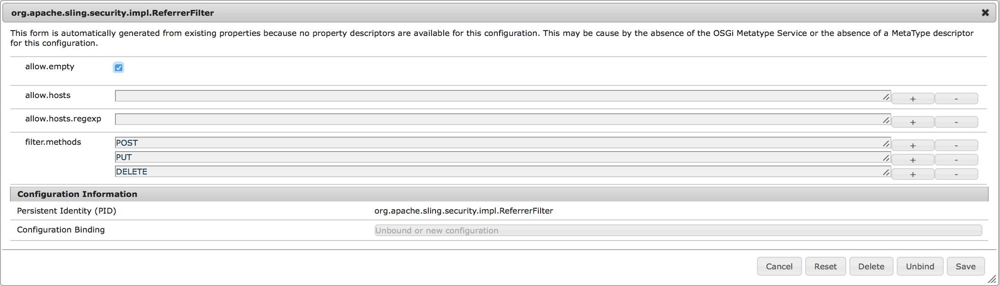

# Solução de problemas do Device Control Center {#troubleshooting-device-control-center}

Você pode monitorar e solucionar problemas de desempenho para a atividade e o dispositivo do player do Screens usando o painel Dispositivo. Esta página fornece informações sobre como monitorar e solucionar problemas de desempenho percebidos no player do Screens e nos dispositivos atribuídos.

## Monitor e solução de problemas do Device Control Center {#monitor-and-troubleshoot-from-device-control-center}

Você pode monitorar a atividade e, portanto, solucionar problemas do player do Screens, usando o Painel do dispositivo.

### Painel do dispositivo {#device-dashboard}

Siga as etapas abaixo para navegar até o painel Dispositivos:

1. Navegue até o painel Dispositivos do seu projeto, por exemplo, ***Testar projeto*** —> ***Dispositivos***.

   Selecione **Dispositivos** e **Gerenciador de Dispositivos** na barra de ações.

   

1. A lista exibe os dispositivos atribuídos e não atribuídos, conforme mostrado na figura abaixo.

   

1. Selecione o dispositivo (**NewTestDevice**) e clique em **Dashboard** na barra de ações.

   

1. A página mostra as informações, a atividade e os detalhes do dispositivo que permitem monitorar as atividades e as funções do dispositivo.

   

### Monitorar atividade do dispositivo {#monitor-device-activity}

O painel **Atividade** mostra o último ping do reprodutor de telas com o carimbo de data e hora. O último ping corresponde à última vez que o dispositivo contatou o servidor.

Além disso, clique em **Collect Logs** no canto superior direito do painel **Activity** para visualizar os logs do seu player.

### Atualizar Detalhes do Dispositivo {#update-device-details}

Verifique o painel **Detalhes do dispositivo** para visualizar o IP do dispositivo, o uso de armazenamento, a versão do firmware e o tempo de atividade do reprodutor para o seu dispositivo.

Além disso, clique em **Limpar cache** e em **Atualizar** para limpar o cache do seu dispositivo e atualizar a versão [firmware](screens-glossary.md) respectivamente deste painel.

Além disso, clique no **...** no canto superior direito do painel **Detalhes do dispositivo** para reiniciar ou atualizar o status do player.

### Atualizar Informações do Dispositivo {#update-device-information}

Verifique o painel **DEVICE INFORMATION** para visualizar a atualização de configuração, o modelo do dispositivo, o SO do dispositivo e as informações do shell.

Além disso, clique no (**...**) no canto superior direito do painel Informações do dispositivo para exibir as propriedades ou atualizar o dispositivo.

Clique em **Propriedades** para exibir a caixa de diálogo **Propriedades do dispositivo**. Você pode editar o título do dispositivo ou escolher a opção para atualizações de configuração como **Manual** ou **Automático**.

>[!NOTE]
>
>Para saber mais sobre os eventos associados às atualizações automáticas ou manuais do dispositivo, consulte a seção ***Atualizações automáticas versus manuais no Painel do dispositivo*** em [Gerenciamento de canais](managing-channels.md).

### Visualizar captura de tela do player {#view-player-screenshot}

Você pode exibir a captura de tela do reprodutor do dispositivo no painel **PLAYER SCREENSHOT**.

Clique em (**...**) no canto superior direito do painel Captura de tela do player e selecione **Atualizar captura de tela** para exibir o instantâneo do player em execução.

### Gerenciar preferências {#manage-preferences}

O painel **PREFERÊNCIAS** permite que o usuário altere as preferências para **Interface do usuário do administrador**, **Seletor de canal** e **Depuração remota** para o dispositivo.

>[!NOTE]
>Para saber mais sobre essas opções, consulte [AEM Screens Player](working-with-screens-player.md).

Além disso, clique em **Settings** no canto superior direito para atualizar as preferências do dispositivo. Você pode atualizar as seguintes preferências:

* **URL do servidor**
* **Resolução**
* **Reinicializar agendamento**
* **Nº máx. de arquivos de log a serem mantidos**
* **Nível de registro**

>[!NOTE]
>Você pode selecionar qualquer um dos seguintes níveis de Log:
>* **Desativar**
>* **Depurar**
>* **Informações**
>* **Aviso**
>* **Erro**

## Solucionar problemas das configurações do OSGi {#troubleshoot-osgi-settings}

Você precisa ativar o referenciador vazio para permitir que o dispositivo poste dados no servidor. Por exemplo, se a propriedade de referenciador vazia estiver desativada, o dispositivo não poderá postar uma captura de tela de volta.

Atualmente, alguns desses recursos só estão disponíveis se o *Apache Sling Referrer Filter Allow Empty* estiver habilitado na configuração OSGi. O painel pode exibir um aviso de que as configurações de segurança podem impedir que alguns desses recursos funcionem.

Siga as etapas abaixo para ativar o Filtro de referenciador do Apache Sling Permitir vazio

1. Navegue até **Configuração do Adobe Experience Manager Web Console**, ou seja, `https://localhost:4502/system/console/configMgr/org.apache.sling.security.impl.ReferrerFilter`.
1. Marque a opção **allow.empty**.
1. Clique em **Salvar**.

### Recomendações {#recommendations}

A seção a seguir recomenda o monitoramento de links de rede, servidores e players para entender a integridade e reagir a problemas.

O AEM fornece monitoramento integrado para:

* ** Heartbeat a cada 5 segundos para indicar que o Player do AEM Screens está em operação.
* ** Tela do Player que mostra o que está sendo exibido no momento no Player.
* A versão *AEM Screens Player Firmware* instalada no Player.
* *Espaço livre de armazenamento* no Player.

Recommendations para monitoramento remoto com software de terceiros:

* Uso da CPU em Players.
* Verifique se o processo do AEM Screens Player está em execução.
* Reinicialização/reinicialização remota do Player.
* Notificações em tempo real.

É recomendável implantar o hardware e o sistema operacional do Player de uma forma que permita o logon remoto para diagnosticar problemas e reiniciar o Player.

#### Recursos adicionais {#additional-resources}

Consulte [Video Playback Configuration and Troubleshooting](troubleshoot-videos.md) para depurar e solucionar problemas de reprodução de vídeos no seu canal.
