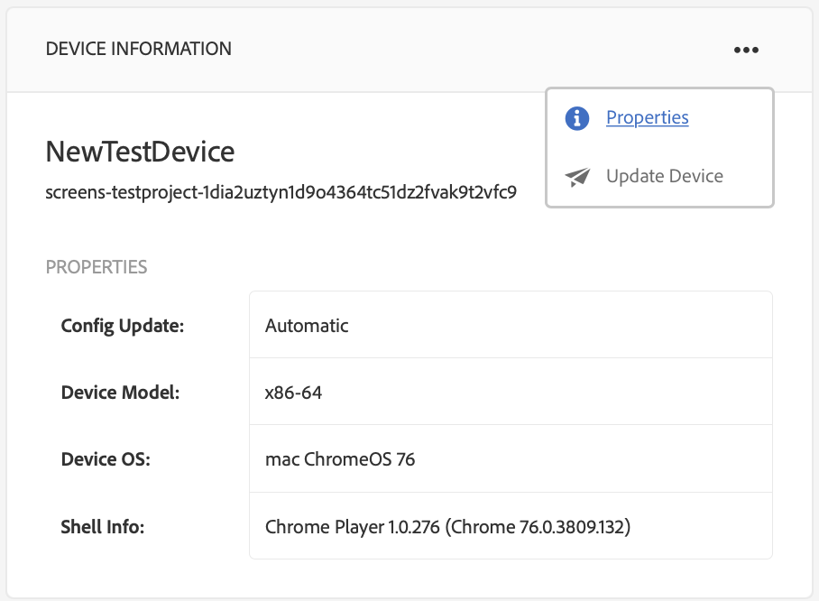

# Solução de problemas do Device Control Center {#troubleshooting-device-control-center}

Você pode monitorar e solucionar problemas de desempenho para a atividade e o dispositivo do player do Screens usando o painel do dispositivo. Esta página fornece informações sobre como monitorar e solucionar problemas de desempenho percebidos para o player do Screens e os dispositivos atribuídos.

## Monitor e solução de problemas do Device Control Center {#monitor-and-troubleshoot-from-device-control-center}

Você pode monitorar a atividade e, portanto, solucionar problemas do player do Screens, usando o Painel do dispositivo.

### Painel do dispositivo {#device-dashboard}

Siga as etapas abaixo para navegar até o painel do dispositivo:

1. Navegue até o painel do dispositivo do seu projeto, por exemplo, ***Testar projeto*** —> ***Dispositivos***.

   Selecione **Dispositivos** e **Gerenciador de dispositivos** na barra de ações.

   

1. A lista exibe os dispositivos atribuídos e não atribuídos, conforme mostrado na figura abaixo.

   

1. Selecione o dispositivo (**NewTestDevice**) e clique em **Painel** na barra de ações.

   

1. A página mostra as informações do dispositivo, a atividade e os detalhes do dispositivo que permitem monitorar as atividades e funções do dispositivo.

   

### Atividade do dispositivo do monitor {#monitor-device-activity}

O painel **Atividade** mostra o último ping do player de sua tela com o carimbo de data e hora. O último ping corresponde à última vez que o dispositivo entrou em contato com o servidor.

Além disso, clique em **Coletar registros** no canto superior direito do painel **Atividade** para visualização dos registros do player.

### Atualizar Detalhes do Dispositivo {#update-device-details}

Verifique o painel **Detalhes do dispositivo** para visualização do IP do dispositivo, do uso do Armazenamento, da versão do firmware e do tempo de funcionamento do player do dispositivo.

Além disso, clique em **Limpar cache** e **Atualizar** para limpar o cache do seu dispositivo e atualizar a versão [firmware](screens-glossary.md) respectivamente deste painel.

Além disso, clique em **...** no canto superior direito do painel **Detalhes do dispositivo** para reiniciar ou atualizar o status do player.

### Atualizar informações do dispositivo {#update-device-information}

Verifique o painel **INFORMAÇÕES DO DISPOSITIVO** para visualização das informações de atualização da configuração, modelo do dispositivo, SO do dispositivo e shell.

Além disso, clique em (**...**) no canto superior direito do painel Informações do dispositivo para propriedades de visualização ou atualizar o dispositivo.

Clique em **Propriedades** para visualização a caixa de diálogo **Propriedades do dispositivo**. Você pode editar o título do dispositivo ou escolher a opção para atualizações de configuração como **Manual** ou **Automático**.

>[!NOTE]
>
>Para saber mais sobre os eventos associados às atualizações automáticas ou manuais do dispositivo, consulte a seção ***Atualizações automáticas versus manuais do Painel do dispositivo*** em [Gerenciamento de Canais](managing-channels.md).

### Captura de tela do player de visualização {#view-player-screenshot}

Você pode visualização a captura de tela do player do dispositivo do painel **PLAYER SCREENSHOT**.

Clique em (**...**) no canto superior direito do painel Captura de tela do player e selecione **Atualizar captura de tela** para visualização do instantâneo do player em execução.

### Gerenciar preferências {#manage-preferences}

O painel **PREFERÊNCIAS** permite que o usuário altere as preferências para **IU de administração**, **Comutador de Canais** e **Depuração Remota** para o dispositivo.

>[!NOTE]
>Para saber mais sobre essa opção, consulte [AEM Screens Player](working-with-screens-player.md).

Além disso, clique em **Settings** no canto superior direito para atualizar as preferências do dispositivo. Você pode atualizar as seguintes preferências:

* **URL do servidor**
* **Resolução**
* **Reinicializar agendamento**
* **Nº máx. dos arquivos de log a serem mantidos**
* **Nível de registro**

>[!NOTE]
>Você pode selecionar qualquer um dos seguintes níveis de Log:
>* **Desativar**
>* **Depurar**
>* **Informações**
>* **Aviso**
>* **Erro**

## Solucionar problemas de configurações OSGi {#troubleshoot-osgi-settings}

É necessário ativar a quem indicou vazia para permitir que o dispositivo publique dados no servidor. Por exemplo, se a propriedade quem indicou vazia estiver desativada, o dispositivo não poderá postar uma captura de tela novamente.

Atualmente, alguns desses recursos estão disponíveis somente se *Filtro de Quem indicou Apache Sling Permitir vazio* estiver ativado na configuração do OSGi. O painel pode exibir um aviso de que as configurações de segurança podem impedir que alguns desses recursos funcionem.

Siga as etapas abaixo para ativar o Filtro de Quem indicou Apache Sling Permitir vazio

1. Navegue até **Configuração do Adobe Experience Manager Web Console**, ou seja, `https://localhost:4502/system/console/configMgr/org.apache.sling.security.impl.ReferrerFilter`.
1. Verifique a opção **allow.empty**.
1. Clique em **Salvar**.

### Recomendações {#recommendations}

A seção a seguir recomenda o monitoramento dos links de rede, do servidor e dos players para entender a integridade e reagir a problemas.

AEM fornece monitoramento integrado para:

* *A* pulsação a cada 5 segundos indica que o AEM Screens Player está em operação.
* ** Captura de tela do Player que mostra o que está sendo exibido no momento no Player.
* A versão *Firmware do AEM Screens Player* instalada no Player.
* *Espaço livre do armazenamento* no Player.

Recommendations para monitoramento remoto com software de terceiros:

* Uso da CPU em Players.
* Verifique se o processo do AEM Screens Player está em execução.
* Reinicialização/reinicialização remota do Player.
* Notificações em tempo real.

É recomendável implantar o hardware do Player e o SO de uma forma que permita o logon remoto para diagnosticar problemas e reiniciar o Player.

#### Recursos adicionais {#additional-resources}

Consulte [Configuração e solução de problemas da reprodução de vídeo](troubleshoot-videos.md) para depurar e solucionar problemas de vídeos reproduzidos no seu canal.
