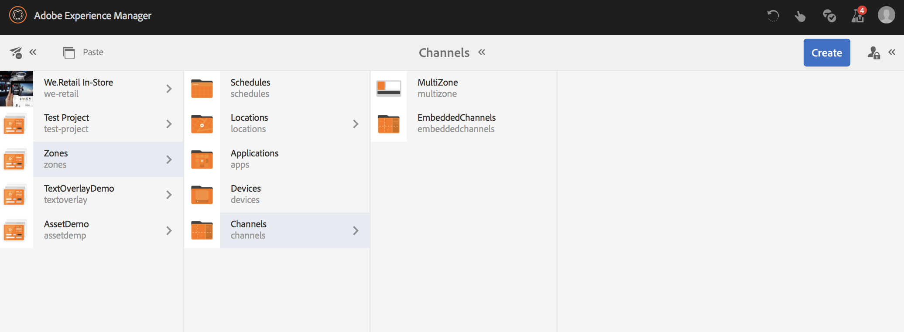

# Layout de várias zonas {#multi-zone-layout}

A página a seguir descreve o uso do layout de várias zonas e aborda os seguintes tópicos:

* Visão geral
* Criação de layout multizona
* Pré-requisitos
* Uso de ativos únicos em uma ou mais zonas
* Uso de conteúdo sequenciado em uma ou mais zonas

## Visão geral {#overview}

***O Layout*** de várias zonas permite criar vários conteúdos de zona e usar diversos ativos, como vídeos, imagens e texto, que podem ser combinados em uma única tela. Você pode inserir imagens, vídeos e texto, permitindo que tudo se misture e crie uma experiência digital intuitiva.

De acordo com os requisitos do projeto, às vezes você precisa usar várias zonas em um canal e editá-las como uma unidade abrangente. Por exemplo, uma sequência de produtos com um feed de redes sociais relacionado executado em três zonas separadas em um único canal.

### Pré-requisitos {#prerequisites}

Antes de implementar esta funcionalidade, certifique-se de que tem conhecimento conceitual sobre:

* [Criar um projeto do AEM Screens](https://docs.adobe.com/content/help/en/experience-manager-screens/user-guide/authoring/setting-up-projects/creating-a-screens-project.html)
* [Criação de uma exibição](https://docs.adobe.com/content/help/en/experience-manager-screens/user-guide/authoring/setting-up-projects/managing-displays.html)
* [Atribuindo um Canal a uma tela](https://docs.adobe.com/content/help/en/experience-manager-screens/user-guide/authoring/setting-up-projects/channel-assignment.html)

## Criação de layout multizona {#creating-multi-zone-layout}

Ao criar um canal, você pode usar modelos diferentes para criar zonas em seu canal. Você pode adicionar uma única imagem, vídeo ou um canal incorporado que permite que vários ativos sejam exibidos em uma sequência.

**Criação do Canal**

1. Selecione o link do Adobe Experience Manager (parte superior esquerda) e o **Screens**. Alternatively, you can go directly to: `http://localhost:4502/screens.html/content/screens`.
1. Navegue até a pasta **Canais** e clique em **Criar** na barra de ações.

1. Selecione **1x2 Canal** de tela dividida no assistente **Criar** .

1. Clique em **Avançar** e insira o **título** como **MultiZone**.

1. Clique em **Criar** para concluir a criação do canal.

### Uso de ativos únicos em uma ou mais zonas {#using-single-assets-in-one-or-more-zones}

Você pode usar ativos únicos, como uma imagem ou um vídeo, em todas as três zonas diferentes. Siga as etapas abaixo para a implementação:

1. **Adicionar conteúdo ao Canal**

   1. Navegue até **Zonas** —> **Canais**—> **MultiZona**.
   1. Select the **MultiZone** channel and click **Edit** from the action bar to open the editor.

1. **Adicionar imagens ao Canal**

   Para reproduzir uma única imagem ou um vídeo em duas zonas, basta arrastar e soltar uma imagem em cada zona no editor de canais, como mostra a figura abaixo:

   

### Uso de conteúdo sequenciado em uma ou mais zonas {#using-sequenced-content-in-one-or-more-zones}

Se quiser que as zonas exibam a sequência de imagens e um vídeo em duas zonas diferentes, siga as etapas abaixo para obter detalhes.

1. **Criação de uma pasta de Canais**

   1. Navegue até **Zonas** —> **MultiZone** —> **Canais** e clique em **Criar** na barra de ações.
   1. Select **Channels Folder** from the **Create** wizard and click **Next**.
   1. Enter the title as **EmbeddedChannels** and click **Create**.
   

1. **Adicionando mais dois canais à pasta Canal**

   1. Navegue até **Zonas** —> **Canais** —> Canais **incorporados** e clique em **Criar** na barra de ações.
   1. Selecione Canal **de** sequência no assistente **Criar** para criar um canal chamado **Zona1**.
   1. Select **Zone1** and click **Edit** from the action bar to open the editor.
   1. Arraste e solte algumas imagens neste canal.
   Da mesma forma, crie outro canal de sequência chamado **Zone2** na pasta **EmbeddedChannels** .

   

   As imagens adicionadas ao editor do canal de sequência **Zone1** são mostradas abaixo:

   

   Adicione um vídeo ao editor do canal de sequência **Zone2** , conforme mostrado na figura abaixo:

   

1. **Adicionar sequências incorporadas (componente) ao canal principal (MultiZone)**

   1. Navegue até **Zonas** —> **Canais** —> **MultiZona**.
   1. Clique em **Editar** na barra de ações para abrir o editor.
   1. Arraste e solte o componente Sequência **** incorporada em duas zonas.
   1. Selecione a sequência incorporada em uma das zonas.
   1. Clique no ícone **Configurar** (chave) para uma das sequências incorporadas no editor.
   1. Selecione o caminho do canal como **Zonas** —> **Canais** —> Canais **Incorporados** —> **Zona1**, conforme mostrado na figura abaixo.
   1. Da mesma forma, adicione a **Zona2** a outro componente de sequência incorporado no editor.

      

### Criação de um local e uma exibição {#creating-location}

Você deve criar um local e uma exibição para visualização do conteúdo no player do Screens. Siga as etapas abaixo para criar um local e uma tela.

1. **Criação de uma localização**

   1. Navegue até a pasta **Zonas** —> **Locais** .
   1. Selecione a pasta **Locais** e clique em **Criar** na barra de ações.
   1. Select **Location** from the **Create** wizard and click **Next**.
   1. Enter the **Title** as **SanJose** and click **Create**.

1. **Criação de uma exibição**

   1. Navegue até a pasta **Zonas** —> **Locais** .
   1. Selecione o local **de SanJose** e clique em **Criar** na barra de ações.
   1. Select **Display** from the **Create** wizard and click **Next**.
   1. Enter the **Title** as **Lobby** and click **Create**.

### Atribuindo Canal à tela {#channel-channel}

É necessário atribuir os canais à exibição para visualização do conteúdo. Siga as etapas abaixo para atribuir o canal à tela.

1. **Atribuindo Canal à tela**

   1. Navegue até **Zonas** —> **Locais** —> **SanJose**—> **Sala de espera**.
   1. Selecione a tela **Sala de espera** e clique em **Atribuir Canal** na barra de ação.
   1. Digite o caminho para o canal **MultiZone** no Caminho **do** Canal.
   1. Defina os Eventos **** suportados como **Carregamento** inicial, Tela **** inativa e **Temporizador**.
   1. Clique em **Salvar**.

      
   1. Da mesma forma, você deve atribuir os outros dois canais incorporados (**Zona1** e **Zona2**) a essa exibição.
   1. Depois de atribuir os três canais à tela **Sala de espera** , você deve ser capaz de visualização dos canais atribuídos do painel de exibição.

      

      >[!Iimportante]
      > Depois de atribuir o canal principal (neste caso, **MultiZone**) à exibição, é obrigatório atribuir os outros dois canais incorporados **Zone1** e **Zone2** também à mesma exibição.

### Registrando o dispositivo {#registering-device}

Depois de configurar um local e uma tela, siga as etapas abaixo para registrar o dispositivo e atribuir a exibição ao dispositivo.

1. **Registrando o dispositivo**

   1. Navegue até a pasta **Zonas** —> **Dispositivos** .
   1. Select the **Devices** folder and click **Device Manager** from the action bar.
   1. Clique em **Device Registration (Registro** do dispositivo) e selecione o dispositivo pendente na lista.
      >[!NOTE]
      > O título do dispositivo deve corresponder ao token do dispositivo (campo **Token** ) exibido na guia Registro **do** dispositivo.
   1. Se o título corresponder ao token do dispositivo, selecione o dispositivo e clique em **Registrar dispositivo** na barra de ação.
   1. Se o código de registro corresponder ao código na guia Registro **do** dispositivo do player do Screens, clique em **Validar** na barra de ação.
      
   1. Enter the **Title** as **Chrome-Device1** and click **Register**.
   1. Selecione **Atribuir exibição** e selecione o caminho para a configuração do dispositivo.
   >[!NOTE]
   >Se estiver tentando visualização do conteúdo no player do Screens, clique em **Atualizar conteúdo** offline do painel do canal.

#### Como visualizar o resultado {#viewing-the-result}

Depois de implementar layouts de várias zonas usando as etapas anteriores, a saída a seguir é exibida.

Verifique o player do Screens para visualização na saída que exibe o conteúdo em duas zonas diferentes. As zonas esquerda e direita (ambas usam a sequência incorporada como um componente).

A zona esquerda é um canal de sequência e a zona direita inclui um vídeo.

