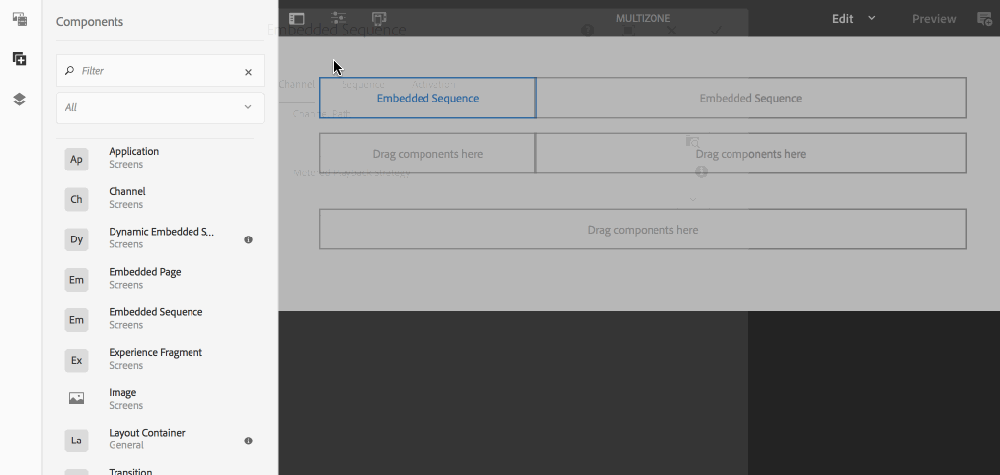

# Layout de várias zonas {#multi-zone-layout}

A página a seguir descreve o uso do layout de várias zonas e aborda os seguintes tópicos:

* Visão geral
* Criação de layout multizona
* Pré-requisitos
* Uso de ativos únicos em uma ou mais zonas
* Uso de conteúdo sequenciado em uma ou mais zonas

## Visão geral {#overview}

***O Layout*** de várias zonas permite que você crie conteúdo de várias zonas e use diversos ativos, como vídeos, imagens e texto, que podem ser combinados em uma única tela. Você pode inserir imagens, vídeos e texto, permitindo que tudo se misture e crie uma experiência digital intuitiva.

De acordo com os requisitos do projeto, às vezes você precisa usar várias zonas em um canal e editá-las como uma unidade abrangente. Por exemplo, uma sequência de produtos com um feed de redes sociais relacionado executado em três zonas separadas em um único canal.

## Criação de layout multizona {#creating-multi-zone-layout}

Ao criar um canal, você pode usar diferentes modelos para criar zonas em seu canal. É possível adicionar uma única imagem, vídeo ou um canal incorporado que permita que vários ativos sejam exibidos em uma sequência.

### Pré-requisitos {#prerequisites}

Antes de começar a implementar essa funcionalidade, certifique-se de que você tenha um projeto pronto como pré-requisito para iniciar a implementação do layout de várias zonas. Por exemplo,

* Criar um projeto do AEM Screens chamado de **Zonas**
* Criar uma exibição em **Locais** intitulados como **VídeoDeZonaMúltipla**

Crie um canal chamado **MultiZone** no projeto **Zones** . Siga as etapas abaixo:

**Criação do canal**

1. Selecione o link do Adobe Experience Manager (parte superior esquerda) e o **Screens**. Alternatively, you can go directly to: `http://localhost:4502/screens.html/content/screens`.
1. Navegue até a pasta **Canais** e clique em **Criar** na barra de ações.

1. Selecione Painel **de tela dividida na barra L** esquerda no assistente **Criar** .

1. Clique em **Avançar** e insira o **título** como **MultiZone**.

1. Clique em **Criar** para concluir a criação do canal.

### Uso de ativos únicos em uma ou mais zonas {#using-single-assets-in-one-or-more-zones}

Você pode usar ativos únicos, como uma imagem ou um vídeo, em todas as três zonas diferentes. Siga as etapas abaixo para a implementação:

1. **Adicionar conteúdo ao canal**

   1. Navegue até **Zonas** —&gt; **Canais**—&gt;**MultiZona**.
   1. Select the **MultiZone** channel and click **Edit** from the action bar to open the editor.
   

1. **Adicionar imagens ao canal**

   Para reproduzir uma única imagem ou um vídeo em todas as três zonas, basta arrastar e soltar a imagem no editor de canal, como mostrado abaixo.

   

### Uso de conteúdo sequenciado em uma ou mais zonas {#using-sequenced-content-in-one-or-more-zones}

Se quiser que as zonas exibam a sequência de imagens ou conteúdo e uma imagem estática em três zonas diferentes, siga as etapas abaixo para obter detalhes.

1. **Criação de uma pasta de canal**

   1. Navegue até **Zonas** —&gt; **MultiZone** —&gt; **Canais** e clique em **Criar** na barra de ações.
   1. Select **Channels Folder** from the **Create** wizard and click **Next**.
   1. Enter the title as **EmbeddedChannels** and click **Create**.
   

1. **Adicionando mais dois canais à pasta Canal**

   1. Navegue até **Zonas** —&gt; **Canais** —&gt; Canais **Incorporados** e clique em **Criar** na barra de ações.
   1. Selecione Canal **de** sequência no assistente **Criar** para criar um canal chamado** Zone1**.
   1. Select **Zone1** and click **Edit** from the action bar to open the editor.
   1. Arraste e solte algumas imagens neste canal.
   Da mesma forma, crie outro canal de sequência chamado **Zone2** na pasta **EmbeddedChannels** .

   

1. **Adicionando sequências incorporadas/componente ao canal principal (MultiZone)**

   1. Navegue até **Zonas** —&gt; **Canais** —&gt; **MultiZona**.
   1. Clique em **Editar** na barra de ações para abrir o editor.
   1. Arraste e solte o componente de Sequência **** incorporada em duas zonas, conforme mostrado na figura abaixo.
   

1. **Adicionar conteúdo às três zonas**

   1. Navegue até **Zonas** —&gt; **Canais** —&gt; **MultiZona**.
   1. Selecione a sequência incorporada em uma das zonas.
   1. Clique no ícone **Configurar** (chave) para uma das sequências incorporadas no editor.
   1. Selecione o caminho do canal como **Zonas** —&gt; **Canais** —&gt; Canais **Incorporados** —&gt; **Zona1**, conforme mostrado na figura abaixo.
   Da mesma forma, adicione a **Zona2** a outro componente de sequência incorporado no editor. Além disso, adicione uma imagem à terceira zona na parte inferior, como mostrado abaixo.

   

#### Como visualizar o resultado {#viewing-the-result}

Depois de implementar layouts de várias zonas usando as etapas anteriores, a saída a seguir é exibida, como mostra a figura abaixo.

A saída a seguir no Screens Player exibe o conteúdo em três zonas diferentes. As zonas esquerda e direita (ambas usam a sequência incorporada como um componente) exibem a sequência de imagens e a zona abaixo exibe uma imagem estática.

