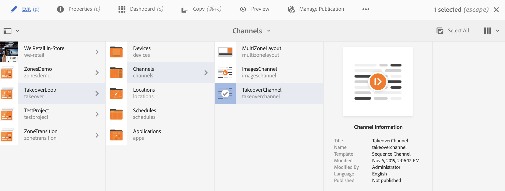

# Transição de várias zonas para uma única zona {#multizone-to-singlezone-use-case}

## Descrição do caso de uso {#use-case-description}

Esta seção descreve um exemplo de caso de uso que enfatiza como configurar um canal de layout multizona que alterna com um canal de layout de zona única. O canal de várias zonas tem ativos de imagem/vídeo em sequência e mostra como você pode configurar projetos que alternam de várias zonas para uma única zona e vice-versa.

### Pré-condições {#preconditions}

Antes de start deste caso de uso, certifique-se de saber como:

* **[Criar e gerenciar Canais](managing-channels.md)**
* **[Criar e gerenciar locais](managing-locations.md)**
* **[Criar e gerenciar programações](managing-schedules.md)**
* **[Registro do dispositivo](device-registration.md)**

### Principais intervenientes {#primary-actors}

Autores de conteúdo

## Configuração do projeto {#setting-up-the-project}

Siga as etapas abaixo para configurar um projeto:

1. Crie um projeto da AEM Screens chamado **TakeoverLoop**, conforme mostrado abaixo.

   

1. **Criando um Canal de telas de várias zonas**

   1. Selecione a pasta **Canais** e clique em **Criar** na barra de ações para abrir o assistente para criar um canal.
   1. Selecione **Canal de tela dividida na barra esquerda** do assistente e crie o canal chamado **MultiZoneLayout**.
   1. Adicione conteúdo ao canal. Arraste e solte os ativos em cada uma das zonas. O exemplo a seguir mostra um canal **MultiZoneLayout** composto de um vídeo, uma imagem e um banner de texto (em uma sequência incorporada), como mostrado abaixo.

   

   >[!NOTE]
   >
   >Para saber mais sobre como criar um layout de várias zonas no seu canal, consulte [Layout de várias zonas](multi-zone-layout-aem-screens.md).

1. Crie outro canal chamado **TakeoverChannel** para a pasta **Canais**.

   

1. Clique em **Editar** na barra de ações para adicionar conteúdo a este canal. Adicione um componente **Canal** e um ativo de imagem para o qual você deseja alternar, a este canal, conforme mostrado na figura abaixo:

   

1. Abra as configurações do componente de Canal e aponte-o para o canal **MultiZoneLayout** criado em *etapa 2*.

   

1. Defina a duração do campo **Sequência** como **10000 ms**.

   

1. Da mesma forma, abra as configurações para a Imagem (ativo adicionado) e defina sua duração do campo **Sequência** para **3000 ms**.

   

## Verificando a Pré-visualização {#checking-the-preview}

Você pode visualização a saída desejada do player ou apenas clicando na **Pré-visualização** do editor.

A saída demonstrará como um layout de várias zonas é reproduzido por *10000 ms* e, em seguida, alterna para um layout de zona única que tenha uma duração de reprodução de *3000 ms* e, em seguida, volta para o layout de várias zonas.

>[!VIDEO](https://video.tv.adobe.com/v/30366)

>[!NOTE]
>
>Você pode personalizar sua transição de canal (de várias zonas para o layout de uma única zona ou vice-versa), conforme suas necessidades.