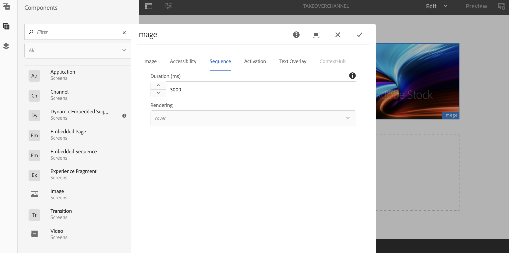

# Transição de várias regiões para uma única região {#multizone-to-singlezone-use-case}

## Descrição do caso de uso {#use-case-description}

Esta seção descreve um exemplo de caso de uso que enfatiza como configurar um canal de layout de várias zonas que se alterna com um canal de layout de zona única. O canal multizona tem ativos de imagem/vídeo de sequenciamento e mostra como você pode configurar um projeto que se alterna de multizona para zona única e vice-versa.

### Pré-condições {#preconditions}

Antes de iniciar este caso de uso, verifique se você sabe como:

* **[Criar e gerenciar canais](managing-channels.md)**
* **[Criar e Gerenciar Locais](managing-locations.md)**
* **[Criar e gerenciar cronogramas](managing-schedules.md)**
* **[Registro do dispositivo](device-registration.md)**

### Atores principais {#primary-actors}

Autores de conteúdo

## Configuração do projeto {#setting-up-the-project}

Siga as etapas abaixo para configurar um projeto:

1. Crie um projeto do AEM Screens chamado como **LoopTomada**, conforme mostrado abaixo.

   

1. **Criação de um canal de telas de várias zonas**

   1. Selecione o **Canais** e clique em **Criar** na barra de ações e abrindo o assistente para criar um canal.
   1. Selecionar **Canal de tela dividida em barra à esquerda** do assistente e crie o canal chamado de **MultiZoneLayout**.
   1. Adicione conteúdo ao canal. Arraste e solte os ativos em cada uma das zonas. O exemplo a seguir mostra uma **MultiZoneLayout** canal que inclui um vídeo, uma imagem e um banner de texto (em uma sequência incorporada), conforme mostrado abaixo.

   

   >[!NOTE]
   >
   >Para saber mais sobre como criar um layout de várias zonas no seu canal, consulte [Layout de várias zonas](multi-zone-layout-aem-screens.md).

1. Crie outro canal chamado como **Canal de aquisição** ao seu **Canais** pasta.

   

1. Clique em **Editar** na barra de ações para que você possa adicionar conteúdo a este canal. Adicionar um **Canal** e um ativo de imagem que você deseja alternar para esse canal, como mostrado na figura abaixo:

   

1. Abra as configurações do componente Canal e aponte para **MultiZoneLayout** canal que você criou em *etapa 2*.

   

1. Defina a duração a partir de **Sequência** campo para **10000 milissegundos**.

   

1. Da mesma forma, abra as configurações para a Imagem (ativo adicionado) e defina sua duração no **Sequência** campo para **3000 milissegundos**.

   

## Verificação da visualização {#checking-the-preview}

Você pode visualizar a saída desejada do reprodutor ou apenas selecionando **Visualizar** do editor.

A saída demonstra como um layout de várias zonas é reproduzido para *10000 milissegundos* e alterna para o layout de zona única com duração de reprodução de *3000 milissegundos* e, em seguida, volta para o layout multizona.

>[!VIDEO](https://video.tv.adobe.com/v/30366)

>[!NOTE]
>
>Você pode personalizar a transição de canal (do layout de várias zonas para uma única zona ou vice-versa), de acordo com suas necessidades.
