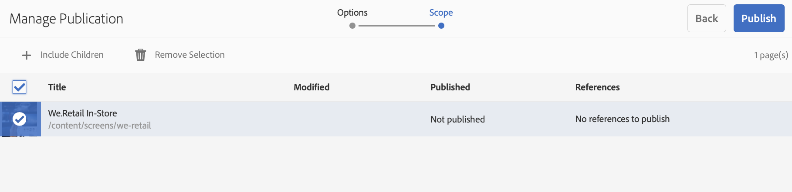
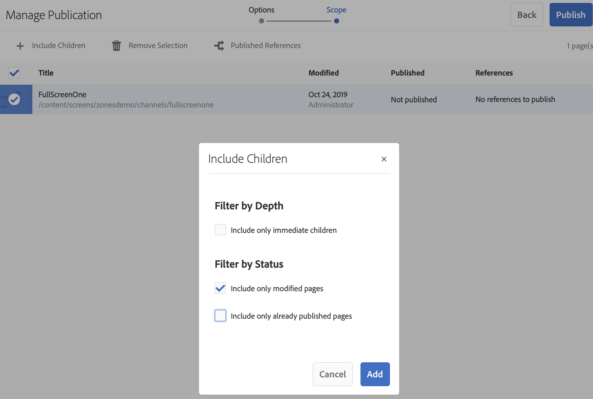

# Atualização de conteúdo sob demanda {#on-demand}

Esta seção descreve o conteúdo sob demanda para o gerenciamento de publicações.

## Gerenciando a publicação: Fornecer atualizações de conteúdo do autor para o dispositivo {#managing-publication-delivering-content-updates-from-author-to-publish-to-device}

Você pode publicar e cancelar a publicação de conteúdo de AEM Screens. O recurso Gerenciar publicação permite que você forneça atualizações de conteúdo do autor para publicar no dispositivo. Você pode publicar/desfazer a publicação de conteúdo para todo o seu projeto de AEM Screens ou somente para um de seus canais, local, dispositivo, aplicativo ou agendamento.

### Gerenciando a publicação de um projeto do AEM Screens {#managing-publication-for-an-aem-screens-project}

Siga as etapas abaixo para fornecer atualizações de conteúdo do autor para publicar em um dispositivo para um projeto do AEM Screens:

1. Navegue até o seu projeto de AEM Screens.
1. Clique em **Gerenciar publicação** na barra de ações para publicar a instância do projeto.

   

1. The **Manage Publication** wizard opens. Você pode selecionar a **Ação** e também agendar o tempo de publicação para agora ou para depois. Clique em **Avançar**.

   

1. Marque a caixa para selecionar o projeto inteiro no assistente **Gerenciar publicação** .

   

1. Clique em **+ Incluir filhos** na barra de ações e desmarque todas as opções para publicar todos os módulos no seu projeto e clique em **Adicionar** para publicar.

   >[!NOTE]
   >
   >Por padrão, todas as caixas serão marcadas e você terá que desmarcar manualmente as caixas para publicar todos os módulos em seu projeto.

   

   **Noções Gerais da caixa de diálogo Incluir filhos**

   A etapa mencionada acima mostra como você pode publicar o conteúdo inteiro. Caso deseje usar as outras três alternativas disponíveis, será necessário verificar essa opção específica.
Por exemplo, a imagem a seguir permite que você gerencie e atualize somente as páginas modificadas no seu projeto:
   

   Siga as explicações abaixo para entender as opções disponíveis:

   1. **Incluir apenas filhos**imediatos:
Essa opção permite gerenciar atualizações somente nos subnós da estrutura do projeto.
   1. **Incluir somente páginas**modificadas:
Essa opção permite gerenciar atualizações somente nas páginas modificadas do projeto em que as alterações são encontradas na estrutura do projeto.
   1. **Incluir somente as páginas**já publicadas:
Essa opção permite gerenciar atualizações somente para as páginas que foram publicadas antes.

1. Clique em **Publicar** no assistente **Gerenciar publicação.**

   

   >[!NOTE]
   >
   >Aguarde alguns segundos/minutos para que o conteúdo chegue à instância de publicação.
   >
   >
   >    1. O fluxo de trabalho não funcionará se não houver alterações no projeto e nada para **Atualizar conteúdo** offline.
   >    1. O fluxo de trabalho não funcionará se o autor não concluir o processo de replicação (os conteúdos ainda estão sendo carregados para a instância de publicação) depois de clicar no botão **Publicar** no fluxo de trabalho de gerenciamento da publicação.

   >[!CAUTION]
   >Se você quiser ver as alterações nos dispositivos anexados à instância do autor como autor ou criador de conteúdo, clique em **Atualizar conteúdo** offline do painel do canal ou selecionando o projeto. Nesse caso, a atualização do conteúdo offline é executada somente na instância do autor.

1. Navegue até o projeto e clique em **Atualizar conteúdo** offline na barra de ações. Essa ação encaminha o mesmo comando para publicar a instância, de modo que os zips offline também sejam criados na instância de publicação.

   

   >[!NOTE]
   >
   >Após concluir o fluxo de trabalho de gerenciamento da publicação e se houver um player apontando para a instância do autor, você deverá disparar a atualização do conteúdo offline do autor, que criará a atualização offline na instância do autor.

   >[!CAUTION]
   >
   >É necessário acionar a atualização do conteúdo offline na instância do autor, se você tiver um player registrado no servidor do autor. Atualizar conteúdo offline não é necessário para o player registrado para a instância de publicação.

### Gerenciando a publicação de um Canal {#managing-publication-for-a-channel}

Siga as etapas abaixo para fornecer atualizações de conteúdo do autor para publicar em um dispositivo para um Canal em um projeto do AEM Screens:

>[!NOTE]
>
>Siga esta seção somente se houver alterações em um canal. Se um canal não tiver alterações após a atualização anterior do conteúdo offline, o fluxo de trabalho de gerenciamento de publicação de um canal individual não funcionará.

1. Navegue até o projeto do Screens e selecione o canal.
1. Clique em **Gerenciar publicação** na barra de ações para publicar o canal para publicar a instância.

   

1. The **Manage Publication** wizard opens. Você pode selecionar a **Ação** e também agendar o tempo de publicação para agora ou para depois. Clique em **Avançar**.

   

1. Clique em **Publicar** no assistente **Gerenciar publicação.**

   

   >[!NOTE]
   >
   >Aguarde alguns segundos/minutos para que o conteúdo chegue à instância de publicação.

1. O acionador **Atualizar conteúdo** offline no painel do canal somente enviará o conteúdo offline para a instância do autor, mas não para a instância de publicação. As etapas de 1 a 4 são para enviar conteúdo offline para a instância de publicação.

   

   >[!CAUTION]
   >
   >Primeiro, você deve publicar e depois acionar a atualização do conteúdo offline, como resumido nas etapas anteriores.

### Reatribuição de Canais e dispositivos: {#channel-and-device-re-assignment}

Se você tiver atribuído novamente um dispositivo, deverá publicar a exibição inicial e a nova exibição, assim que o dispositivo for atribuído novamente à nova exibição.

Da mesma forma, se você tiver atribuído novamente um canal, deverá publicar a exibição inicial e a nova exibição, depois que o canal tiver sido atribuído novamente à nova exibição.