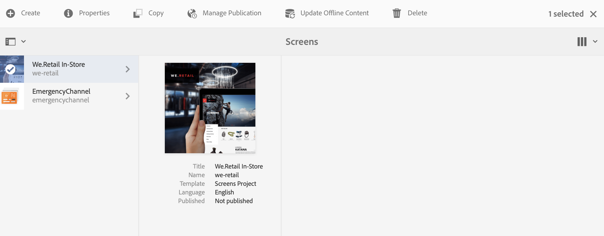

# Atualização de conteúdo sob demanda {#on-demand}

Esta seção descreve conteúdo sob demanda para gerenciar publicações.

## Gerenciar publicação: entregar atualizações de conteúdo do autor para a publicação no dispositivo {#managing-publication-delivering-content-updates-from-author-to-publish-to-device}

Você pode publicar e desfazer a publicação de conteúdo do AEM Screens. **Gerenciar publicação** permite que você forneça atualizações de conteúdo do autor para a publicação no dispositivo. Você pode publicar/desfazer a publicação de conteúdo para todo o projeto do AEM Screens ou apenas para um de seus canais, locais, dispositivos, aplicativos ou um agendamento.

### Gerenciar publicação de um projeto do AEM Screens {#managing-publication-for-an-aem-screens-project}

Siga as etapas abaixo para fornecer atualizações de conteúdo do autor para a publicação no dispositivo para um projeto do AEM Screens:

1. Navegue até o projeto do AEM Screens.
1. Clique em **Gerenciar publicação** na barra de ações para poder publicar o projeto na sua instância de Publicação.

   

1. O Assistente **Gerenciar Publicação** é aberto. Você pode clicar em **Ação** e também agendar o horário de publicação para agora ou depois. Clique em **Avançar**.

   

1. Marque a caixa para poder clicar em todo o projeto no assistente **`Manage Publication`**.

   

1. Clique em **+ Incluir filhos** na barra de ações e desmarque todas as opções para poder publicar todos os módulos em seu projeto e clique em **Adicionar** para publicar.

   >[!NOTE]
   >
   >Por padrão, todas as caixas são marcadas e você deve desmarcar manualmente as caixas para publicar todos os módulos no projeto.

   

   **Entender a caixa de diálogo Incluir Filhos**

   As etapas mencionadas acima mostram como você pode publicar todo o conteúdo. Caso deseje usar as outras três alternativas disponíveis, é necessário marcar essa opção específica.
Por exemplo, a imagem a seguir mostra como é possível gerenciar e atualizar somente as páginas modificadas no seu projeto:
   

   Siga as explicações abaixo para entender as opções disponíveis:

   1. **Incluir somente filhos imediatos**:
Essa opção permite gerenciar atualizações somente nos subnós na estrutura do projeto.
   1. **Incluir somente as páginas modificadas**:
Essa opção permite gerenciar atualizações somente nas páginas modificadas do projeto em que as alterações são encontradas na estrutura do projeto.
   1. **Incluir somente páginas já publicadas**:
Essa opção permite gerenciar atualizações somente nas páginas que foram publicadas antes.

1. No **`Manage Publication wizard`**, clique em **Publicar**.

   

   >[!NOTE]
   >
   >Aguarde alguns segundos/minutos para que o conteúdo atinja a instância de publicação.
   >
   >
   >    1. O fluxo de trabalho não funcionará se não houver alterações no projeto e nada em **Atualizar Conteúdo Offline**.
   >    1. O fluxo de trabalho não funcionará se o autor não concluir o processo de replicação (o conteúdo está sendo carregado na instância de publicação) após selecionar o botão **Publicar** no fluxo de trabalho de publicação de gerenciamento.

   >[!CAUTION]
   >Como criador de conteúdo, se quiser ver as alterações nos dispositivos anexados à instância do autor, clique em **Atualizar conteúdo offline** no painel do canal ou selecione o projeto. Nesse caso, a atualização do conteúdo offline é executada somente na instância do autor.

1. Navegue até o projeto e clique em **Atualizar Conteúdo Offline** na barra de ações. Essa ação encaminha o mesmo comando para a instância de publicação, para que os zips offline também sejam criados na instância de publicação.

   

   >[!NOTE]
   >
   >Depois de concluir o fluxo de trabalho de publicação de gerenciamento e se houver um player apontando para a instância do autor, acione a atualização do conteúdo offline no autor. Isso cria a atualização offline na instância do Autor.

   >[!CAUTION]
   >
   >Acione a atualização do conteúdo offline na instância do autor, se você tiver um reprodutor registrado no servidor do autor. A atualização de conteúdo offline não é necessária para o reprodutor registrado na instância de publicação.

### Gerenciar publicação de um canal {#managing-publication-for-a-channel}

Siga as etapas abaixo para fornecer atualizações de conteúdo de Autor > Publicar > dispositivo para um Canal em um projeto do AEM Screens:

>[!NOTE]
>
>Siga esta seção somente se houver alterações em um canal. Se um canal não tiver alterações após a atualização anterior do conteúdo offline, o fluxo de trabalho de publicação de gerenciamento para um canal individual não funcionará.

1. Navegue até o projeto do AEM Screens e clique no canal.
1. Clique em **Gerenciar publicação** na barra de ações para poder publicar o canal na sua instância de Publicação.

   

1. O Assistente **Gerenciar Publicação** é aberto. Você pode clicar em **Ação** e também agendar o horário de publicação para agora ou depois. Clique em **Avançar**.

   

1. Clique em **Publicar** no assistente **`Manage Publication`**.

   

   >[!NOTE]
   >
   >Aguarde alguns segundos/minutos para que o conteúdo atinja a instância de publicação.

1. O acionamento do **Atualizar Conteúdo Offline** no painel de canal apenas envia o conteúdo offline para a instância de Autor, mas não para a instância de Publicação. As etapas 1 a 4 são para enviar conteúdo offline para a instância de publicação.

   

   >[!CAUTION]
   >
   >Publique primeiro e acione a atualização do conteúdo offline conforme resumido nas etapas anteriores.

### Reatribuição de canal e dispositivo: {#channel-and-device-re-assignment}

Se você tiver reatribuído um dispositivo, publique a exibição inicial e a nova exibição, uma vez que o dispositivo tenha sido reatribuído à nova exibição.

Da mesma forma, se você tiver reatribuído um canal, publique a exibição inicial e a nova exibição depois que o canal for reatribuído à nova exibição.
