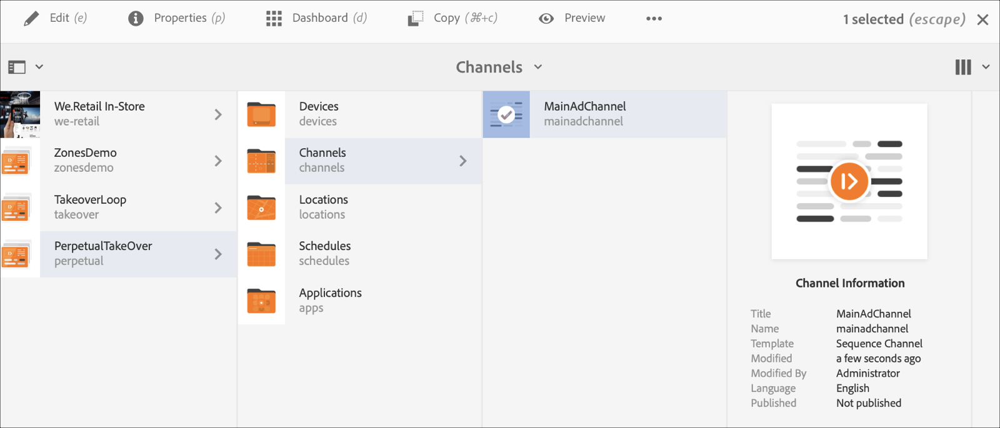
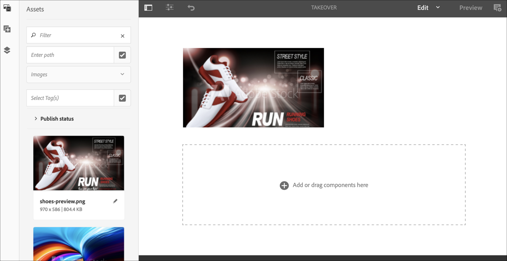
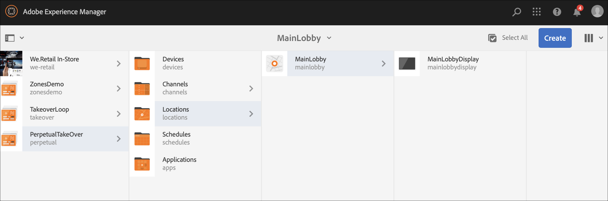
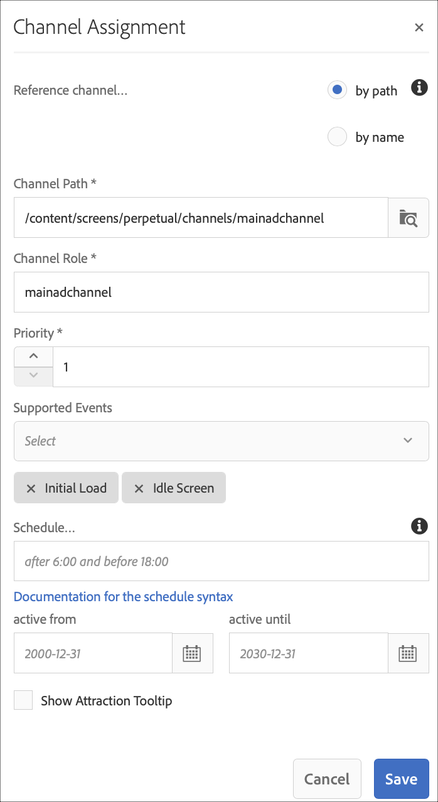

# Canal de aquisição permanente {#perpetual-takeover-channel}

>[!IMPORTANT]
>Esse conteúdo é válido para o AEM no local/AMS (AEM 6.5LTS e AEM 6.5). Para ver o conteúdo do AEM as a Cloud Service Screens, consulte o [guia do AEM as a Cloud Service](https://experienceleague.adobe.com/en/docs/experience-manager-cloud-service/content/screens-as-cloud-service/overview/introduction).

A página a seguir mostra um caso de uso que enfatiza a configuração de um projeto sobre como criar um canal TakeOver Permanente que é reproduzido continuamente por um dia e hora específicos.

## Descrição do caso de uso {#use-case-description}

Este caso de uso explica como criar um canal que *assume* do canal de reprodução normal para uma exibição ou grupo de exibições. A tomada de controle ocorre para um dia e hora específicos perpetuamente.
Por exemplo, há um canal de TakeOver Permanente que é reproduzido todas as sextas-feiras, das 9h00 às 10h30. Durante esse tempo, nenhum outro canal deve ser reproduzido. O exemplo a seguir mostra a criação de um canal de aquisição permanente que permite que o conteúdo seja reproduzido todas as quartas-feiras por duas horas, das 2:00 às 16:00.:00:00

### Pré-condições {#preconditions}

Antes de iniciar este caso de uso, verifique se você sabe como:

* **[Criar e Gerenciar Canais](managing-channels.md)**
* **[Criar e Gerenciar Locais](managing-locations.md)**
* **[Criar e Gerenciar Agendamentos](managing-schedules.md)**
* **[Registro do dispositivo](device-registration.md)**

### Atores principais {#primary-actors}

Autores de conteúdo

## Configuração do projeto {#setting-up-the-project}

Siga as etapas abaixo para configurar um projeto:

**Configurando os Canais e a Exibição**

1. Crie um projeto do AEM Screens intitulado como **PerpetualTakeOver**, conforme mostrado abaixo.

   

1. Crie um **MainAdChannel** na pasta **Channels**.

   

1. Clique em **MainAdChannel** e em **Editar** na barra de ações. Arraste e solte alguns ativos (imagens, vídeos, sequências incorporadas) no seu canal.

   

   >[!NOTE]
   >O **MainAdChannel** deste exemplo demonstra um canal de sequência que reproduz o conteúdo continuamente.

1. Crie um canal **TakeOver** que controle o conteúdo no **MainAdChannel** e seja reproduzido toda quarta-feira das 2:00 às 16:00.

1. Clique em **Assumir controle** e em **Editar** na barra de ações. Arraste e solte alguns ativos no seu canal. O exemplo a seguir mostra uma única imagem de zona adicionada a esse canal.

   

1. Configure um local e uma exibição para seus canais. Por exemplo, o seguinte local **MainLobby** e exibição **MainLobbyDisplay** estão configurados para este projeto.

   

**Atribuindo Canais a uma Exibição**

1. Clique na exibição **MainLobbyDisplay** da pasta **Locations**. Clique em **Atribuir canal** na barra de ações para que você possa abrir a caixa de diálogo **Atribuição de canal**.

   >[!NOTE]
   >Para saber como atribuir um canal a uma exibição, consulte **[Atribuição de canal](channel-assignment.md)**.

1. Preencha os campos (**Caminho do Canal**, **Prioridade** e **Eventos com Suporte**) da caixa de diálogo **Atribuição de Canal** e clique em **Salvar** para atribuir o **MainAdChannel** à sua exibição.

   * **Caminho do canal**: clique no caminho para o canal **MainAdChannel**
   * **Prioridade**: defina a prioridade deste canal como 1.
   * **Eventos com Suporte**: Clique em **Carregamento Inicial** e **Tela Inativa**.

   

1. Clique na exibição **TakeOver** da pasta **Locations**. Clique em **Atribuir canal** na barra de ações para poder atribuir o canal de tomada.

1. Atribuindo o canal **TakeOver** à exibição em um horário agendado. Em seguida, preencha os seguintes campos a partir da caixa de diálogo **Atribuição de canal** e selecione **Salvar**:

   * **Caminho do canal**: clique no caminho para o canal **TakeOver**
   * **Prioridade**: defina a prioridade deste canal como maior que **MainAdChannel**. Por exemplo, a prioridade definida neste exemplo é 8.
   * **Eventos com Suporte**: Clique em **Tela Inativa** e **Timer**.
   * **Agendar**: digite o texto do agendamento que você deseja que este canal execute na exibição. O texto na **Agenda** mencionada neste exemplo é *na quarta-feira depois de 14:00 e antes de 16:00*.

     >[!NOTE]
     >Para saber mais sobre as expressões que você pode adicionar ao **Cronograma**, consulte a seção [Expressões de Exemplo](#example-expressions) abaixo.
   * **ativo de**: data e hora de início.
   * **ativo até**: data e hora final.

     Por exemplo, o texto em **Agenda** e **ativa de** e **ativa até** data e hora aqui permite que o conteúdo seja reproduzido toda quarta-feira das 2:00 P.M. até as 4:00 P.M.

     

     Navegue até a exibição em **TakeOver** > **Locations** > **MainLobby** > **MainLobbyDisplay**. Em seguida, clique em **Dashboard** na barra de ações para poder exibir os canais atribuídos com suas prioridades, conforme mostrado abaixo.

     >[!NOTE]
     >É obrigatório definir a prioridade do canal de aquisição como a mais alta.

     
Agora, o canal **TakeOver** assume o **MainAdChannel** às 2:00 P.M. por duas horas até as 4:00 P.M. de quarta-feira e reproduz o conteúdo de 9 de janeiro de 2020 até 31 de janeiro de 2020.

## Expressões de exemplo {#example-expressions}

A tabela a seguir resume algumas expressões de exemplo que você pode adicionar ao agendamento ao atribuir um canal a uma exibição.

| **Expressão** | **Interpretação** |
|---|---|
| antes das 8:00 | o canal é reproduzido antes das 8:00 da manhã todos os dias |
| depois das 2:00 P.M. | o canal é reproduzido depois das 2:00 da tarde todos os dias |
| após 12:15 e antes de 12:45 | o canal é reproduzido diariamente após as 12h00 por 30 minutos:15 |
| antes de 12:15 também depois de 12:45 | o canal é reproduzido antes das 12h00 todos os dias e também depois das 12h10.:15:45 |
| no primeiro dia de janeiro após as 2:00 P.M., também no segundo dia de janeiro e também no terceiro dia de janeiro antes das 3:00 A.M. | o canal começa a ser reproduzido depois das 2:00 P.M. de 01 de janeiro, continua a ser reproduzido durante todo o dia de 02 de janeiro até às 3:00 A.M. de 03 de janeiro |
| nos dias 1-2 de janeiro após as 2:00 P.M. também nos dias 2-3 de janeiro antes das 3:00 a.m. | o canal inicia o player após as 2:00 P.M. em 01 de janeiro, continua a jogar até as 3:00 A.M. em 02 de janeiro, em seguida, começa novamente em 02 de janeiro às 2:00 P.M. e continua a jogar até as 3:00 A.M. em 03 de janeiro |

>[!NOTE]
>
>Você também pode usar a notação _tempo militar_ (14:00) em vez de *A.M./P.M.* (2:00 P.M.).
