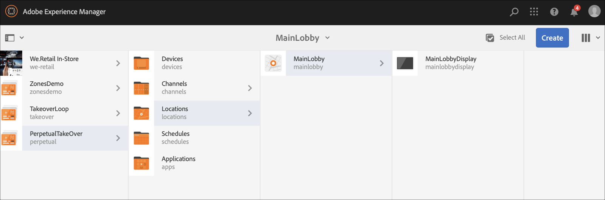

# Canal de Assumição Perpétua {#perpetual-takeover-channel}

A página a seguir mostra um caso de uso que enfatiza a configuração de um projeto sobre como criar um canal de Tomada Perpétua que é reproduzido continuamente por um dia e hora específicos.

## Descrição do caso de uso {#use-case-description}

Este caso de uso explica como criar um canal que *assume* o controle do canal de reprodução normal para um monitor ou grupo de monitores. A aquisição ocorrerá por um dia e hora específicos, perpetuamente.
Por exemplo, há um canal de TakeOver Perpetual que é reproduzido todas as sextas-feiras das 9h às 10h. Durante esse tempo, nenhum outro canal deve ser reproduzido. O exemplo a seguir mostra a criação de um canal de aquisição perpétuo que é reproduzido permite que o conteúdo seja reproduzido toda quarta-feira por 2 horas, das 17h às 19h.

### Condições prévias {#preconditions}

Antes de iniciar este caso de uso, certifique-se de saber como:

* **[Criar e gerenciar canais](managing-channels.md)**
* **[Criar e gerenciar locais](managing-locations.md)**
* **[Criar e gerenciar programações](managing-schedules.md)**
* **[Registro do dispositivo](device-registration.md)**

### Principais intervenientes {#primary-actors}

Autores de conteúdo

## Configuração do projeto {#setting-up-the-project}

Siga as etapas abaixo para configurar um projeto:

**Configuração dos canais e do monitor**

1. Crie um projeto do AEM Screens intitulado como **PerpetualTakeOver**, como mostrado abaixo.

   

1. Crie um **MainAdChannel** na pasta **Canais** .

   

1. Selecione **MainAdChannel** e clique em **Editar** na barra de ações. Arraste e solte alguns ativos (imagens, vídeos, sequências incorporadas) no seu canal.

   

   >[!NOTE]
   >O **MainAdChannel** neste exemplo demonstra um canal de sequência que reproduz conteúdo continuamente.

1. Crie um canal **TakeOver** que assuma o conteúdo no **MainAdChannel** e será reproduzido todas as quartas-feiras das 14:00 às 16:00.

1. Selecione a opção **Assumir** e clique em **Editar** na barra de ações. Arraste e solte alguns ativos em seu canal. O exemplo a seguir mostra uma única imagem de zona adicionada a este canal.

   

1. Configure um local e exibição para seus canais. Por exemplo, a seguinte localização **MainLobby** e exibição **MainLobbyDisplay** está configurada para este projeto.

   

**Atribuindo canais a uma exibição**

1. Selecione a exibição **MainLobbyDisplay** na pasta **Locais** . Clique em **Atribuir canal** na barra de ações para abrir a caixa de diálogo Atribuição **de** canal.

   >[!NOTE]
   >Para saber como atribuir um canal a uma exibição, consulte Atribuição **[de](channel-assignment.md)**canal.

1. Preencha os campos (Caminho **do** canal, **Prioridade** e Eventos **** suportados) da caixa de diálogo Atribuição **de** canal e clique em **Salvar** **** para atribuir oMainAdChannel a sua exibição.

   * **Caminho** do canal: Selecione o caminho para o canal **MainAdChannel**
   * **Prioridade**: Defina a prioridade deste canal como 1.
   * **Eventos** suportados: Selecione a Carga **** inicial e a Tela **inativa**.
   

1. Selecione a exibição **Assumir** da pasta **Locais** . Clique em **Atribuir canal** na barra de ações para atribuir o canal de aquisição.

1. Para atribuir o canal **TakeOver** à exibição em um horário agendado, preencha os seguintes campos na caixa de diálogo Atribuição **de** canal e clique em **Salvar**:

   * **Caminho** do canal: Selecione o caminho para o canal **TakeOver**
   * **Prioridade**: Defina a prioridade deste canal maior que o **MainAdChannel**. Por exemplo, a prioridade definida neste exemplo é 8.
   * **Eventos** suportados: Selecione Tela **** inativa e **Temporizador**.
   * **Agendamento**: Insira o texto para o agendamento no qual você deseja que este canal execute a exibição. Por exemplo, o texto aqui permite que o conteúdo seja reproduzido toda quarta-feira das 14:00 às 16:00.
O texto da **Programação** mencionada neste exemplo é *na quarta-feira depois das 14:00 e antes das 16:00*.

      

      Navegue até a exibição de **TakeOver** —> **Locations** —> **MainLobby** —> **MainLobbyDisplay** e clique em **Dashboard** na barra de ações para exibir os canais atribuídos com suas prioridades, como mostrado abaixo.

      >[!NOTE]
      >É obrigatório definir a prioridade mais elevada do canal de aquisição.

      Agora, o canal **TakeOver** assumirá o **MainAdChannel** às 14:00 horas por duas horas até às 16:00 todas as quartas-feiras e reproduzirá seu conteúdo de 9 de janeiro de 2020 a 31 de janeiro de 2020.

### Expressões de exemplo {#example-expressions}

A tabela a seguir resume algumas expressões de exemplo que podem ser adicionadas ao agendamento enquanto o canal é atribuído a uma exibição.

| **Expressão** | **Interpretação** |
|---|---|
| depois das 12:15 e antes das 12:45 | o canal é reproduzido depois das 12h15 todos os dias por 30 minutos |
