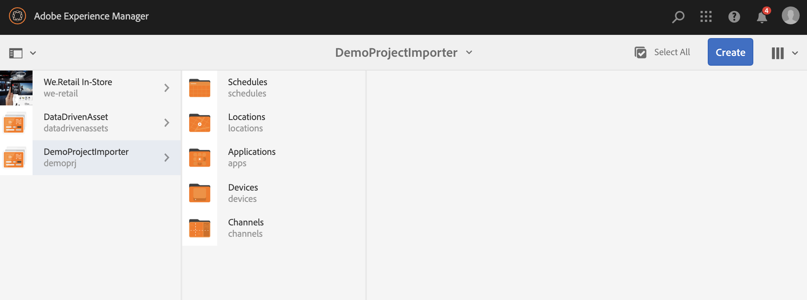

# Novo importador de projeto do arquivo {#new-project-importer-from-file}

Esta seção descreve uma funcionalidade para importar em massa um conjunto de locais de uma planilha CSV/XLS para o projeto do AEM Screens.

## Introdução {#introduction}

Ao configurar um projeto do AEM Screens pela primeira vez em sua organização, crie todos os locais também. Se o seu projeto envolve muitos locais, ele resulta em uma tarefa tediosa que envolve muita seleção e espera na interface do usuário.

O objetivo desse recurso é reduzir o tempo necessário para configurar o projeto e, portanto, resolver problemas de orçamento.

Ao permitir que o autor forneça uma planilha como um arquivo de entrada e que o sistema crie automaticamente a árvore de local no back-end, esse recurso:

* *atinge um desempenho muito melhor do que selecionar manualmente por meio da interface*
* O *permite que o cliente exporte os locais que possui de seu próprio sistema e os importe facilmente diretamente do AEM*

Esse processo economiza tempo e dinheiro durante a configuração inicial do projeto ou ao estender o AEM Screens existente para novos locais.

## Visão geral da arquitetura {#architectural-overview}

O diagrama a seguir mostra a visão geral da arquitetura do recurso Importador de projetos:

### Modelo de dados {#data-model}

O modelo de dados para o Importador de projetos é descrito abaixo:

>[!NOTE]
>
>A versão atual oferece suporte apenas para a importação de locais.

| **Propriedade** | **Descrição** |
|---|---|
| ***`path {string*}`*** | O caminho do recurso para o local |
| ***`[./jcr:title] {string*}`*** | O nome do modelo a ser usado (isto é, o local para *telas/núcleo/modelos/local*) |
| ***`template {string}`*** | Título opcional para usar na página |
| ***`[./jcr:description] {string}`*** | Descrição opcional para usar na página |

O arquivo de planilha (CSV/XLS) requer, portanto, as seguintes colunas:

* **caminho{string}** - O caminho do local a ser importado, onde a raiz do caminho é a pasta do local do projeto (ou seja, *`/foo`* é importado para *`/content/screens/<project>/locations/foo`*)
* **modelo{string}** - O modelo a ser usado para o novo local; por enquanto, o único valor permitido é &quot;local&quot;, mas esse valor será estendido para todos os `Screens` modelos no futuro (`display`, `sequencechannel` e assim por diante)
* **[./*] {string}** - Qualquer propriedade opcional a ser definida no local (ou seja, `./jcr:title`, `./jcr:description`, `./foo, ./bar`). A versão atual não permite filtragem.

>[!NOTE]
>
>Qualquer coluna que não corresponda às condições acima será ignorada. Por exemplo, se você tiver qualquer outra coluna definida no arquivo de planilha (CSV/XLS) diferente de **caminho**, **modelo**, **título** e **descrição** no arquivo, esses campos serão ignorados. E o **Importador de Projetos** não valida esses campos adicionais para importar seu projeto para o projeto do AEM Screens.

## Usando o importador de projeto {#using-project-importer}

A seção a seguir descreve como o Importador de projeto é usado em um projeto do AEM Screens.

>[!CAUTION]
>
>Limitações:
>
>* Arquivos diferentes das extensões CSV/XLS/XLSX não são compatíveis com a versão atual.
>* Não existe filtragem das propriedades para arquivos importados e nada que comece com &quot;./&quot; é importado.
>

### Pré-requisitos {#prerequisites}

* Crie um projeto intitulado como **DemoProjectImport**

* Use um arquivo CSV ou Excel de amostra que você deve importar.

Para fins de demonstração, você pode baixar um arquivo do Excel na seção abaixo.

[Obter arquivo](assets/minimal-file.xls)

### Importação do arquivo com campos mínimos obrigatórios {#importing-the-file-with-minimum-required-fields}

Siga as etapas abaixo para importar um arquivo para uma pasta de local com os campos mínimos necessários:

>[!NOTE]
>
>O exemplo a seguir mostra os quatro campos mínimos necessários para importar seu projeto:

1. Navegue até o projeto do AEM Screens (**DemoProjectImport**).

   

1. Clique no projeto,**&#x200B; DemoProjectImporter &#x200B;**>**&#x200B; Criar &#x200B;**>**&#x200B; Importar locais** da barra lateral.

   

1. O assistente **Import** é exibido. Clique no arquivo do seu projeto com locais ou clique no arquivo (***minimal-file.xls***) que você baixou da seção *Pré-requisitos*.

   Após selecionar o arquivo, clique em **Avançar**.

   

1. Verifique o conteúdo do arquivo (locais) no assistente de Importação e clique em **Importar**.

   

1. Como resultado, agora é possível exibir todos os locais importados para o projeto.

   
