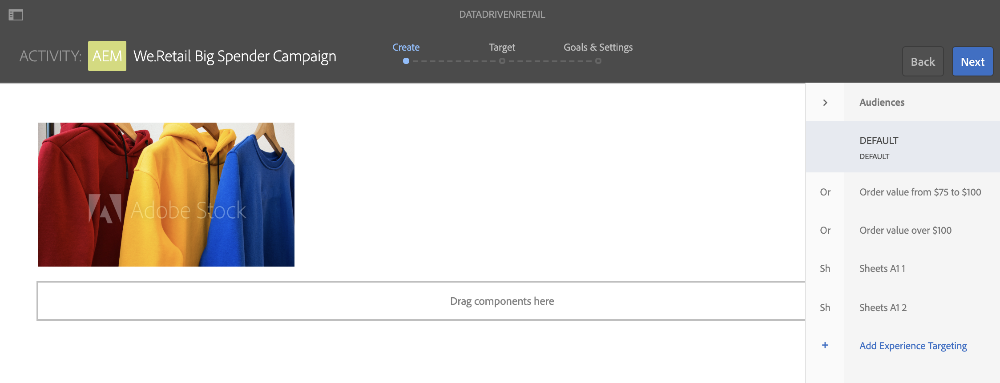

# Ativação direcionada para inventário de varejo {#retail-inventory-targeted-activation}

O caso de uso a seguir demonstra três imagens diferentes com base nos valores em sua planilha do Google.

## Descrição {#description}

Este caso de uso mostra o estoque de varejo para três camisas de suor diferentes. Dependendo do número de camisas disponíveis em estoque que são gravadas nas planilhas do Google, a imagem (camiseta vermelha, verde ou azul) com o número mais alto é exibida na tela.

Neste caso de uso, o suéter vermelho, verde ou azul será exibido na tela com base no valor mais alto do número de suéteres disponíveis.

## Pré-condições {#preconditions}

Antes de começar a implementar a ativação de direcionamento do inventário de varejo, você deve aprender a configurar ***Data Store***, ***Segmentação de público-alvo*** e ***Ativar direcionamento para canais*** em um projeto do AEM Screens.

Consulte [Configuração do ContextHub no AEM Screens](configuring-context-hub.md) para obter informações detalhadas.

## Fluxo básico {#basic-flow}

Siga as etapas abaixo para implementar o caso de uso de Ativação de inventário de varejo:

1. **Preencher as planilhas do Google**

   1. Navegue até o ContextHubDemo Google Sheet.
   1. Adicione três colunas (Vermelho, Verde e Azul) com os valores correspondentes para três camisas diferentes.

   

1. **Configuração dos públicos-alvo de acordo com os requisitos**

   1. Navegue até os segmentos em seu público-alvo (Consulte ***Etapa 2: Configuração da segmentação de público-alvo*** em **[Configuração do ContextHub na página AEM Screens](configuring-context-hub.md)** para obter mais detalhes).

   1. Adicione três novos segmentos **For_Red**, **For_Green** e **For_Blue**.

   1. Selecione **For_Red** e clique em **Editar** na barra de ações.

   1. Arraste e solte a **Comparação : Propriedade - Propriedade** para o editor e clique no ícone de configuração para editar as propriedades.
   1. Selecione **googlesheets/value/1/2** no menu suspenso em **Nome da primeira propriedade**

   1. Selecione **Operator** como **greater-than** no menu suspenso

   1. Selecione **Tipo de Dados** como **número**

   1. Selecione **googlesheets/value/1/1** no menu suspenso em **Second Property name**.

   1. Arraste e solte **outra Comparação : Propriedade - Propriedade** para o editor e clique no ícone de configuração para editar as propriedades.
   1. Selecione **googlesheets/value/1/2** no menu suspenso em **Nome da primeira propriedade**.

   1. Selecione **Operator** como **greater-than** no menu suspenso

   1. Selecione **Tipo de Dados** como **número**

   1. Selecione **googlesheets/value/1/0** no menu suspenso em **Second Property name**

   

   Da mesma forma, edite e adicione regras de propriedade de comparação ao segmento **For_Blue**, conforme mostrado na figura abaixo:

   

   Da mesma forma, edite e adicione regras de propriedade de comparação a ** Para_verde **segmento, conforme mostrado na figura abaixo:

   

   >[!NOTE]
   >
   >Você observará que, para segmentos **For_Green** e **For_Green**, os dados não podem ser resolvidos no editor, pois apenas a primeira comparação é válida a partir de agora, de acordo com os valores na Folha do Google.

1. Navegue e selecione seu canal **DataDrivenRetail** (um canal sequencial) e clique em **Editar** na barra de ações.

   

   >[!CAUTION]
   >
   >Você deve ter configurado seu **ContextHub** **Configurações** usando a guia **Propriedades** —> **Personalização** do canal.

   

   >[!NOTE]
   Você deve selecionar a **Marca** e a **Área** para que as atividades sejam listadas corretamente ao iniciar o processo de Direcionamento.

1. **Adição de uma imagem padrão**

   1. Adicione uma imagem padrão ao seu canal e clique em **Direcionamento**.
   1. Selecione **Marca** e **Atividade** no menu suspenso e clique em **Iniciar Direcionamento**.

   1. Clique em **Iniciar o direcionamento**.

   

   >[!NOTE]
   Antes de começar a direcionar, você deve adicionar os segmentos (**For_Green**, **For_Red** e **For_Blue**) clicando em **+ Adicionar Direcionamento de experiência** no painel lateral, como mostrado na figura abaixo.

   

1. Adicione as imagens a todos os três cenários diferentes, conforme mostrado abaixo.

   

1. **Verificar a visualização**

   1. Clique em **Visualizar.** Além disso, abra o Google Sheet e atualize seu valor.
   1. Altere o valor de todas as três colunas diferentes e você notará as atualizações de imagem de exibição de acordo com o valor mais alto no inventário.

   

