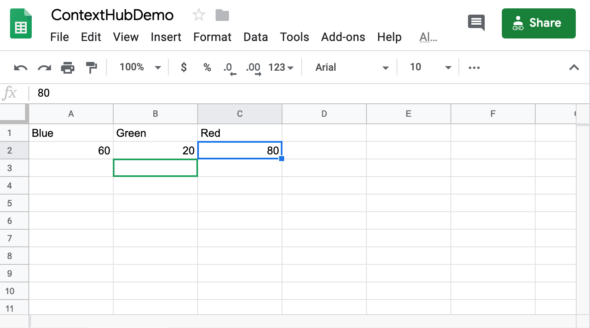
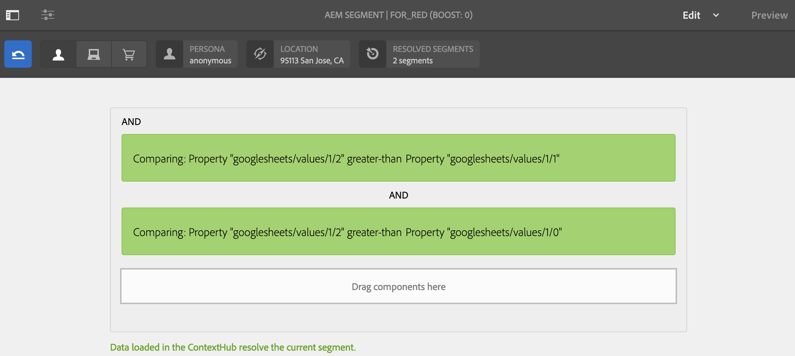
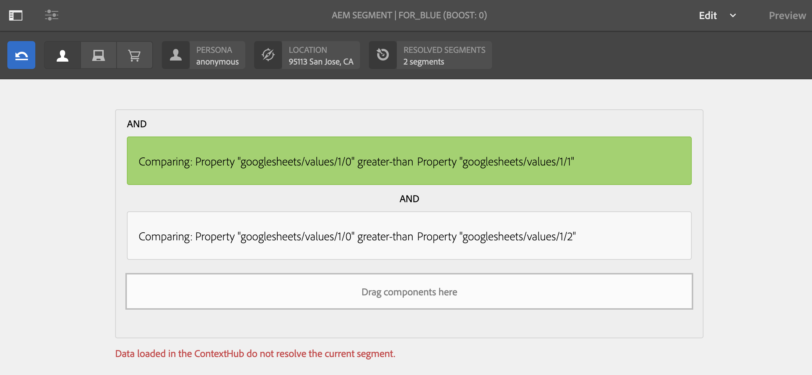
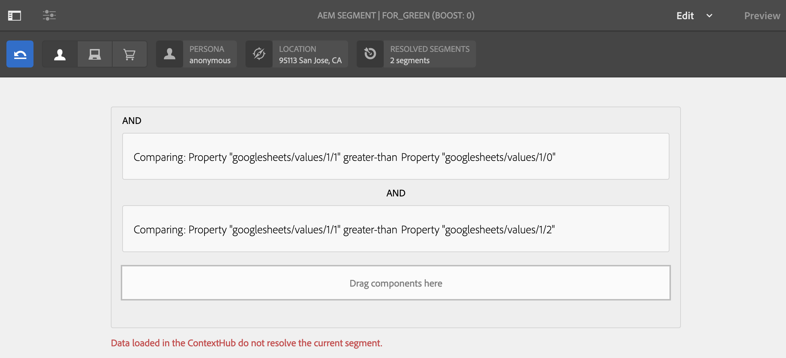
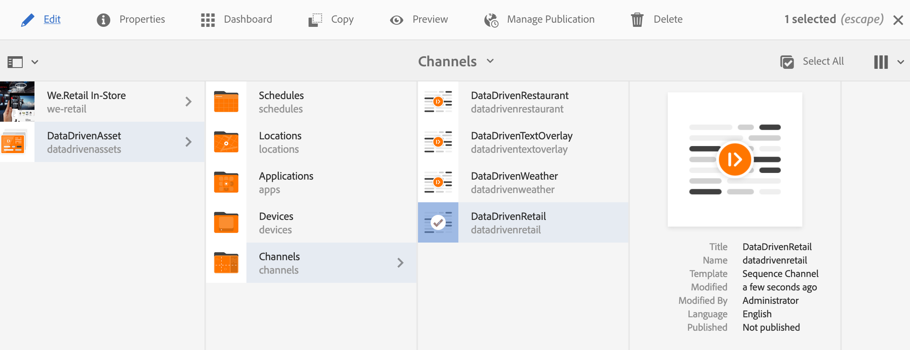
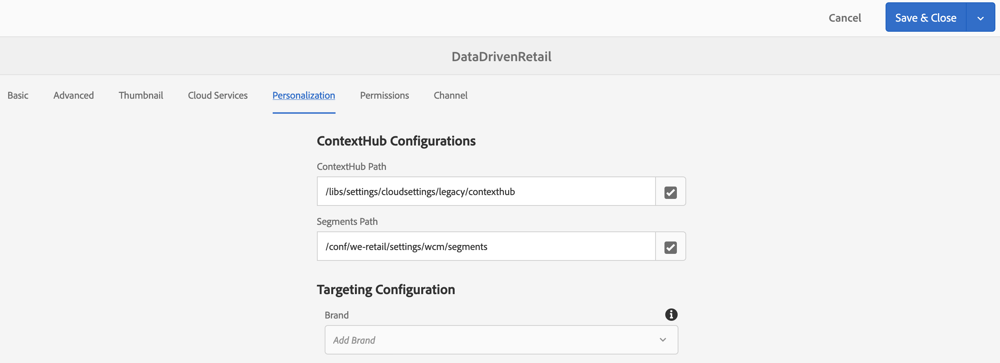
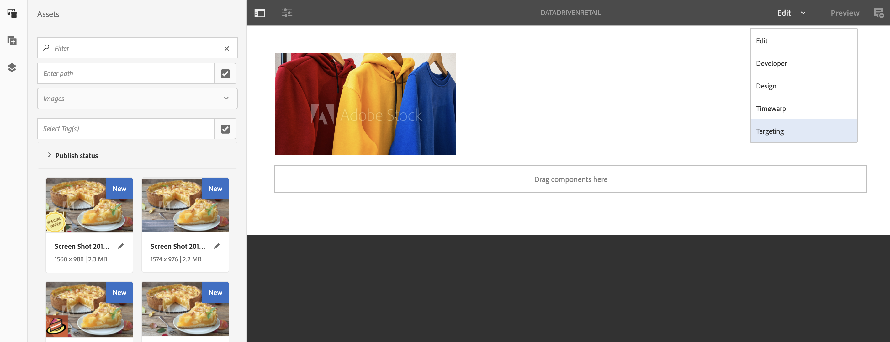
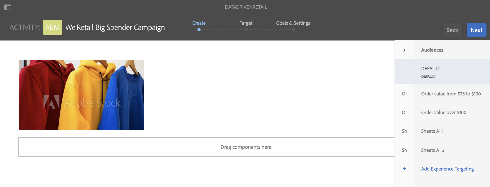
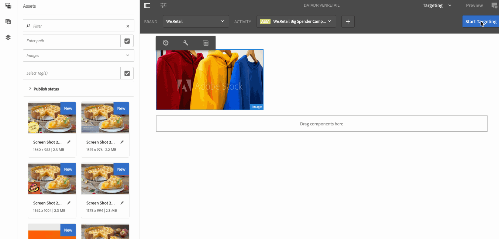
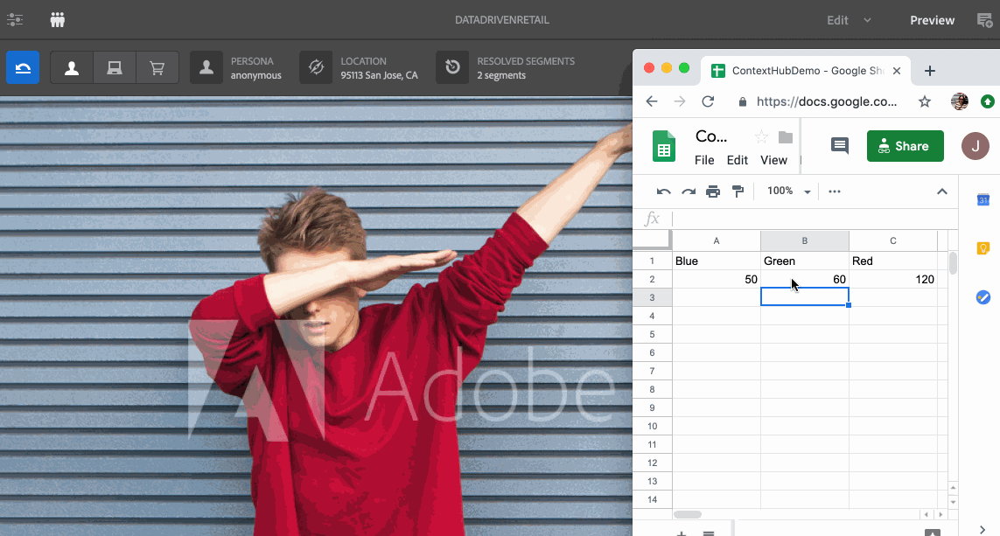

# Ativação Direcionada de Estoque de Varejo {#retail-inventory-targeted-activation}

>[!IMPORTANT]
>Esse conteúdo é válido para o AEM no local/AMS (AEM 6.5LTS e AEM 6.5). Para ver o conteúdo do AEM as a Cloud Service Screens, consulte o [guia do AEM as a Cloud Service](https://experienceleague.adobe.com/en/docs/experience-manager-cloud-service/content/screens-as-cloud-service/overview/introduction).

O caso de uso a seguir demonstra três imagens diferentes com base nos valores na sua Planilha do Google.

## Descrição {#description}

Este caso de uso mostra o estoque de estoque de estoque de varejo para três camisetas coloridas diferentes. Dependendo do número de camisetas disponíveis em estoque gravadas no Google Sheets, a imagem (camiseta vermelha, verde ou azul) com o número mais alto será exibida.

O suéter Vermelho, Verde ou Azul é exibido com base no valor mais alto do número de suéteres disponíveis.

## Pré-condições {#preconditions}

Antes de começar a implementar a ativação de direcionamento de estoque de varejo, saiba como configurar o ***Armazenamento de dados***, a ***Segmentação de público*** e a ***Habilitar o direcionamento para Canais*** em um projeto do AEM Screens.

Consulte [Configurando o ContextHub no AEM Screens](configuring-context-hub.md) para obter informações detalhadas.

## Fluxo básico {#basic-flow}

Siga as etapas abaixo para implementar o caso de uso de Ativação de Inventário de Varejo:

1. **Preenchendo as Planilhas Google**

   1. Navegue até a Folha de Google ContextHubDemo.
   1. Adicione três colunas (vermelha, verde e azul) com valores correspondentes para três sweatshirts diferentes.

   

1. **Configurando os Públicos de acordo com os requisitos**

   1. Navegue até os segmentos no seu público-alvo (Consulte ***Etapa 2: Configuração da segmentação de público-alvo*** na página **[Configuração do ContextHub no AEM Screens](configuring-context-hub.md)** para obter mais detalhes).

   1. Adicione três novos segmentos **Para_Vermelho**, **Para_Verde** e **Para_Azul**.

   1. Clique em **For_Red** e em **Editar** na barra de ações.

   1. Arraste e solte a **Comparação: Propriedade - Propriedade** no editor.
   1. Clique no ícone **Configuração**.
   1. Clique em **googlesheets/value/1/2** no menu suspenso em **Nome da Primeira Propriedade**.
   1. Clique no **Operador** e como **maior que** no menu suspenso.
   1. Clique em **Tipo de Dados** e como **número**.
   1. Clique em **googlesheets/value/1/1** na lista suspensa em **Nome da segunda propriedade**.
   1. Arraste e solte **outra Comparação: Propriedade - Propriedade** no editor e clique no ícone **Configuração**.
   1. Clique em **googlesheets/value/1/2** no menu suspenso em **Nome da Primeira Propriedade**.
   1. Clique no **Operador** e como **maior que** no menu suspenso.
   1. Clique em **Tipo de Dados** e como **número**.
   1. Clique em **googlesheets/value/1/0** na lista suspensa em **Nome da segunda propriedade**.

   

   Da mesma forma, edite e adicione regras de propriedade de comparação ao segmento **For_Blue**, conforme mostrado na figura abaixo:

   

   Da mesma forma, edite e adicione regras de propriedade de comparação ao segmento **For_Green**, conforme mostrado na figura abaixo:

   

   >[!NOTE]
   >
   >Observe que para os segmentos **For_Green** e **For_Green**, os dados não podem ser resolvidos no editor, pois somente a primeira comparação é válida a partir de agora, de acordo com os valores na Planilha do Google.

1. Navegue e clique no canal **DataDrivenRetail** (um canal de sequência).
1. Clique em **Editar** na barra de ações.

   

   >[!CAUTION]
   >
   >Você já deve ter configurado suas **Configurações do** ContextHub **** usando a guia **Propriedades** > **Personalization** do canal.

   

   >[!NOTE]
   >
   >Clique na **Marca** e na **Área** para que as atividades sejam listadas corretamente quando você iniciar o processo de Direcionamento.

1. **Adicionando uma imagem padrão**

   1. Adicione uma imagem padrão ao canal e clique em **Direcionamento**.
   1. Clique em **Marca** e na **Atividade** no menu suspenso e clique em **Iniciar o Direcionamento**.
   1. Clique em **Iniciar o direcionamento**.

   

   >[!NOTE]
   >
   >Antes de começar o direcionamento, adicione os segmentos (**For_Green**, **For_Red** e **For_Blue**) selecionando **+ Adicionar direcionamento de experiência** no painel lateral, como mostrado na figura abaixo.

   

1. Adicione as imagens a todos os três cenários diferentes, conforme mostrado abaixo.

   

1. **Verificando a Visualização**

   1. Clique em **Visualizar.** Além disso, abra a Planilha do Google e atualize o valor.
   1. Altere o valor de todas as três colunas diferentes. Observe as atualizações de imagem de exibição de acordo com o valor mais alto no inventário.

   
