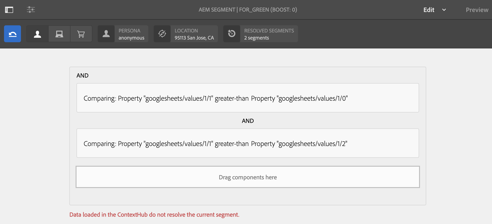
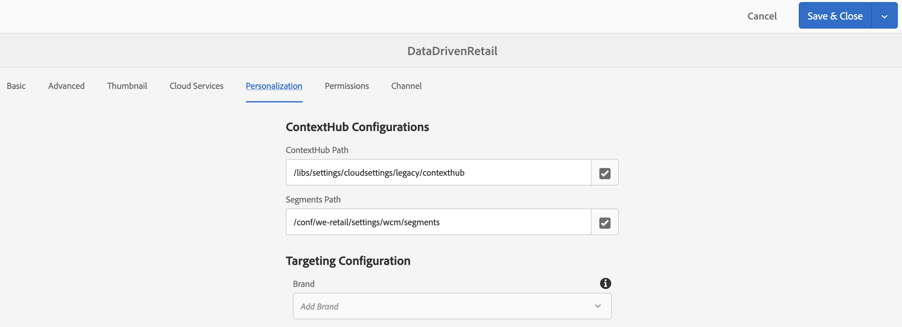

# Ativação Direcionada de Estoque de Varejo {#retail-inventory-targeted-activation}

O caso de uso a seguir demonstra três imagens diferentes com base nos valores na sua Planilha do Google.

## Descrição {#description}

Este caso de uso mostra o estoque de inventário de varejo para três camisetas coloridas diferentes. Dependendo do número de camisetas disponíveis em estoque gravadas no Google Sheets, a imagem (camiseta vermelha, verde ou azul) com o número mais alto é exibida na tela.

Para este caso de uso, o suéter vermelho, verde ou azul é exibido em sua tela com base no valor mais alto do número de suéteres disponíveis.

## Pré-condições {#preconditions}

Antes de começar a implementar a ativação de direcionamento de estoque de varejo, saiba como configurar ***Armazenamento de dados***, ***Segmentação de público*** e ***Ativar o direcionamento para canais*** em um projeto do AEM Screens.

Consulte [Configuração do ContextHub no AEM Screens](configuring-context-hub.md) para obter informações detalhadas.

## Fluxo básico {#basic-flow}

Siga as etapas abaixo para implementar o caso de uso de Ativação de Inventário de Varejo:

1. **Preencher as planilhas do Google**

   1. Navegue até a Folha de Google ContextHubDemo.
   1. Adicione três colunas (vermelha, verde e azul) com valores correspondentes para três sweatshirts diferentes.

   

1. **Configuração dos públicos de acordo com os requisitos**

   1. Navegue até os segmentos no seu público-alvo (Consulte ***Etapa 2: Configuração da segmentação de público*** in **[Configuração do ContextHub no AEM Screens](configuring-context-hub.md)** para obter mais detalhes).

   1. Adicionar três novos segmentos **Para_vermelho**, **For_Green**, e **For_Blue**.

   1. Selecionar **Para_vermelho** e selecione **Editar** na barra de ações.

   1. Arraste e solte a variável **Comparação : Propriedade - Propriedade** ao editor.
   1. Selecione o **Configuração** ícone.
   1. Selecionar **googlesheets/value/1/2** no menu suspenso em **Nome da primeira propriedade**.
   1. Selecione o **Operador** as **maior que** no menu suspenso.
   1. Selecionar **Tipo de dados** as **número**.
   1. Selecionar **googlesheets/value/1/1** no menu suspenso em **Nome da segunda propriedade**.
   1. Arrastar e soltar **outra Comparação : Propriedade - Propriedade** ao editor e selecione a variável **Configuração** ícone.
   1. Selecionar **googlesheets/value/1/2** no menu suspenso em **Nome da primeira propriedade**.
   1. Selecione o **Operador** as **maior que** no menu suspenso.
   1. Selecionar **Tipo de dados** as **número**.
   1. Selecionar **googlesheets/value/1/0** no menu suspenso em **Nome da segunda propriedade**.

   

   Da mesma forma, edite e adicione regras de propriedade de comparação a **For_Blue** conforme mostrado na figura abaixo:

   

   Da mesma forma, edite e adicione regras de propriedade de comparação a **For_Green** conforme mostrado na figura abaixo:

   

   >[!NOTE]
   >
   >Observe que para segmentos **For_Green** e **For_Green**, os dados não podem ser resolvidos no editor, pois somente a primeira comparação é válida a partir de agora, de acordo com os valores na Planilha do Google.

1. Navegue e selecione o **DataDrivenRetail** canal (um canal de sequência).
1. Selecionar **Editar** na barra de ações.

   

   >[!CAUTION]
   >
   >Você deveria ter configurado seu **ContextHub** **Configurações** uso do canal **Propriedades** > **Personalização** guia.

   

   >[!NOTE]
   >
   >Selecione ambas as opções **Marca** e a variável **Área** para que as atividades sejam listadas corretamente ao iniciar o processo de direcionamento.

1. **Adição de uma imagem padrão**

   1. Adicione uma imagem padrão ao canal e selecione **Direcionamento**.
   1. Selecionar **Marca** e a variável **Atividade** no menu suspenso e selecione **Iniciar o direcionamento**.
   1. Selecione **Iniciar o direcionamento**.

   

   >[!NOTE]
   >
   >Antes de começar o direcionamento, adicione os segmentos (**For_Green**, **Para_vermelho**, e **For_Blue**) selecionando **+ Adicionar direcionamento de experiência** do painel lateral como mostrado na figura abaixo.

   

1. Adicione as imagens a todos os três cenários diferentes, conforme mostrado abaixo.

   

1. **Verificação da visualização**

   1. Selecionar **Visualizar.** Além disso, abra a Planilha do Google e atualize o valor.
   1. Altere o valor de todas as três colunas diferentes. Observe as atualizações de imagem de exibição de acordo com o valor mais alto no inventário.

   
