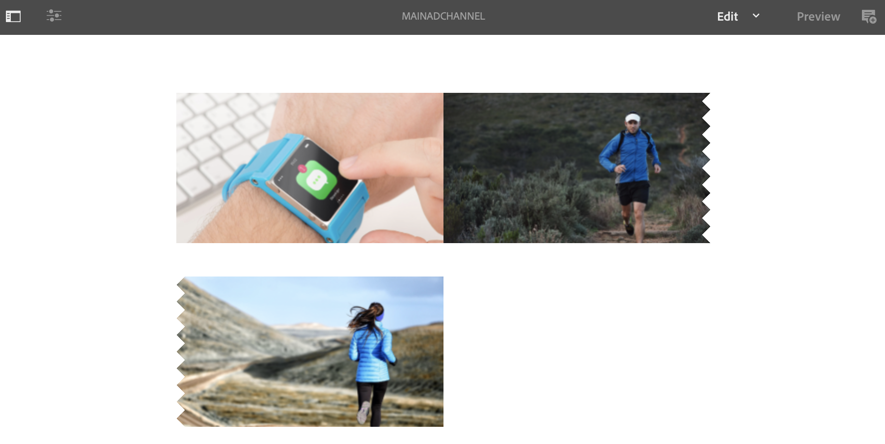

# Canal de tomada a cargo de uso único {#single-use-takeover-channel}

A página a seguir mostra um caso de uso que enfatiza a configuração de um projeto sobre como criar um único canal de TakeOver que é reproduzido apenas uma vez por um tempo específico.

## Descrição do caso de uso {#use-case-description}

Este caso de uso explica como criar um canal que *assume o controle* do canal que normalmente reproduz para uma exibição ou grupo de exibições. A aquisição só ocorrerá uma vez e por um período específico.
Por exemplo, há um único canal de TakeOver que é reproduzido na sexta-feira das 9h às 10h. Durante esse tempo, nenhum outro canal deve ser reproduzido. Antes e depois desse tempo, o canal de aquisição de uso único não será reproduzido. O exemplo a seguir mostra a criação de um único canal de aquisição que é reproduzido, permitindo que o conteúdo seja reproduzido por 2 minutos antes das 12h de 31 de dezembro até as 12h01.

### Pré-condições {#preconditions}

Antes de iniciar este caso de uso, verifique se você sabe como:

* **[Criar e gerenciar canais](managing-channels.md)**
* **[Criar e Gerenciar Locais](managing-locations.md)**
* **[Criar e gerenciar cronogramas](managing-schedules.md)**
* **[Registro do dispositivo](device-registration.md)**

### Atores principais {#primary-actors}

Autores de conteúdo

## Configuração do projeto {#setting-up-the-project}

Siga as etapas abaixo para configurar um projeto:

**Configuração de canais e exibição**

1. Crie um projeto do AEM Screens intitulado como **ControleDeUsoÚnico**, conforme mostrado abaixo.

   

1. Criar um **MainAdChannel** no **Canais** pasta.

   

1. Selecione o **MainAdChannel** e clique em **Editar** na barra de ações. Arraste e solte alguns ativos (imagens, vídeos, sequências incorporadas) no seu canal.

   

   >[!NOTE]
   >A variável **MainAdChannel** neste exemplo, demonstra um canal de sequência que reproduz conteúdo continuamente.

   

1. Criar um **AssumirControle** canal que assume o conteúdo no **MainAdChannel** e jogarão apenas por um dia e hora específicos.

1. Selecione o **AssumirControle** e clique em **Editar** na barra de ações. Arraste e solte alguns ativos no seu canal. O exemplo a seguir mostra uma única imagem de zona adicionada a esse canal.

   

1. Configure um local e uma exibição para seus canais. Por exemplo, o seguinte local **Lobby** e exibição **MainLobbyDisplay** está configurado para este projeto.

   

**Atribuição de Canais a uma Exibição**

1. Selecionar a exibição **MainLobbyDisplay** do **Localizações** pasta. Clique em **Atribuir canal** na barra de ações.

   

   >[!NOTE]
   >Para saber como atribuir um canal a uma exibição, consulte **[Atribuição de canal](channel-assignment.md)**.

1. Preencha os campos (**Caminho do canal**, **Prioridade**, e **Eventos suportados**) do **Atribuição de canal** e clique em **Salvar**. Agora você atribuiu o **MainAdChannel** para sua exibição.

   

1. Selecionar a exibição **AssumirControle** do **Localizações** pasta. Clique em **Atribuir canal** na barra de ações para atribuir o canal de aquisição de uso único.

1. Para atribuir a variável **AssumirControle** para exibir em um horário agendado e preencha os seguintes campos no **Atribuição de canal** e clique em **Salvar**:

   * **Caminho do canal**: selecione o caminho para o canal TakeOver
   * **Prioridade**: Defina a prioridade deste canal como maior que a **MainAdChannel**. Por exemplo, a prioridade definida neste exemplo é 8.

      >[!NOTE]
      >A prioridade pode ser qualquer valor maior que o valor de prioridade do canal que está sendo reproduzido normalmente.
   * **Eventos suportados**: selecione a variável **Tela inativa** e **Temporizador**.
   * **Agendar**: Insira o texto do agendamento para o qual você deseja que este canal execute a exibição. Por exemplo, o texto aqui permite que o conteúdo seja reproduzido 2 minutos antes das 12:00 em 31 de dezembro até as 12:01.
O texto no campo **Agendar** mencionado neste exemplo é *no dia 31 de dezembro depois de 23:58 e também no dia 1 de janeiro antes 00.01*.

      

      Navegar para a exibição a partir de **ControleDeUsoÚnico** —> **Localizações** —> **Lobby** —> **MainLobbyDisplay** e clique em **Painel** na barra de ações para exibir os canais atribuídos com suas prioridades, conforme mostrado abaixo.

      >[!NOTE]
      >É obrigatório definir a prioridade do canal de aquisição como a mais alta.

      

>[!NOTE]
>
>É uma prática recomendada excluir o canal de controle de uso único depois de reproduzido.
