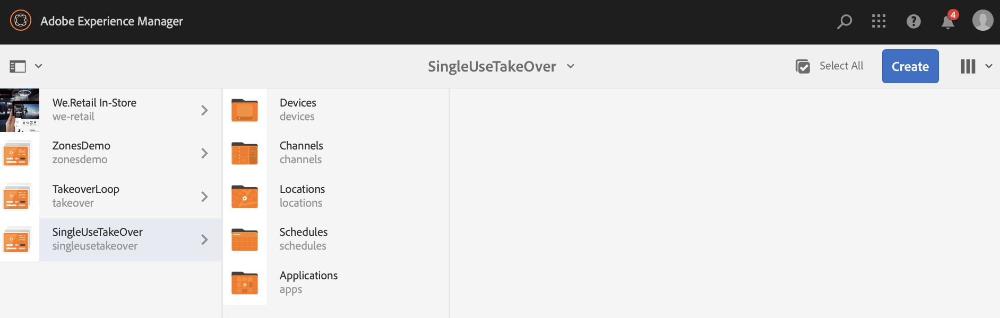
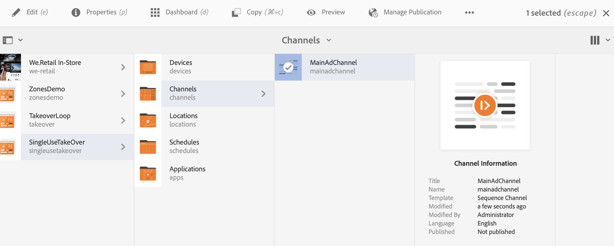
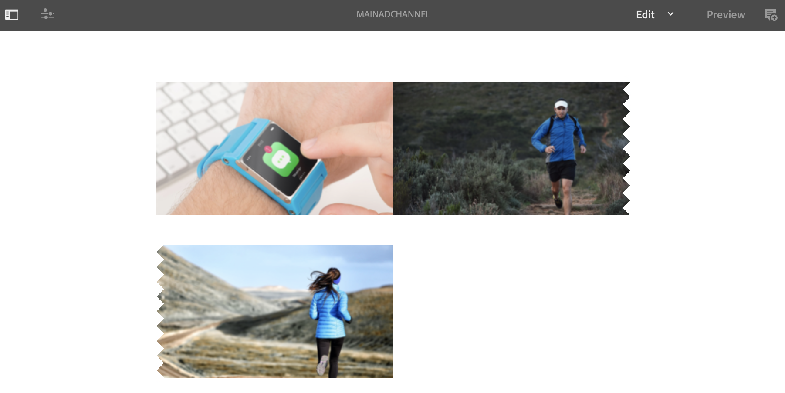
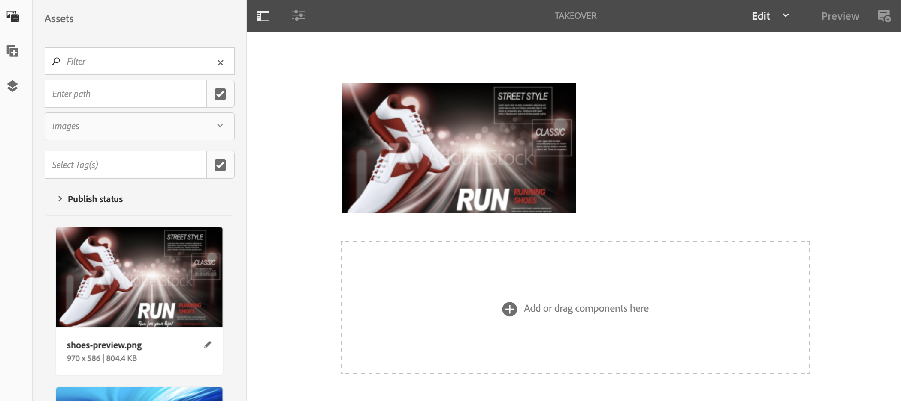
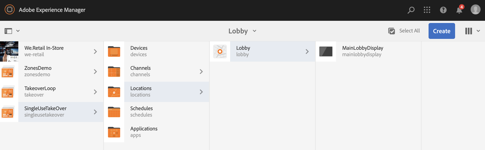
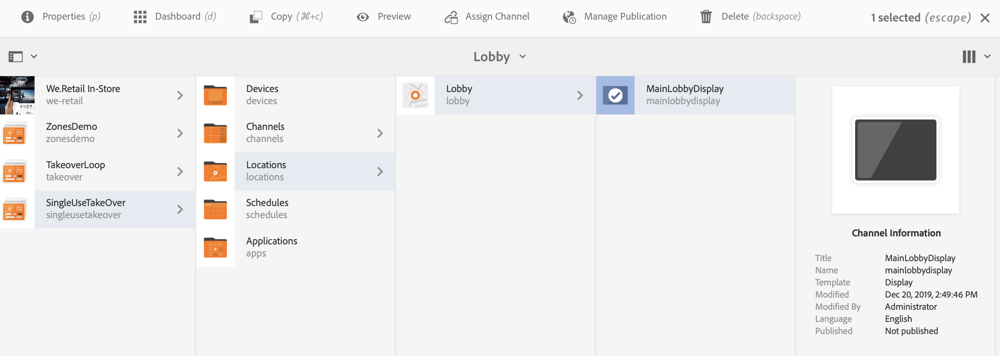
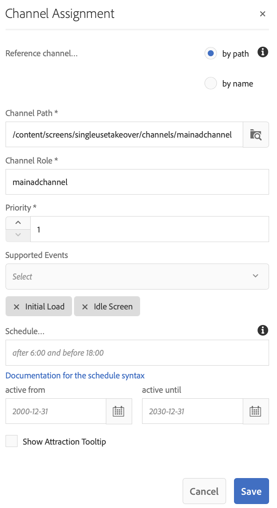
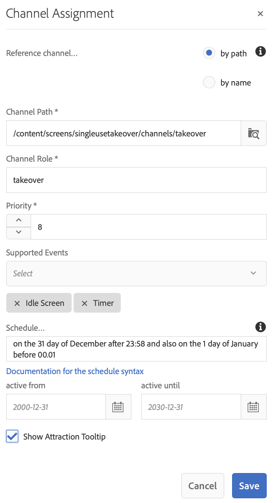
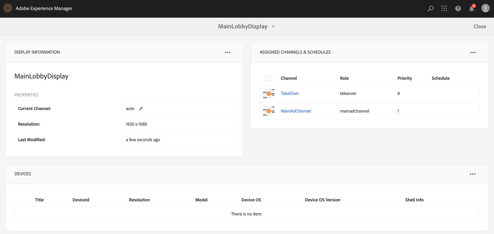

# Canal de tomada a cargo de uso único {#single-use-takeover-channel}

>[!IMPORTANT]
>Esse conteúdo é válido para o AEM no local/AMS (AEM 6.5LTS e AEM 6.5). Para ver o conteúdo do AEM as a Cloud Service Screens, consulte o [guia do AEM as a Cloud Service](https://experienceleague.adobe.com/en/docs/experience-manager-cloud-service/content/screens-as-cloud-service/overview/introduction).

A página a seguir mostra um caso de uso que enfatiza a configuração de um projeto sobre como criar um único canal de TakeOver que é reproduzido uma vez por um tempo específico.

## Descrição do caso de uso {#use-case-description}

Este caso de uso explica como criar um canal que *assume* do canal de reprodução normal para uma exibição ou grupo de exibições. A aquisição só ocorre uma vez e por um período específico.

Por exemplo, há um único canal de TakeOver que é reproduzido de sexta-feira, das 9h00 às 10h10. Durante esse tempo, nenhum outro canal deve ser reproduzido. :00:00Antes e depois desse tempo, o canal de aquisição de uso único não é reproduzido. O exemplo a seguir mostra a criação de um único canal de aquisição que permite a reprodução do conteúdo por 2 minutos antes das 12h00 em 31 de dezembro até as 12h10.:00:01

### Pré-condições {#preconditions}

Antes de iniciar este caso de uso, verifique se você sabe como:

* **[Criar e Gerenciar Canais](managing-channels.md)**
* **[Criar e Gerenciar Locais](managing-locations.md)**
* **[Criar e Gerenciar Agendamentos](managing-schedules.md)**
* **[Registro do dispositivo](device-registration.md)**

### Atores principais {#primary-actors}

Autores de conteúdo

## Configuração do projeto {#setting-up-the-project}

Siga as etapas abaixo para configurar um projeto:

**Configurando os Canais e a Exibição**

1. Crie um projeto do AEM Screens intitulado como **SingleUseTakeOver**, conforme mostrado abaixo.

   

1. Crie um **MainAdChannel** na pasta **Channels**.

   

1. Clique em **MainAdChannel** e em **Editar** na barra de ações. Arraste e solte alguns ativos (imagens, vídeos, sequências incorporadas) no seu canal.

   

   >[!NOTE]
   >O **MainAdChannel** deste exemplo demonstra um canal de sequência que reproduz o conteúdo continuamente.

   

1. Crie um canal **TakeOver** que controle o conteúdo no **MainAdChannel** e seja reproduzido apenas para um dia e hora específicos.

1. Clique em **Assumir controle** e em **Editar** na barra de ações. Arraste e solte alguns ativos no seu canal. O exemplo a seguir mostra uma única imagem de zona adicionada a esse canal.

   

1. Configure um local e uma exibição para seus canais. Por exemplo, o seguinte local **Lobby** e exibição **MainLobbyDisplay** estão configurados para este projeto.

   

**Atribuindo Canais a uma Exibição**

1. Clique na exibição **MainLobbyDisplay** da pasta **Locations**. Clique em **Atribuir canal** na barra de ações.

   

   >[!NOTE]
   >Para saber como atribuir um canal a uma exibição, consulte **[Atribuição de canal](channel-assignment.md)**.

1. Preencha os campos (**Caminho do Canal**, **Prioridade** e **Eventos com Suporte**) da caixa de diálogo **Atribuição de Canal** e clique em **Salvar**. Você atribuiu o **MainAdChannel** à sua exibição.

   

1. Clique na exibição **TakeOver** da pasta **Locations**. Clique em **Atribuir canal** na barra de ações para que você possa atribuir o canal de tomada de uso único.

1. Atribua o canal **TakeOver** a sua exibição em um horário agendado e preencha os seguintes campos a partir da caixa de diálogo **Atribuição de canal** e clique em **Salvar**:

   * **Caminho do canal**: clique no caminho para o canal TakeOver
   * **Prioridade**: defina a prioridade deste canal como maior que **MainAdChannel**. Por exemplo, a prioridade definida neste exemplo é 8.

     >[!NOTE]
     >A prioridade pode ser qualquer valor maior que o valor de prioridade do canal de reprodução normal.
   * **Eventos com Suporte**: Clique em **Tela Inativa** e **Timer**.
   * **Agendar**: digite o texto do agendamento que você deseja que este canal execute na exibição. Por exemplo, o texto aqui permite que o conteúdo seja reproduzido 2 minutos antes das 12:00 da manhã, em 31 de dezembro, até as 12:01 da manhã.
O texto na **Agenda** mencionada neste exemplo é *no dia 31 de dezembro após 23:58 e também no dia 1 de janeiro antes de 00.01*.

     

     Navegue até a exibição de **SingleUseTakeOver** > **Locations** > **Lobby** > **MainLobbyDisplay**. Clique em **Painel** na barra de ações para que você possa visualizar os canais atribuídos com suas prioridades, conforme mostrado abaixo.

     >[!NOTE]
     >É obrigatório definir a prioridade do canal de aquisição como a mais alta.

     

>[!NOTE]
>
>É uma prática recomendada excluir o canal de controle de uso único depois de reproduzido.
