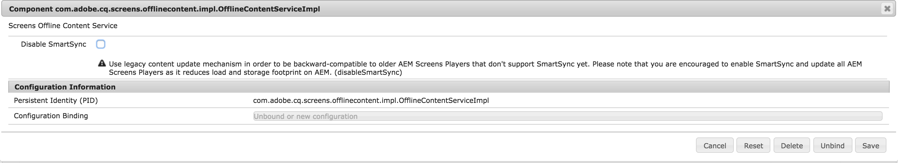
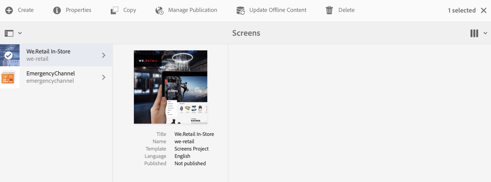

# Transição do ContentSync para o SmartSync {#transitioning-from-contentsync-to-smartsync}

>[!IMPORTANT]
>Esse conteúdo é válido para o AEM no local/AMS (AEM 6.5LTS e AEM 6.5). Para ver o conteúdo do AEM as a Cloud Service Screens, consulte o [guia do AEM as a Cloud Service](https://experienceleague.adobe.com/en/docs/experience-manager-cloud-service/content/screens-as-cloud-service/overview/introduction).

Esta seção fornece uma visão geral do recurso SmartSync e como ele minimiza a carga/armazenamento do servidor e o tráfego de rede para reduzir o custo.

## Visão geral {#overview}

O SmartSync é o mecanismo mais recente usado pelo AEM Screens. Ele serve como uma substituição do método atual usado para armazenar canais offline em cache e entregá-los ao reprodutor.

Ele é executado no lado do servidor e no lado do cliente.

**No lado do servidor**

* Os conteúdos dos canais, incluindo ativos, são armazenados em cache em *`/var/contentsync`*.
* O cache é exposto aos players por meio de um manifesto que descreve o conteúdo disponível para uma exibição.

**No lado do cliente**

* O reprodutor atualiza o conteúdo com base no manifesto gerado acima.

### Benefícios do uso do SmartSync {#benefits-of-using-smartsync}

O recurso SmartSync fornece vários benefícios para o seu projeto AEM Screens, como os seguintes:

* Redução drástica dos requisitos de tráfego de rede e armazenamento no lado do servidor.
* O reprodutor baixa ativos de forma inteligente somente se o ativo estiver ausente ou tiver sido alterado.
* Otimizações de armazenamento do lado do servidor e do lado do cliente.

>[!NOTE]
>
>A Adobe recomenda que você use o SmartSync para projetos AEM Screens.

## Migração de ContentSync para SmartSync {#migrating-from-contentsync-to-smartsync}

>[!NOTE]
>
>Se você já tiver instalado o AEM 6.3 Feature Pack 5 e o AEM 6.4 Feature Pack 3, poderá ativar o SmartSync para ativos a fim de melhorar o uso do espaço em disco. Para habilitar o SmartSync, siga a seção abaixo para fazer a transição de ContentSync para SmartSync, habilitando o SmartSync.
>
>O SmartSync está disponível para o Screens Player com servidores compatíveis com o AEM 6.4.3 FP3.
>
>Consulte os [Downloads do AEM Screens Player](https://download.macromedia.com/screens/) para baixar o player mais recente. A tabela a seguir descreve a versão mínima do player necessária para cada plataforma:

| **Plataforma** | **Versão Mínima com Suporte do Player** |
|---|---|
| Android™ | 3.3.72 |
| SO CHROME | 1.0.136 |
| Windows | 1.0.136 |

Siga as etapas abaixo para fazer a transição de ContentSync para SmartSync:

1. A migração de ContentSync para SmartSync requer a limpeza do cache ContentSync antes da ativação do SmartSync.

   Navegue até o console ContentSync de sua instância usando o link ***https://localhost:4502/libs/cq/contentsync/content/console.html*** e clique em **Limpar Cache**, conforme mostrado na figura abaixo:

   

   >[!CAUTION]
   >
   >Todo o cache de conteúdo deve ser limpo antes da primeira utilização do SmartSync.

1. Navegue até **Configuração do Console Web do Adobe Experience Manager** por meio da instância do AEM > ícone de martelo > **Operações** > **Console Web**.

   

1. **A Configuração do Console da Web do Adobe Experience Manager** é aberta. Pesquise por *offlinecontentservice*.

   Para pesquisar a propriedade **Serviço de Conteúdo Offline do Screens**, pressione **Command+F** para o **Mac** e **Control+F** para o **Windows**.

   

1. Clique em **Salvar** para habilitar a propriedade **Screens Offline Content Services** e, portanto, usar SmartSync para AEM Screens.
1. Quando você tiver ativado o SmartSync, navegue até o seu projeto e clique em **Atualizar Conteúdo Offline** *(na barra de ações),* conforme mostrado na figura abaixo.

   
