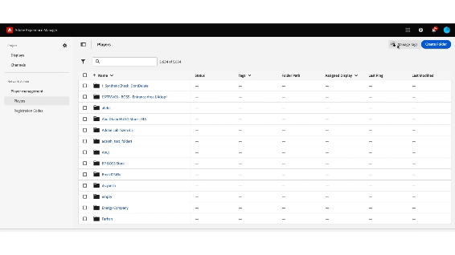

# Marcação na Screens Cloud {#tagging-on-Screens-Cloud}

>[!IMPORTANT]
>Esse conteúdo é válido para o AEM no local/AMS (AEM 6.5LTS e AEM 6.5). Para ver o conteúdo do AEM as a Cloud Service Screens, consulte o [guia do AEM as a Cloud Service](https://experienceleague.adobe.com/pt-br/docs/experience-manager-cloud-service/content/screens-as-cloud-service/overview/introduction).

>[!CAUTION]
>
>O recurso **Marcação** só estará disponível se estiver habilitado para o locatário. Entre em contato com o departamento de engenharia da AEM Screens para ativá-lo.

## Introdução {#introduction}

O usuário pode criar tags na Screens Cloud e usá-las para classificar exibições e players.

## Criar e gerenciar tags {#create-and-manage-tags}

.

Use o mesmo menu de ação para renomear ou excluir uma tag.

>[!NOTE]
> 
> Um total de 500 tags são permitidas para um locatário

## Gerenciar atribuições de tags {#manage-tags-assignments}

Use tags criadas em Exibições e players.

.

>[!NOTE]
>
> Uma exibição ou um reprodutor pode ter no máximo 30 tags atribuídas.
> No máximo 30 itens podem ser marcados de uma só vez.

## Filtrar por tags {#filter-by-tags}

Selecione tags para filtrar a lista de exibições ou players.

.

>[!NOTE]
> 
> As tags definidas na Screens Cloud não estão relacionadas/sincronizadas com as tags definidas na AEM.
> 
