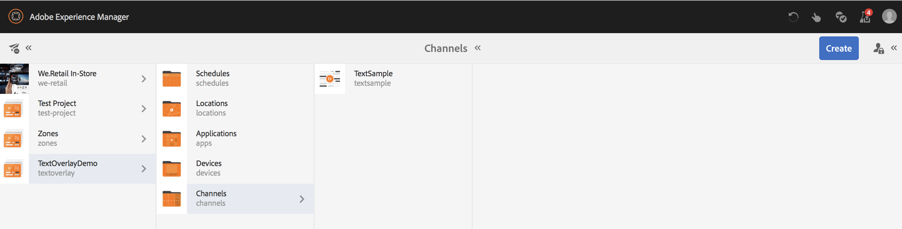

# Sobreposição de texto {#text-overlay}

Esta seção aborda os seguintes tópicos:

* **Visão geral**
* **Uso da sobreposição de texto**
* **Como entender as propriedades da sobreposição de texto**
* **Uso de valores do ContextHub na sobreposição de texto**

>[!CAUTION]
>
>O recurso Sobreposição **de** texto só estará disponível se você tiver instalado o AEM 6.3 Feature Pack 5 ou o AEM 6.4 Feature Pack 3.

## Visão geral {#overview}

A sobreposição de texto é um recurso disponível no AEM Screens que permite criar uma experiência atraente em um Canal de sequência, fornecendo um título ou uma descrição sobreposta sobre uma imagem.

Para saber como criar seu próprio componente personalizado, consulte **Extensão de um componente** do AEM Screens.

Esta seção mostra somente como usar e aproveitar o componente de pôster em um projeto do AEM Screens e usá-lo como sobreposição de texto em um de seus canais de sequência.

## Uso da sobreposição de texto {#using-text-overlay}

A seção a seguir descreve o uso de sobreposição de texto em um projeto do AEM Screens.

**Pré-requisitos**

Antes de implementar essa funcionalidade no start, certifique-se de configurar um projeto como pré-requisito para o start implementar a sobreposição de texto. Por exemplo,

* Criar um projeto do AEM Screens (neste exemplo, **TextOverlayDemo**)

* Criar um canal de sequência chamado **TextSample** na pasta **Canais**

* Adicionar conteúdo ao seu Canal **TextSample**

A imagem a seguir mostra o projeto **TextOverlayDemo** com o canal **TextSample** na pasta **Canais** .

Siga as etapas abaixo para usar a sobreposição de texto em um canal do AEM Screens:

1. Navegue até **TextOverlayDemo** —> **Canais** —> **TextSample** e clique em **Editar** na barra de ações para abrir o editor.

   

1. Selecione a imagem e clique em **Configurar** (ícone de chave) para abrir a caixa de diálogo de propriedades.

   

1. Selecione a opção Sobreposição **** de texto na barra de navegação da caixa de diálogo, conforme mostrado na figura abaixo.

   

### Como entender as propriedades da sobreposição de texto {#understanding-text-overlay-properties}

Usando as propriedades de Sobreposição de texto, é possível adicionar texto a qualquer um dos componentes do projeto do Screens. A seção a seguir fornece uma visão geral das propriedades que estão disponíveis em Sobreposição de texto:

É possível adicionar um texto à caixa de texto e adicionar ênfase tipográfica, como negrito, itálico, sublinhado e assim por diante.

**Variante** de cor Essa opção permite que o texto seja escuro (texto em preto) ou claro (texto em branco).

**Dimensionamento e posicionamento** Essa opção permite que o usuário alinhe o texto horizontal ou verticalmente ou, adicionalmente, use ferramentas de granulado fino para alinhamento de texto.

>[!NOTE]
>
>Para usar corretamente ferramentas de granulado fino, identifique a posição correta em pixels usando (px) como sufixo, por exemplo 200px. O resultado dessa expressão será de 200 pixels a partir do ponto do start.

## Uso de valores do ContextHub na sobreposição de texto {#using-text-overlay-context-hub}

A seção a seguir descreve o uso de valores de um armazenamento de dados, por exemplo, google sheets no componente de sobreposição de texto.

**Pré-requisitos**

É necessário configurar o ContextHub para seu projeto do AEM Screens.

Para saber como configurar e gerenciar alterações de ativos orientadas por dados usando um armazenamento de dados, consulte [Configuração do ContextHub no AEM Screens](https://docs.adobe.com/content/help/en/experience-manager-screens/user-guide/developing/configuring-context-hub.html).

Depois de configurar as configurações necessárias para o seu projeto, siga as etapas abaixo para usar os valores das planilhas do google:

1. Navegue até **TextOverlayDemo** —> **Canais** —> **TextSample** e clique em **Propriedades** na barra de ações.

1. Selecione a guia **Personalização** para configurar as configurações do ContextHub.

   1. Selecione o Caminho **do** ContextHub como **libs** > **configurações** > **configurações** de nuvem > **padrão** **** ****> Configurações doContextHube clique em Selecionar.

   1. Selecione Caminho **dos** segmentos como **conf** > **telas** > **configurações** > **wcm** **** ****> segmentos e clique em Selecionar.

   1. Click **Save &amp; Close**.

      >[!NOTE]
      >
      >Use o ContextHub e o caminho Segmentos, onde você salvou inicialmente suas configurações e segmentos do hub de contexto.

      

1. Navegue até **TextOverlayDemo** —> **Canais** —> **TextSample** e clique em **Editar** na barra de ações para abrir o editor.

   

1. Adicione um componente de imagem e sobreposição de texto à imagem, conforme descrito na seção [Uso da sobreposição](/help/user-guide/text-overlay.md#using-text-overlay) de texto desta página.

1. Clique em **Configurar** (ícone de chave) para abrir a caixa de diálogo **Imagem** .

   

1. Navegue até a guia **ContextHub** na caixa de diálogo **Imagem** . Clique em **Adicionar**.

   >[!NOTE]
   >Se você não tiver configurado as configurações do ContextHub, essa opção será desativada para o seu projeto.

1. Digite **Valor** no campo **Espaço reservado** , selecione a linha que deseja obter o valor da planilha do Google na Variável **** ContextHub (neste caso, o valor é recuperado da linha 2 e da coluna 1 das planilhas do google) e informe o Valor **** padrão como **20**, como mostrado na figura abaixo. Quando terminar, clique na marca de seleção.

   

   >[!NOTE]
   >Para sua referência, a imagem a seguir mostra o valor recuperado das planilhas do google:

   

1. Navegue até a guia Sobreposição **de texto na caixa de diálogo Imagem e adicione o texto Temperatura** atual {Valor} **, como mostrado na figura abaixo.

   

1. Clique em **Pré-visualização** para visualização da saída desejada.

   

