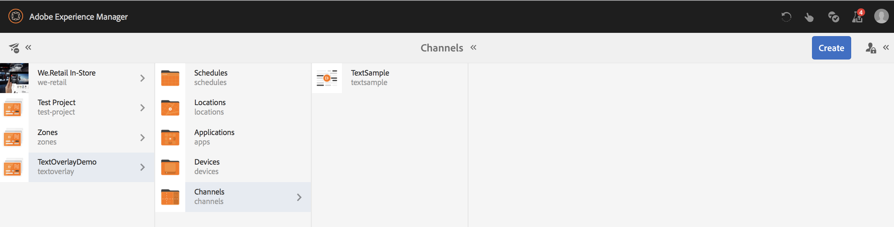
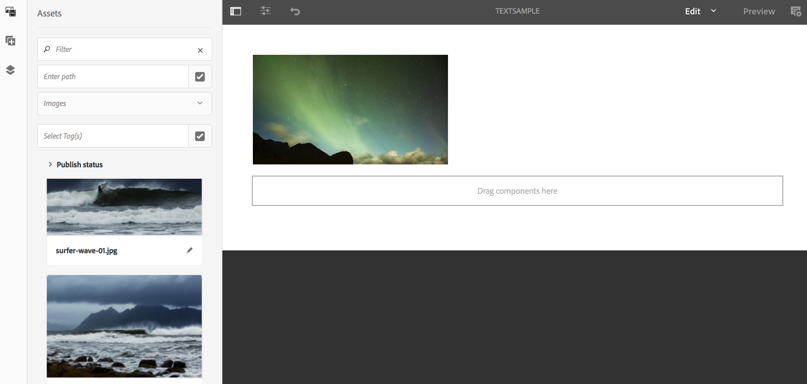
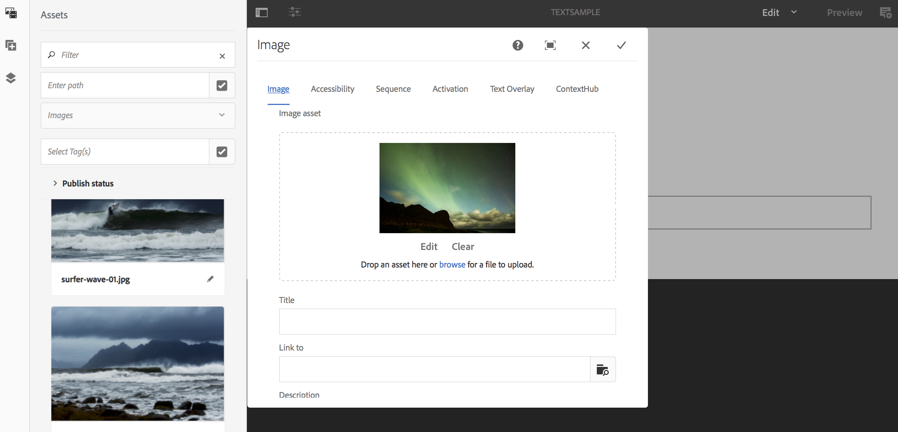
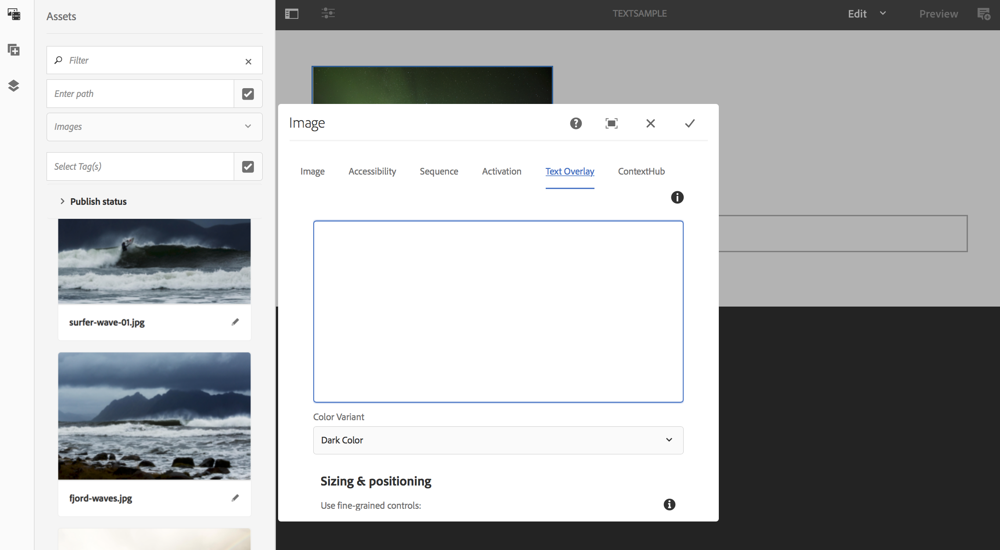
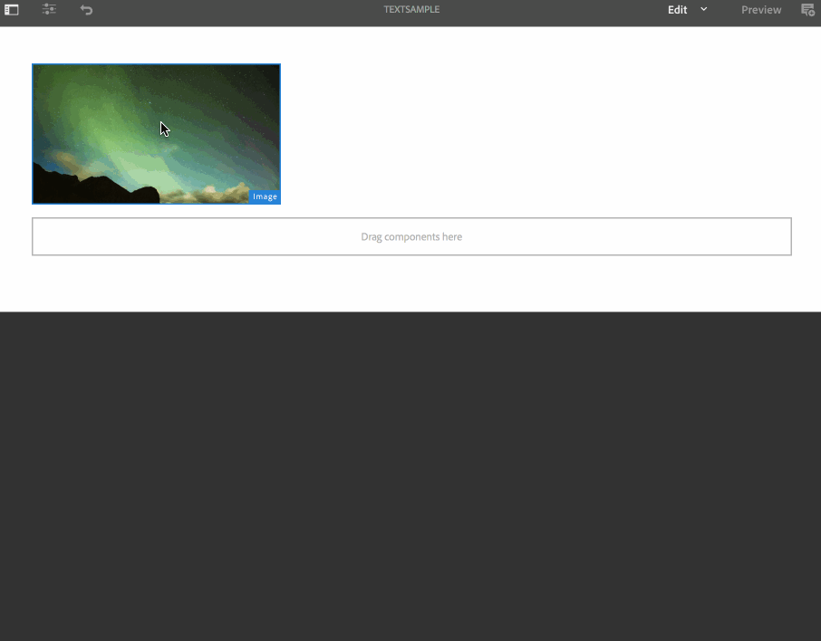

# Sobreposição de texto {#text-overlay}

Esta seção abrange os seguintes tópicos:

* **Visão geral**
* **Usando sobreposição de texto**
* **Noções básicas sobre as propriedades de sobreposição de texto**
* **Usando Valores do ContextHub na Sobreposição de Texto**

>[!CAUTION]
>
>O recurso **Sobreposição de Texto** só estará disponível se você tiver instalado o Feature Pack 5 do AEM 6.3 ou o Feature Pack 3 do AEM 6.4.

## Visão geral {#overview}

A Sobreposição de texto é um recurso disponível no AEM Screens. Ele permite criar uma experiência atraente em um canal de sequência ao fornecer um título ou uma descrição sobreposta sobre uma imagem.

Para saber como criar seu próprio componente personalizado, consulte **Extensão de um componente do AEM Screens**.

Esta seção mostra apenas como usar e aplicar o componente de pôster em um projeto do AEM Screens. Ele também mostra sua utilização como uma sobreposição de texto em um dos canais de sequência.

## Uso de sobreposição de texto {#using-text-overlay}

A seção a seguir descreve o uso de sobreposição de texto em um projeto do AEM Screens.

**Pré-requisitos**

Antes de implementar essa funcionalidade, configure um projeto como pré-requisito para começar a implementar a sobreposição de texto. Por exemplo,

* Crie um projeto do AEM Screens (neste exemplo, **TextOverlayDemo**)

* Crie um canal de sequência chamado **TextSample** na pasta **Channels**

* Adicionar conteúdo ao seu canal **TextSample**

A imagem a seguir mostra o projeto **TextOverlayDemo** com o canal **TextSample** na pasta **Channels**.

Siga as etapas abaixo para usar a sobreposição de texto em um canal do AEM Screens:

1. Navegue até **TextOverlayDemo** > **Channels** > **TextSample** e clique em **Editar** na barra de ações.

   

1. Clique na imagem e em **Configurar** (ícone de chave inglesa) para abrir a caixa de diálogo de propriedades.

   

1. Clique na opção **Sobreposição de Texto** na barra de navegação da caixa de diálogo, conforme mostrado na figura abaixo.

   

### Noções básicas sobre propriedades de sobreposição de texto {#understanding-text-overlay-properties}

Usando as propriedades de Sobreposição de texto, é possível adicionar texto a qualquer um dos componentes no projeto do Screens. A seção a seguir fornece uma visão geral das propriedades que estão disponíveis em Sobreposição de texto:

É possível adicionar um texto à caixa de texto e adicionar ênfase tipográfica, como negrito, itálico e sublinhado.

**Variante de cor** Essa opção permite que o texto seja Escuro (texto em preto) ou Claro (texto em branco).

**Dimensionamento e posicionamento** Essa opção permite que o usuário alinhe o texto na horizontal ou na vertical ou também use ferramentas refinadas para alinhamento de texto.

>[!NOTE]
>
>Ao usar ferramentas refinadas, identifique a posição correta em pixels usando (px) como sufixo, por exemplo, 200 px. O resultado dessa expressão é 200 pixels a partir do ponto inicial.

## Utilização de valores do ContextHub na sobreposição de texto {#using-text-overlay-context-hub}

A seção a seguir descreve o uso de valores de um armazenamento de dados, por exemplo, google sheets no componente de sobreposição de texto.

**Pré-requisitos**

Defina as configurações do ContextHub para o seu projeto do AEM Screens.

Para saber como configurar e gerenciar alterações de ativos orientados por dados usando um armazenamento de dados, consulte [Configuração do ContextHub no AEM Screens](https://experienceleague.adobe.com/en/docs/experience-manager-screens/user-guide/developing/configuring-context-hub).

Depois de definir as configurações necessárias para o seu projeto, siga as etapas abaixo para usar os valores das Planilhas Google:

1. Navegue até **TextOverlayDemo** > **Channels** > **TextSample** e clique em **Properties** na barra de ações.

1. Clique na guia **Personalization** para definir as configurações do ContextHub.

   1. Clique no **Caminho do ContextHub** como **bibliotecas** > **configurações** > **cloudsettings** > **padrão** > **Configurações do ContextHub** e clique em **Selecionar**.

   1. Clique no **Caminho dos Segmentos** como **conf** > **telas** > **configurações** > **wcm** > **segmentos** e clique em **Selecionar**.

   1. Clique em **Salvar e fechar**.

      >[!NOTE]
      >
      >Use o ContextHub e o caminho Segmentos, onde você salvou inicialmente as configurações e os segmentos do seu hub de contexto.

      

1. Navegue até **TextOverlayDemo** > **Channels** > **TextSample** e clique em **Editar** na barra de ações.

   

1. Adicione um componente de sobreposição de imagem e texto à imagem conforme descrito na seção [Usando Sobreposição de Texto](/help/user-guide/text-overlay.md#using-text-overlay) desta página.

1. Clique em **Configurar** (ícone de chave inglesa) para abrir a caixa de diálogo **Imagem**.

   

1. Navegue até a guia **ContextHub** na caixa de diálogo **Image**. Clique em **Adicionar**.

   >[!NOTE]
   >Se você não definiu a configuração do ContextHub, essa opção estará desativada para o seu projeto.

1. Insira **Value** no campo **Placeholder**. Clique na linha que você deseja obter o valor de sua planilha do Google na **Variável do ContextHub**. Nesse caso, o valor é recuperado da linha 2 e da coluna 1 das planilhas Google. Agora, insira o **Valor Padrão** como **20**, conforme mostrado na figura abaixo. Quando terminar, clique na marca de seleção.

   

   >[!NOTE]
   >Para sua referência, a imagem a seguir mostra o valor recuperado das Google Sheets:

   

1. Volte para a guia **Sobreposição de Texto** na caixa de diálogo Imagem e adicione o texto *Temperatura Atual{Value}*, como mostrado na figura abaixo.

   

1. Clique em **Visualizar**.

   
