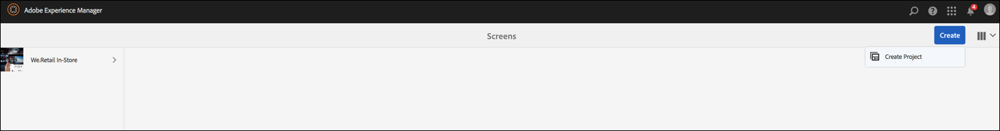

# Configuração e solução de problemas da reprodução de vídeo {#video-playback-configuration-and-troubleshooting}

Ao carregar um vídeo no DAM e adicioná-lo ao seu canal, você pode encontrar problemas que podem não ser reproduzidos no Screens player.

As seções a seguir descrevem como depurar e solucionar problemas de reprodução de vídeo no seu canal.

## Representações de DAM {#dam-renditions}

Depois que você carregar o vídeo no canal, o start AEM criar algumas execuções para ele. Você pode visualização seus vídeos em Ativos.

Para visualização do vídeo:

1. Navegue até o vídeo, por exemplo `http://localhost:4502/assets.html/content/dam/we-retail/en/videos`.
1. Clique no vídeo, expanda o menu superior esquerdo e clique em **Representações**.

Deve haver representações diferentes (um MP4 ou M4V).

Se não houver renderização, verifique se você tem ffmpeg instalado no SO onde o AEM está em execução.

>[!CAUTION]
>
>Se não houver renderização, verifique se você tem ffmpeg instalado no SO onde o AEM está em execução.
>
>Clique [aqui](https://www.ffmpeg.org/download.html) para instalar o ffmpeg.

## Ativos de vídeo {#video-assets}

Se você não vir um atributo de origem em vídeo, pode ser que o vídeo não tenha sido transcodificado. Se o vídeo estiver corretamente codificado, ele aparecerá no painel, como mostra a figura abaixo.

Verifique se ffmpeg está instalado e os perfis de vídeo.

### Verificando o Perfil de vídeo {#checking-video-profile}

1. Navegue até o Perfil **** Vídeo, ou seja, `http://localhost:4502/etc/dam/video.html` e clique em **Carregar vídeo** de teste.

   

1. Carregue um vídeo de teste e clique em **Ok** para começar a transcodificação.

   Se a transcodificação falhar, expanda a saída ffmpeg para entender quaisquer erros na saída do console de ffmpeg.

   

   Além disso, se a transcodificação de vídeo tiver êxito, é possível baixar o arquivo transcodificado.

   

   >[!NOTE]
   >
   >Certifique-se de dar tempo suficiente para que o vídeo transcodifique (ele deve mostrar a tag new em vez de processar) antes de adicioná-lo a qualquer canal.

### Como verificar o Perfil com um componente de vídeo {#checking-profile-with-a-video-component}

Verifique a lista de perfis do design da página se o componente de vídeo não está configurado corretamente.

1. Navegue até o canal e selecione o modo **Design** .

   

1. Selecione o vídeo e abra a caixa de diálogo **Editar** . Open the **Profiles** tab.

   >[!NOTE]
   >Selecione perfis diferentes (pelo menos o perfil &quot;H.264&quot; de alta qualidade deve estar presente).

### Como verificar o vídeo no Web Player {#checking-the-video-in-the-web-player}

Use o **Web Player** `http://localhost:4502/content/mobileapps/cq-screens-player/firmware.html/content/screens/we-retail/locations/demo/flagship/single/device0` para validar a reprodução em navegadores (Chrome e Safari). O Chrome é usado em dispositivos Android, enquanto o Safari é o navegador OSX e iOS.

Se o vídeo não for executado no Safari, ele não será executado nos players OSX e iOS. Este é provavelmente um problema de codificação e o vídeo deve ser recodificado.

Siga estas etapas para usar um fluxo de trabalho DAM para criar execuções FullHD:

1. Navegue até o administrador *do modelo de* fluxo de trabalho, ou seja, `http://localhost:4502/libs/cq/workflow/admin/console/content/models.html/etc/workflow/models`.
1. Selecione o modelo **Screens Update Asset** .
1. clique em Fluxo de trabalho **do** Start na barra de ações para abrir a caixa de diálogo **Executar fluxo de trabalho** .

1. Selecione seu ativo de vídeo na **Carga**.
1. Clique em **Executar**.

>[!NOTE]
>
>Aguarde algum tempo para criar as execuções, mas após alguns segundos/minutos (dependendo do tamanho do vídeo), recarregue o Web player no Safari.

#### Sinalizador de Política de Execução Automática {#troubleshooting-autoplay-policy-flag}

Caso o player AEM Screens pegue o vídeo, mas não o exibe, é necessário solucionar o problema do sinalizador de Política de reprodução automática.

Siga as etapas abaixo para solucionar o problema de sinalização de política de reprodução automática do google:

1. Navegue até ***chrome://flags/#autoplay-policy***
1. Alterar a política **de reprodução** automática de **Padrão** para **nenhum gesto de usuário é necessário**

1. Reinicie o navegador da Web e atualize o player

>[!NOTE]
>
>Para saber mais sobre as práticas recomendadas para boas experiências de usuário com as novas políticas de reprodução automática no Chrome, consulte a documentação de Alterações *na política de reprodução* automática, ou seja, `https://developers.google.com/web/updates/2017/09/autoplay-policy-changes#webaudio`.

### Sincronização de vídeo entre vários players {#syncing-video-across-multiple-players}

Para reproduzir vídeos sincronicamente em vários dispositivos, use a estratégia absoluta para a sequência da qual o vídeo faz parte.

#### Requisitos {#requirements}

* dois ou mais players idênticos
* hardware idealmente semelhante
* topologia de rede idêntica (os players estão conectados a um servidor NTP que alinha seus relógios internos do sistema)

#### Configuração da estratégia absoluta {#setting-up-the-absolute-strategy}

A estratégia absoluta:

* calcula um tempo de ancoragem (meia-noite do dia atual)
* calcula a duração da sequência (soma da duração de todos os seus itens)
* a qualquer momento, calcula qual item deve ser reproduzido no momento e o próximo item, solucionando a sequência _remain_time = (current_time - anchor_time) % sequence_duration.

Siga as etapas abaixo para configurar uma estratégia absoluta:

1. Navegue até o autor do canal e selecione o componente de sequência, conforme mostrado na figura abaixo.
1. Abra a caixa de diálogo de configuração.
1. Edite a **Estratégia** e adicione absoluto.

   

   >[!NOTE]
   >O SO dos players deve ter o mesmo relógio.

**Alinhamento de blocos no OS X** Siga as etapas abaixo para alinhar os relógios no OSX:

1. Abrir preferências de **data e hora** em cada caixa OSX
1. Verificar **Definir data e hora automaticamente**
1. Cole o valor 0.pool.ntp.org, 1.pool.ntp.org, 2.pool.ntp.org, 3.pool.ntp.org, time.apple.com na lista suspensa ou simplesmente execute *sudo ntpdate -u -v 0.pool.ntp.org*
1. Start de mais de 2 players

Pode levar algum tempo até que os players start uma nova sequência alinhada.

