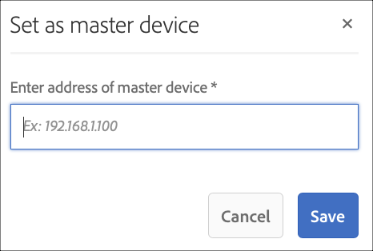

# Sincronização de comandos {#command-sync}

A página a seguir descreve como usar a Sincronização de comandos. A Sincronização de comandos permite a reprodução sincronizada em diferentes reprodutores. Os players podem reproduzir conteúdo diferente, mas cada ativo precisa ter a mesma duração.

>[!IMPORTANT]
>
>Esse recurso não é compatível com Sequências incorporadas, Sequências incorporadas dinâmicas, Canais de aplicativo ou Transições.

## Visão geral {#overview}

As soluções de sinalização digital precisam suportar murais de vídeo e reprodução sincronizada para suportar cenários como contagem regressiva de Ano Novo ou vídeo grande fatiado para ser reproduzido em várias telas e é aqui que a Sincronização de Comando entra em ação.

Para usar a Sincronização de comandos, um reprodutor age como *principal* e envia o comando e todos os outros players atuam como *clientes* e são reproduzidos quando recebem o comando.

O *principal* envia um comando para todos os clientes registrados quando está prestes a iniciar a reprodução de um item. A carga disso pode ser o índice do item a ser reproduzido e/ou o html externo do elemento a ser reproduzido.

## Implementando a sincronização de comandos {#using-command-sync}

A seção a seguir descreve como usar a Sincronização de comandos em um projeto do AEM Screens.

>[!NOTE]
>
>Para reprodução sincronizada, é necessário que todos os dispositivos de hardware tenham as mesmas especificações de hardware e, de preferência, o mesmo sistema operacional. Não é recomendável sincronizar entre diferentes hardware e sistemas operacionais.

### Configurando o projeto {#setting-up}

Antes de usar o recurso de Sincronização de comandos, verifique se você tem um projeto e um canal com o conteúdo configurado para o seu projeto.

1. O exemplo a seguir mostra um projeto de demonstração chamado **CommandSyncDemo** e um canal de sequência **ChannelLobby**.

   

   >[!NOTE]
   >
   >Para saber como criar um canal ou adicionar conteúdo a um canal, consulte [Criação e gerenciamento de canais](/help/user-guide/managing-channels.md)

   O canal contém o seguinte conteúdo, como mostrado na figura abaixo.

   

1. Crie um local **Lobby** e, subsequentemente, uma exibição denominada **LobbyDisplay** na pasta **Locations**, conforme mostrado na figura abaixo.
   

1. Atribua o canal, **ChannelLobby** a **LobbyDisplay**. Agora é possível exibir o canal atribuído à exibição no painel de exibição.
   

   >[!NOTE]
   >
   >Para saber como atribuir um canal a uma exibição, consulte [Criação e gerenciamento de exibições](/help/user-guide/managing-displays.md).

1. Navegue até a pasta **Dispositivos** e clique em **Gerenciador de Dispositivos** na barra de ações para registrar os dispositivos.

   

   >[!NOTE]
   >
   >Para saber como registrar um dispositivo, consulte [Registro do dispositivo](/help/user-guide/device-registration.md)

1. Para fins de demonstração, este exemplo mostra um dispositivo chrome e um windows player como dois dispositivos separados. Ambos os dispositivos apontam para a mesma tela.
   

### Atualização das configurações de canal

1. Navegue até **ChannelLobby** e clique em **Edit** na barra de ações para atualizar as configurações de canal.

1. Selecione o canal inteiro como mostrado na figura abaixo.
   

1. Clique no ícone da chave inglesa para abrir a caixa de diálogo **Page**.
   

1. Insira a palavra-chave *synced* no campo **Estratégia**.

   

### Configurar um {#setting-up-master} principal

1. Navegue até o painel de exibição em **CommandSyncDemo** —> **Locations** —> **Lobby** —> **LobbyDisplay** e clique em **Dashboard** na barra de ações.
Você verá os dois dispositivos (chrome e windows player) no painel **DEVICES**, conforme mostrado na figura abaixo.
   

1. No painel **DEVICES**, selecione o dispositivo que deseja definir como principal. O exemplo a seguir demonstra como configurar o dispositivo Chrome como o principal. Clique em **Definir como dispositivo principal**.

   

1. Insira o endereço IP em **Definir como dispositivo principal** e clique em **Salvar**.

   

>[!NOTE]
>
>Você pode configurar vários dispositivos como principais.

### Sincronização com {#sync-up-master} Principal

1. Depois de definir o dispositivo Chrome como principal, você pode sincronizar o outro dispositivo (neste caso, o windows player) para sincronizar com o principal.
Selecione o outro dispositivo (neste caso, windows player) no painel **DEVICES** e clique em **Sincronizar para dispositivo principal**, conforme mostrado na figura abaixo.

   

1. Selecione o dispositivo na lista e clique em **Save**.

   >[OBSERVAÇÃO:]
   > A caixa de diálogo **Sincronizar com dispositivo principal** mostrará a lista de dispositivos principais. Você pode selecionar a preferência desejada.

1. Depois que o dispositivo (Windows player) for sincronizado com o principal (Chrome player), você verá o dispositivo sincronizado no painel **DEVICES**.

   

### Cancelamento de sincronização com o {#desync-up-master} Principal

Depois de sincronizar um dispositivo ou dispositivos a um principal, você pode cancelar a sincronização da atribuição desse dispositivo.

>[!NOTE]
>
>Se você cancelar a sincronização de um dispositivo principal, ele também desvinculará todos os dispositivos clientes associados a esse dispositivo principal.

Para remover a sincronização do dispositivo principal, siga as etapas abaixo:

1. Navegue até o painel **DISPOSITIVOS** e selecione o dispositivo.

1. Clique em **Dispositivo(s) de dessincronização** para cancelar a sincronização do cliente a partir do dispositivo principal.

   

1. Clique em **Confirmar** para cancelar a sincronização do dispositivo selecionado da principal.

   >[OBSERVAÇÃO:]
   > Se você selecionar o dispositivo principal e usar a opção de dessincronização, todos os dispositivos conectados ao principal serão dessincronizados em uma etapa.
