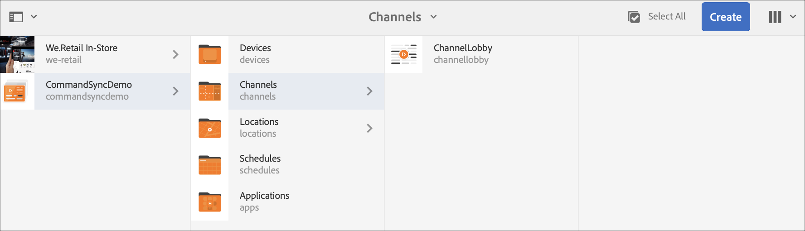
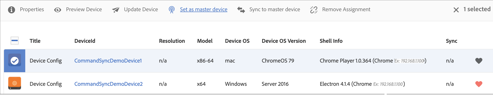

# Sincronização de comando {#command-sync}

A página a seguir descreve como usar a Sincronização de Comando. A sincronização de comandos permite a reprodução sincronizada em diferentes reprodutores. Os reprodutores podem reproduzir conteúdo diferente, mas cada ativo precisa ter a mesma duração.

>[!IMPORTANT]
>
>Este recurso não oferece suporte a Sequências Incorporadas, Sequências Incorporadas Dinâmicas, Canais de Aplicativos ou Transições.

## Visão geral {#overview}

As soluções de sinalização digital precisam suportar paredes de vídeo e reprodução sincronizada para suportar cenários como contagens regressivas de Ano Novo ou vídeo grande fatiado para ser reproduzido em várias telas e é aqui que a sincronização de comandos entra em ação.

Para usar a Sincronização de comandos, um player atua como *principal* e envia o comando e todos os outros jogadores atuam como *clientes* e executar quando receberem o comando.

A variável *principal* envia um comando a todos os clientes registrados quando está prestes a iniciar a reprodução de um item. A carga útil pode ser o índice do item a ser reproduzido e/ou o html externo do elemento a ser reproduzido.

## Implementando a sincronização de comandos {#using-command-sync}

A seção a seguir descreve como você pode usar a sincronização de comandos em um projeto do AEM Screens.

>[!NOTE]
>
>Para a reprodução sincronizada, é necessário que todos os dispositivos de hardware tenham as mesmas especificações de hardware e, de preferência, o mesmo sistema operacional. A sincronização entre hardware e sistemas operacionais diferentes não é recomendada.

### Configuração do projeto {#setting-up}

Antes de usar o recurso de sincronização de comando, verifique se você tem um projeto e um canal com conteúdo configurado para o seu projeto.

1. O exemplo a seguir mostra um projeto de demonstração chamado **CommandSyncDemo** e um canal de sequência **ChannelLobby**.

   

   >[!NOTE]
   >
   >Para saber como criar um canal ou adicionar conteúdo a um canal, consulte [Criação e gerenciamento de canais](/help/user-guide/managing-channels.md)

   O canal inclui o conteúdo a seguir, como mostrado na figura abaixo.

   

1. Criar um local **Lobby** e, subsequentemente, uma exibição intitulada como **ExibiçãoLobby** no **Localizações** conforme mostrado na figura abaixo.
   

1. Atribuir o canal, **ChannelLobby** ao seu **ExibiçãoLobby**. Agora é possível exibir o canal atribuído à exibição no painel de exibição.
   

   >[!NOTE]
   >
   >Para saber como atribuir um canal a uma exibição, consulte [Criando e Gerenciando Exibições](/help/user-guide/managing-displays.md).

1. Navegue até **Dispositivos** e clique em **Gerenciador de dispositivos** na barra de ações para registrar os dispositivos.

   

   >[!NOTE]
   >
   >Para saber como registrar um dispositivo, consulte [Registro do dispositivo](/help/user-guide/device-registration.md)

1. Para fins de demonstração, este exemplo mostra um dispositivo Chrome e um Windows Player como dois dispositivos separados. Ambos os dispositivos apontam para a mesma tela.
   

### Atualização das configurações de canal

1. Navegue até **ChannelLobby** e clique em **Editar** na barra de ações para atualizar as configurações de canal.

1. Selecione o canal inteiro como mostrado na figura abaixo.
   

1. Clique na chave inglesa para abrir a **Página** caixa de diálogo.
   

1. Insira o *sincronizado* palavra-chave na **Estratégia** campo.

   

### Configurar um principal {#setting-up-primary}

1. Navegue até o painel de exibição em **CommandSyncDemo** > **Localizações**  > **Lobby** > **ExibiçãoLobby** e clique em **Painel** na barra de ações.
Você verá os dois dispositivos (chrome e windows player) em **DISPOSITIVOS** como mostrado na figura abaixo.
   

1. No **DISPOSITIVOS** selecione o dispositivo que deseja definir como principal. O exemplo a seguir demonstra como configurar o dispositivo Chrome como o principal. Clique em **Definir como dispositivo principal**.

   

1. Digite o endereço IP em **Definir como dispositivo principal** e clique em **Salvar**.

   

>[!NOTE]
>
>Você pode configurar vários dispositivos como primários.

### Sincronização com o Principal {#sync-up-primary}

1. Depois de definir o dispositivo Chrome como principal, você pode sincronizar o outro dispositivo (nesse caso, o Windows Player) com o principal.
Selecione o outro dispositivo (nesse caso, windows player) na **DISPOSITIVOS** e clique em **Sincronizar com o dispositivo principal**, conforme mostrado na figura abaixo.

   

1. Selecione o dispositivo na lista e clique em **Salvar**.

   >[NOTA:]
   > A variável **Sincronizar com o dispositivo principal** A caixa de diálogo mostrará a lista de dispositivos principais. Você pode selecionar a opção desejada de sua preferência.

1. Depois que o dispositivo (Windows player) for sincronizado com o principal (Chrome player), você verá o dispositivo sincronizado na **DISPOSITIVOS** painel.

   

### Dessincronização com o principal {#desync-up-primary}

Depois de sincronizar um dispositivo ou dispositivos com um dispositivo principal, você pode dessincronizar a atribuição desse dispositivo.

>[!NOTE]
>
>Se você cancelar a sincronização de um dispositivo principal, ele também desvinculará todos os dispositivos clientes associados a esse dispositivo principal.

Para remover a sincronização do dispositivo principal, siga as etapas abaixo:

1. Navegue até a **DISPOSITIVOS** e selecione o dispositivo.

1. Clique em **Dessincronizar dispositivo(s)** para dessincronizar o cliente do dispositivo principal.

   

1. Clique em **Confirmar o** para dessincronizar o dispositivo selecionado do dispositivo principal.

   >[NOTA:]
   > Se você selecionar o dispositivo principal e usar a opção de dessincronização, todos os dispositivos conectados ao principal serão dessincronizados em uma etapa.
