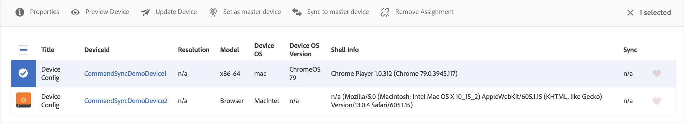

# Sincronização de comandos {#command-sync}

A página a seguir descreve como usar a Sincronização de comandos. A Sincronização de comandos permite a reprodução sincronizada em diferentes players. Os players podem reproduzir conteúdo diferente, mas cada ativo precisa ter a mesma duração.

## Visão geral {#overview}

As soluções de sinalização digital precisam suportar paredes de vídeo e reprodução sincronizada para suportar cenários como contagens de Ano Novo ou vídeos grandes fatiados para serem reproduzidos em várias telas e é aqui que a Sincronização de Comando entra em ação.

Para usar a Sincronização de comandos, um player atua como *mestre* e envia comandos e todos os outros players atuam como *clientes* e são reproduzidos quando recebem o comando.

O *mestre* envia um comando para todos os clientes registrados quando está prestes a iniciar a reprodução de um item. A carga desse elemento pode ser o índice do item a ser reproduzido e/ou o html externo do elemento a ser reproduzido.

## Implementação da sincronização de comandos {#using-command-sync}

A seção a seguir descreve como você pode usar a Sincronização de comandos em um projeto do AEM Screens.

### Configuração do projeto {#setting-up}

Antes de usar o recurso de Sincronização de comandos, verifique se você tem um projeto e um canal com o conteúdo configurado para o seu projeto.

1. O exemplo a seguir mostra um projeto de demonstração chamado **CommandSyncDemo** e um canal de sequência **ChannelLobby**.

   

   >[!NOTE]
   >
   >Para saber como criar um canal ou adicionar conteúdo a um canal, consulte [Criar e gerenciar canais](/help/user-guide/managing-channels.md)

   O canal contém o seguinte conteúdo, como mostrado na figura abaixo.

   

1. Crie uma exibição na pasta **Locais** , como mostrado na figura abaixo.
   

1. Atribua o canal, **ChannelLobby** a seu **LobbyDisplay**.
   

   >[!NOTE]
   >
   >Para saber como atribuir um canal a uma exibição, consulte [Criação e gerenciamento de exibições](/help/user-guide/managing-displays.md).

1. Navegue até a pasta **Dispositivos** e clique em Gerenciador **de** dispositivos na barra de ações para registrar os dispositivos.

   

   >[!NOTE]
   >
   >Para saber como atribuir um canal a uma exibição, consulte [Criação e gerenciamento de exibições](/help/user-guide/managing-displays.md)

1. Para fins de demonstração, este exemplo mostra um dispositivo de cromo e um Windows player como dois dispositivos separados. Ambos os dispositivos apontam para a mesma tela.
   

### Atualizando configurações de canal

1. Navegue até **ChannelLobby** e clique em **Editar** na barra de ações para atualizar as configurações de canal.

1. Selecione o canal inteiro como mostrado na figura abaixo.
   

1. Clique no ícone de chave para abrir a caixa de diálogo **Página** .
   

1. Digite a palavra-chave *sincronizada* no campo **Estratégia** .

   

### Configuração de um mestre {#setting-up-master}

1. Navegue até o painel de exibição em **CommandSyncDemo** —> **Locations** —> **Lobby** —> **LobbyDisplay** e clique em **Dashboard** na barra de ação.
Você verá os dois dispositivos (cromo e Windows player) no painel **DISPOSITIVOS** , como mostra a figura abaixo.

   

1. No painel **DISPOSITIVOS** , selecione o dispositivo que deseja definir como mestre. O exemplo a seguir demonstra como configurar o dispositivo Chrome como mestre. Clique em **Definir como dispositivo** mestre.

   

1. Digite o endereço IP em **Definir como dispositivo** mestre e clique em **Salvar**.

   

### Sincronizando com o Master {#sync-up-master}

1. Depois de definir o dispositivo Chrome como master, você poderá sincronizar o outro dispositivo para sincronizar com o master.
Selecione o outro dispositivo no painel **DISPOSITIVOS** e clique em **Sincronizar para dispositivo** mestre, como mostrado na figura abaixo.

1. Selecione o dispositivo na lista e clique em **Salvar**.

1. Navegue até o [Web Player](http://localhost:4502/screens/player.html).

