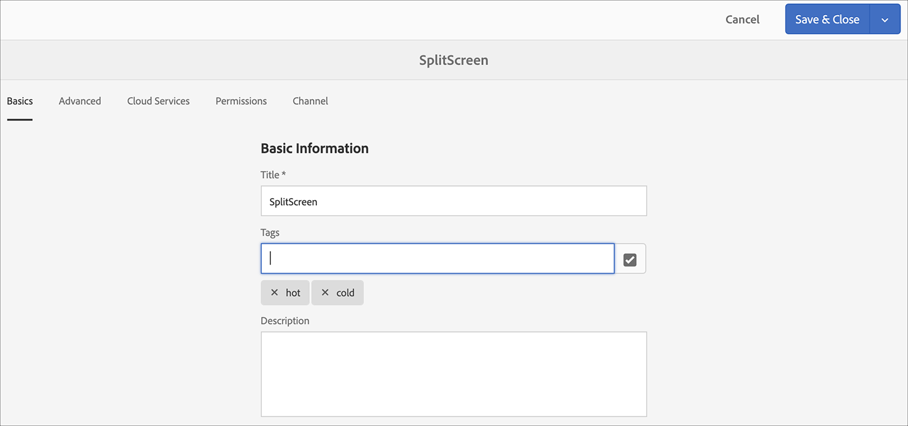

# Reconhecimento de voz no AEM Screens {#voice-recognition}

>[!IMPORTANT]
>
>**Informações importantes sobre privacidade**
>
>Ao usar o recurso de reconhecimento de voz, siga todas as diretrizes legais e éticas aplicáveis à sua região (incluindo, mas não limitado a, fornecer um aviso visível aos usuários finais de que o player está usando o Reconhecimento de voz). O Adobe Inc. não recebe, armazena ou processa nenhuma das informações relacionadas à voz. Os players do AEM Screens usam a API de fala da Web padrão incorporada ao mecanismo de navegação. Em segundo plano, essa API envia uma forma de onda de seu discurso para os servidores do Google para conversão de voz em texto e esse texto é correspondido pelo reprodutor em relação às palavras-chave configuradas.
>
>Consulte o [White paper sobre privacidade do Google sobre API de fala da Web](https://www.google.com/chrome/privacy/whitepaper.html#speech) para obter mais detalhes.

O recurso de reconhecimento de voz permite a alteração do conteúdo em um canal AEM Screens orientado pela interação de voz.

Um autor de conteúdo pode configurar uma exibição para ser habilitada para voz. A finalidade desse recurso é permitir que os clientes utilizem o discurso como um método de interação com suas exibições. Alguns casos de uso semelhantes incluem encontrar recomendações de produto em lojas, solicitar itens de menu em restaurantes e restaurantes. Esse recurso aumenta a acessibilidade para os usuários e pode melhorar bastante a experiência do cliente.

>[!NOTE]
>O hardware do player deve suportar a entrada de voz, como um microfone.

## Implementando o reconhecimento de voz {#implementing}

>[!IMPORTANT]
> O recurso de reconhecimento de voz está disponível somente nos players do Chrome OS e Windows.

Para implementar o reconhecimento de voz em seu projeto do AEM Screens, você deve habilitar o reconhecimento de voz para a Exibição e associar cada canal a uma tag exclusiva para acionar uma transição de canal.

A seção a seguir descreve como você pode ativar e usar o recurso de reconhecimento de voz em um projeto do AEM Screens.

## Visualização de conteúdo em tela cheia ou no switch de canal de tela dividida {#sequence-channel}

Antes de usar o recurso de reconhecimento de voz, verifique se você tem um projeto e um canal com o conteúdo configurado para o seu projeto.

1. O exemplo a seguir mostra um projeto de demonstração chamado **VoiceDemo** e três canais de sequência **Main**, **ColdDrinks**, e **HotDrinks**, conforme mostrado na figura abaixo.

   

   >[!NOTE]
   >
   >Para saber como criar um canal ou adicionar conteúdo a um canal, consulte [Criação e gerenciamento de canais](/help/user-guide/managing-channels.md)

   Ou,

   Você pode criar três canais de sequência **Principal**, **ColdDrinks** e **HotDrinks**, e um canal 1x2 Split Screens adicional **SplitScreen**, conforme mostrado na figura abaixo.

   

1. Navegue até cada canal e adicione conteúdo. Por exemplo, navegue até **VoiceDemo** —> **Canais** —> **Principal** e selecione o canal. Clique em **Editar** na barra de ações para abrir o editor e adicionar conteúdo (imagens/vídeos) de acordo com seu requisito. Da mesma forma, adicione conteúdo a **ColdDrinks** e ao canal **HotDrinks**.

   Os canais agora contêm ativos (imagens), conforme mostrado nas figuras abaixo.

   **Principal**:

   

   **ColdBeinks**:

   

   **HotDrinks**:

   

   Se você tiver adicionado o canal Split Screens ao seu projeto, navegue até **SplitScreen** e arraste e solte duas sequências incorporadas e adicione caminhos ao canal **ColdDrinks** e **HotDrinks**, conforme mostrado na figura abaixo.
   

### Configuração de tags para canais {#setting-tags}

Depois de adicionar conteúdo aos seus canais, você precisa navegar até cada um dos canais e adicionar as tags apropriadas que acionariam o reconhecimento de voz.

Siga as etapas abaixo para adicionar tags ao seu canal:

1. Navegue até cada canal e adicione conteúdo. Por exemplo, navegue até **VoiceDemo** —> **Canais** —> **Principal** e selecione o canal.

1. Clique em **Propriedades** na barra de ações.

   

1. Navegue até a guia **Noções básicas** e selecione uma tag já existente no campo **Tags** ou crie uma nova.

   Você pode criar uma nova tag digitando um novo nome para a tag e pressionando a tecla `return`, como mostrado na figura abaixo:

   

   Ou,

   Você também pode criar tags da sua instância de AEM antecipadamente para o seu projeto e selecioná-las. Depois de seguir as etapas explicadas em [Criação de tags](#creating-tags), você pode selecionar a tag do local e adicioná-la ao seu canal, conforme mostrado na figura abaixo:

   

1. Da mesma forma, adicione a tag intitulada como **hot** ao canal **HotDrinks**.

1. Se você estiver usando um canal Split Screens, adicione as tags (**hot** e **frias**) às propriedades do canal **SplitScreen**, conforme mostrado na figura abaixo.

   

1. Clique em **Salvar e fechar** assim que terminar.

### Criação de tags {#creating-tags}

Siga as etapas abaixo para criar tags:

1. Navegue até a instância de AEM.

1. Clique no ícone de ferramentas —> **Marcação**.
   

1. Clique em **Criar** —> **Criar namespace**.
   

1. Insira o nome do seu projeto, por exemplo, **VoiceDemo** e clique em **Create**.

1. Selecione o projeto **VoiceDemo** e clique em **Criar tag** na barra de ações.
   

1. Insira o nome da tag e clique em **Submit**.
   

Agora, você pode usar essas tags em seu projeto do AEM Screens.

### Atribuindo Canal a uma Exibição e Ativando o Reconhecimento de Voz {#channel-assignment}

1. Crie uma exibição na pasta **Locations**, conforme mostrado na figura abaixo.

   

   >[!NOTE]
   >Para saber como atribuir um canal a uma exibição, consulte [Criação e gerenciamento de exibições](/help/user-guide/managing-displays.md).

1. Atribua os canais **Principal**, **ColdDrinks** e **HotDrinks** ao seu **LobbyDisplay**. Além disso, se estiver usando o canal **SplitScreen** para seu projeto, certifique-se de atribuir isso também à exibição.

   >[!NOTE]
   >Se você criou um canal de tela dividida, atribua o canal **SplitScreen** ao seu monitor.

1. Defina as seguintes propriedades para cada canal, enquanto atribui o canal.

   | **Nome do canal** | **Prioridade** | **Eventos compatíveis** |
   |---|---|---|
   | Principal | 2 | Carga inicial, Tela inativa, Temporizador |
   | HotBeinks | 1 | Interação do usuário |
   | ColdBeinks | 1 | Interação do usuário |
   | SplitScreen | 3 | Interação do usuário |

   >[!NOTE]
   >
   >Para saber como atribuir um canal a uma exibição, consulte [Criação e gerenciamento de exibições](/help/user-guide/managing-displays.md).

1. Depois de atribuir canais a uma exibição, navegue até **LobbyDisplay** e selecione a exibição. Selecione **Propriedades** na barra de ações.

1. Navegue até a guia **Exibir** e habilite a opção **Voz ativada** em **Conteúdo**.

   

   >[!IMPORTANT]
   >É obrigatório ativar o recurso de reconhecimento de voz na tela.

### Visualização do conteúdo no Player do Chrome {#viewing-content}

Depois que as etapas anteriores estiverem concluídas, você poderá registrar o dispositivo chrome para visualizar a saída.

>[!NOTE]
>Consulte [Device Registration](device-registration.md) para saber como registrar um dispositivo em um player do AEM Screens.

**Saída desejada para canal de sequência**

O canal **Principal** está reproduzindo seu conteúdo, mas quando você usa palavras com a palavra-chave **hot** como *Gostaria de ter um hot drinque*, o canal começa a reproduzir o conteúdo do canal **HotDrinks**.

Da mesma forma, se você usar uma palavra com uma palavra-chave **frias** como *Gostaria de ter algo frio*, o canal começará a reproduzir o conteúdo do canal **ColdDrinks**.

**Saída desejada para o canal Split Screens**

O canal **Principal** está reproduzindo seu conteúdo, mas quando você usa palavras com a palavra-chave **hot** e **frito** juntas, como *Gostaria de ver o menu de bebidas quentes e frias*, o canal começa a reproduzir o conteúdo do canal **SplitScreen**. Se você disser *de volta ao menu principal*, ele alternará de volta para o canal principal.

