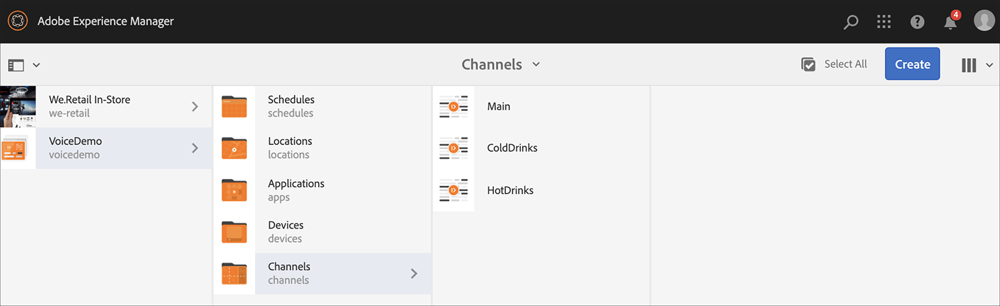

# Reconhecimento de voz no AEM Screens {#voice-recognition}

>[IMPORTANTE]
>**Informações importantes sobre privacidade**
>Ao usar o recurso de Reconhecimento de voz, siga todas as diretrizes legais e éticas aplicáveis à sua região (incluindo, mas não se limitando a, fornecer um aviso visível aos usuários finais de que o player está usando o Reconhecimento de voz). A Adobe Inc. não recebe, armazena ou processa nenhuma das informações relacionadas à voz. Os players AEM Screens usam a API de fala da Web padrão integrada ao mecanismo de navegação. Nos bastidores, uma forma de onda de seu discurso é enviada aos servidores do Google para conversão de fala em texto e esse texto é correspondido pelo player em relação às palavras-chave configuradas.
>
>Consulte o White paper [Google Privacy sobre API](https://www.google.com/chrome/privacy/whitepaper.html#speech) de fala na Web para obter mais detalhes.

## Visão geral {#overview}

O recurso de Reconhecimento de voz permite a alteração do conteúdo em um canal AEM Screens orientada pela interação de voz.

Um autor de conteúdo pode configurar uma exibição para ser habilitada para voz. A finalidade desse recurso é permitir que os clientes utilizem o discurso como método de interagir com seus vídeos. Alguns casos de uso semelhantes incluem encontrar recomendações de produtos em lojas, solicitar itens de menu em restaurantes e restaurantes. Este recurso aumenta a acessibilidade para os usuários e pode melhorar muito a experiência do cliente.

>[!NOTE]
>O hardware do player deve suportar a entrada de voz, como um microfone.

>[!IMPORTANT]
> O recurso Reconhecimento de voz está disponível somente nos players Chrome e Eletron.

## Implementação do reconhecimento de voz {#implementing}

Para implementar o reconhecimento de voz em seu projeto do AEM Screens, você deve ativar o reconhecimento de voz para a Exibição e associar cada canal a uma tag exclusiva para acionar uma transição de canal.

A seção a seguir descreve como você pode ativar e usar o recurso Reconhecimento de voz em um projeto da AEM Screens.

### Configuração do projeto {#setting-up}

Antes de usar o recurso Reconhecimento de voz, verifique se você tem um projeto e um canal com conteúdo configurado para o seu projeto.

1. O exemplo a seguir mostra um projeto de demonstração chamado **VoiceDemo** e três canais de sequência **Main**, **ColdBeinks** e **HotDrinks**, como mostrado na figura abaixo.

   

   >[!NOTE]
   >
   >Para saber como criar um canal ou adicionar conteúdo a um canal, consulte [Criação e gerenciamento de Canais](/help/user-guide/managing-channels.md)

1. Navegue até cada canal e adicione conteúdo. Por exemplo, navegue até **VoiceDemo** —> **Canais** —> **Principal** e selecione o canal. Clique em **Editar** na barra de ações para abrir o editor e adicionar conteúdo (imagens/vídeos) conforme necessário. Da mesma forma, adicione conteúdo a **ColdDrinks** e ao canal **HotDrinks** .

   Os canais agora contêm ativos (imagens), como mostrado nas figuras abaixo.

   **Principal**:

   

   **Bebidas frias**:

   

   **HotBeinks**:

   

### Configuração de tags para Canais {#setting-tags}

Depois de adicionar o conteúdo aos canais, é necessário navegar até cada um dos canais e adicionar as tags apropriadas que acionariam o reconhecimento de voz.

Siga as etapas abaixo para adicionar tags ao seu canal:

1. Navegue até cada canal e adicione conteúdo. Por exemplo, navegue até **VoiceDemo** —> **Canais** —> **Principal** e selecione o canal.

1. Click **Properties** from the action bar.

   

1. Navegue até a guia **Noções básicas** e selecione uma tag já existente no campo **Tags** ou crie uma nova.

   Você pode criar uma nova tag digitando um novo nome para sua tag e tecla de ocorrência, como mostra a figura abaixo: `return`

   

   Ou,

   Você pode criar tags de sua instância AEM antecipadamente para seu projeto e selecioná-las também. Depois de seguir as etapas explicadas em [Criar tags](#creating-tags), você pode selecionar a tag do local e adicioná-la ao seu canal, como mostra a figura abaixo:

   

1. Clique em **Salvar e fechar** quando terminar.

Da mesma forma, adicione a tag denominada **hot** ao canal **HotDrinks** .

#### Criação de tags {#creating-tags}

Siga as etapas abaixo para criar tags:

1. Navegue até sua instância AEM.
1. Clique em ferramentas —> **Marcação**.
   
1. Clique em **Criar** —> **Criar Namespace**.
   
1. Digite o nome do seu projeto, por exemplo: **VoiceDemo** e clique em Criar.
1. Selecione o projeto **VoiceDemo** e clique em **Criar tag** na barra de ações.
1. Clique em **Enviar**.

### Atribuindo Canal a uma Exibição e Habilitando o Reconhecimento de Voz {#channel-assignment}

1. Crie uma exibição na pasta **Locais** , como mostrado na figura abaixo.

   

   >[!NOTE]
   >Para saber como atribuir um canal a uma exibição, consulte [Criar e gerenciar exibições](/help/user-guide/managing-displays.md).

1. Atribua os canais **Principal**, **ColdBeinks** e **HotDrinks** ao seu **LobbyDisplay**.

1. Defina as seguintes propriedades para cada um dos canais, enquanto atribui o canal.

   | **Nome do canal** | **Prioridade** | **Eventos compatíveis** |
   |---|---|---|
   | Principal | 2 | Carga inicial, Tela inativa, Temporizador |
   | HotBeks | 1 | Interação do usuário |
   | Bebidas frias | 1 | Interação do usuário |

   >[!NOTE]
   >
   >Para saber como atribuir um canal a uma exibição, consulte [Criar e gerenciar exibições](/help/user-guide/managing-displays.md).

1. Depois de atribuir canais a uma exibição, navegue até **Sala de espera** e selecione a exibição. Na barra de ações, selecione **Propriedades** .

1. Navegue até a guia **Exibir** e ative a opção **Voz ativada** em **Conteúdo**.

   

   >[!IMPORTANT]
   >É obrigatório ativar o recurso de reconhecimento de voz da tela.

#### Visualização do conteúdo no Chrome Player {#viewing-content}

Quando as etapas anteriores estiverem concluídas, você poderá registrar seu dispositivo de cromo e visualização a saída.

>[!NOTE]
>Consulte Registro [do](device-registration.md) dispositivo para saber como registrar um dispositivo em um player AEM Screens.

Este exemplo mostra a saída em um Chrome Player.

