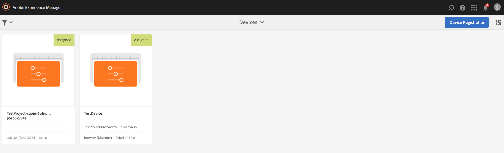

# Trabalhar com o AEM Screens Player {#working-with-aem-screens-player}

É possível gerenciar o conteúdo do canal e outras configurações no AEM Screens Player.

>[!NOTE]
>
>Pressione ***Ctrl+Cmd+F*** para sair do modo de tela cheia do OS X AEM Screens Player.

Depois de atribuir um canal a uma exibição, o AEM Screens Player exibe o conteúdo. Você pode definir as configurações do seu reprodutor usando as preferências para a interface do administrador (no painel) ou a partir do próprio reprodutor.

## Uso do painel de dispositivos {#using-the-device-dashboard}

É possível configurar as preferências para o seu dispositivo no Painel de dispositivos, acessível por meio da instância de criação do AEM.

1. Navegue até o painel do dispositivo em seu projeto, por exemplo, ***Testar projeto*** > ***Dispositivos***.

   Selecionar **Dispositivos** e **Gerenciador de dispositivos** na barra de ações.

   

1. Clique no dispositivo para abrir o painel de dispositivos.

   

1. Verifique a **PREFERÊNCIAS** painel. Você pode ativar/desativar o **Interface do administrador** e **Alternador de canal** para o seu reprodutor a partir dessas duas opções.

   

### A interface do usuário do administrador {#the-admin-ui}

Habilitando o **Interface do administrador** no painel preferências permite que o usuário abra as configurações administrativas no Player do Screens. Além disso, se você desativar essa opção no painel do dispositivo, o usuário não poderá abrir a interface do administrador no reprodutor.

Para exibir a interface do administrador no reprodutor do Screens, pressione no canto superior esquerdo para abrir o menu Administrador, no reprodutor do AEM Screens habilitado para toque ou usando um mouse. Ela mostra as informações após a conclusão do registro e o carregamento dos canais.

>[!NOTE]
>
>Além disso, você pode exibir o tempo de atividade do aplicativo AEM Screens Player para verificar o status de integridade do aplicativo.

#### Acessando as Opções do Menu de Configuração {#configuration-options}

É possível atualizar suas configurações, se você selecionar a opção **Configuração** no menu lateral, conforme mostrado na figura abaixo:

O menu Configuração permite modificar as seguintes configurações:

* Redefinir **Firmware**, **Preferências** ou **Para a fábrica** nesta caixa de diálogo.

* Especifique o número máximo de arquivos de log a serem mantidos para um reprodutor do AEM Screens no **Nº máx. de arquivos de log a serem mantidos**.

* Ativar ou desativar **Menu de administração**, **Alternador de canal**, e **Interface de atividade** para o reprodutor do Screens.

  Se a variável **Interface de atividade** está ativado no **Configuração** , o reprodutor do AEM Screens exibe a variável *notificações de atividade do player* no canto superior direito do reprodutor, como mostrado na figura abaixo.

  

>[!NOTE]
>
>A variável **Atualizar firmware** A opção só funciona no cordova, como players do Android.

>[!NOTE]
>
>Recomenda-se que o **Interface do administrador** ser desativado em Implantações de produção.

#### Acessando as Opções de Menu do Cache de Conteúdo {#content-cache-options}

Você pode limpar o cache de canais e aplicativos na interface do usuário do administrador no AEM Screens Player.

Selecione o **Cache de conteúdo** no painel lateral para atualizar o cache.

### O seletor de canais {#the-channel-switcher}

Habilitando o **Alternador de canal** no painel preferências, permite que o usuário abra as configurações/seleção de canal do reprodutor do Screens.

Além disso, se você desativar essa opção no painel do dispositivo, o usuário não poderá controlar as preferências de canal do reprodutor do Screens.

Você pode alternar e controlar as configurações do seu canal no Player do Screens.

Para ver o alternador de canal do reprodutor, pressione no canto inferior esquerdo para abrir o alternador de canal que permite alternar canais e outros recursos.

>[!NOTE]
>
>Você também pode ativar ou desativar o menu de administração e o alternador de canal do reprodutor no reprodutor do Screens.
>
>(Consulte *Alterar preferências do reprodutor do Screens* como mencionado na seção abaixo).

### Gerenciamento de preferências no AEM Screens Player {#managing-preferences-from-the-aem-screens-player}

Também é possível alterar as configurações da interface do administrador e do alternador de canal no próprio reprodutor.

Siga estas etapas para alterar as preferências do Player:

1. Pressione com o botão direito do mouse no canto superior esquerdo do canal ocioso para abrir o painel de administração.
1. Navegue até **Configuração** no menu de ação esquerdo.
1. Ativar/desativar configuração para **Interface do administrador** ou **Alternador de canal**.

## Solução de problemas do AEM Screens Player {#troubleshooting-aem-screens-player}

Você pode solucionar vários problemas associados ao AEM Screens Player (hardware e software):

| **Problemas** | **Recommendations** |
|---|---|
| O armazenamento do player está cheio | Eliminar arquivos desnecessários |
| O player perdeu a rede | Use o cabo Cat-5/Cat-6. Para Wi-Fi, reduza a distância do roteador até o dispositivo de reprodução |
| Falha no AEM Screens Player | É recomendável ter um aplicativo de vigia que garanta que o AEM Screens Player sempre seja executado |
| O AEM Screens Player perdeu as configurações | Verificar conexão com o servidor AEM |
| O AEM Screens Player não é iniciado automaticamente após a reinicialização/reinicialização do Player | Verifique a pasta de início do SO ou o procedimento de inicialização |
| O AEM Screens Player mostra conteúdo incorreto/antigo | Verificar conexão de rede |

### Atualizações do AEM Screens Player {#updates-for-aem-screens-player}

Há dois tipos de atualizações para o AEM Screens Player:

| **Método** | **Detalhes** | **via Remoto** | **Automatizado** | **0 Tempo de inatividade** |
|---|---|---|---|---|
| Atualização de firmware | Aplicado em players instalados existentes via comando remoto. Após a atualização, o Player será recarregado automaticamente com o conteúdo existente. | Sim | Personalizado | Quase - 1-3 segundos |
| Atualizações do shell do player | Este é um novo executável a ser implantado no Player. Isso requer a cópia remota de um novo binário no reprodutor, a interrupção da versão em execução no momento e o início da nova versão. Isso pode exigir o pré-download dos pacotes. | Sim (via shell remoto) | Personalizado | Não |

## Diretrizes de seleção de hardware para o dispositivo player {#hardware-selection-guidelines-for-player-device}

A seção a seguir fornece as diretrizes de seleção de hardware para um projeto do Screens:

* Sempre origem ***Comercial*** ou ***Industrial*** Os componentes da nota para PC player e painel de exibição ou projetor.

* Sempre interaja com fornecedores que atendem ao mercado de sinalização digital.
* Sempre considere fatores ambientais como temperatura ambiente e umidade relativa.
* Sempre analise os requisitos de energia e o condicionamento de energia.
* Analise cuidadosamente as necessidades de desempenho e as portas de E/S necessárias para o aplicativo.

A tabela a seguir resume as configurações de hardware com casos de uso típicos de um projeto AEM Screens:

<table>
 <tbody>
  <tr>
   <td>Configuração do reprodutor</td>
   <td>Processador</td>
   <td>Memória</td>
   <td>SSD de armazenamento</td>
   <td>GPU</td>
   <td>Exibir</td>
   <td>E/S</td>
   <td>Casos de uso típicos</td>
  </tr>
  <tr>
   <td>Básico</td>
   <td>Processador Intel® Atom Dual Core, i3 ou quad core básico</td>
   <td>
4 GB de memória
 
2 MB de cache
 </td>
   <td>
·ChromeOS 32 GB
 
·Windows 128 GB
 </td>
   <td>OnBoard</td>
   <td>1920 x 1080</td>
   <td>DVI  Ethernet / sem fio,  2xUSB</td>
   <td>
    <ul>
     <li>Looping de tela cheia padrão  </li>
     <li>Divisão de dia</li>
    </ul> </td>
  </tr>
  <tr>
   <td>Padrão</td>
   <td>Quad Core, processador Intel® Core i5</td>
   <td>
8 GB de memória
 
4MB de cache
 </td>
   <td>128 GBB</td>
   <td>OnBoard</td>
   <td>3840x2160 (4K)</td>
   <td>DVI, HDMI  Ethernet / sem fio,  2xUSB</td>
   <td>
    <ul>
     <li>Conteúdo dinâmico de origem única</li>
     <li>Interativo simples</li>
     <li>1-3 Layouts de zona</li>
    </ul> </td>
  </tr>
  <tr>
   <td>Avançado </td>
   <td>Quad Core com hyperthreading, processador Intel® Core i7</td>
   <td>
16 GB de memória
 
8 MB de cache
 </td>
   <td>256 GB</td>
   <td>GPU gráfica dedicada</td>
   <td>3840x2160 (4K)</td>
   <td>DVI, HDMI  Ethernet / sem fio,  4xUSB</td>
   <td>
    <ul>
     <li>4 ou mais zonas de conteúdo, reprodução de vídeo simultânea</li>
     <li>Interativo de várias páginas</li>
     <li>Acionadores de dados de várias origens</li>
    </ul> </td>
  </tr>
 </tbody>
</table>
